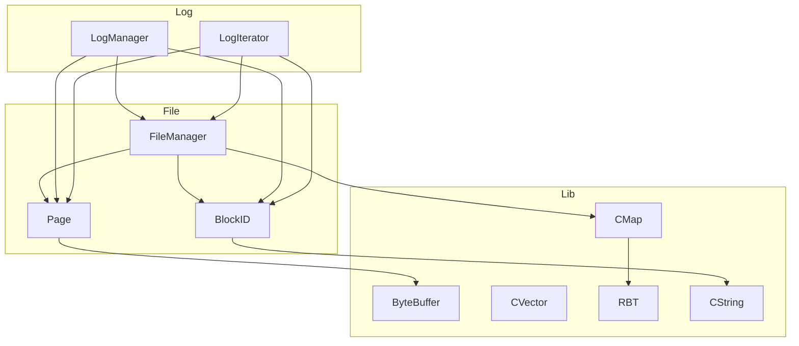
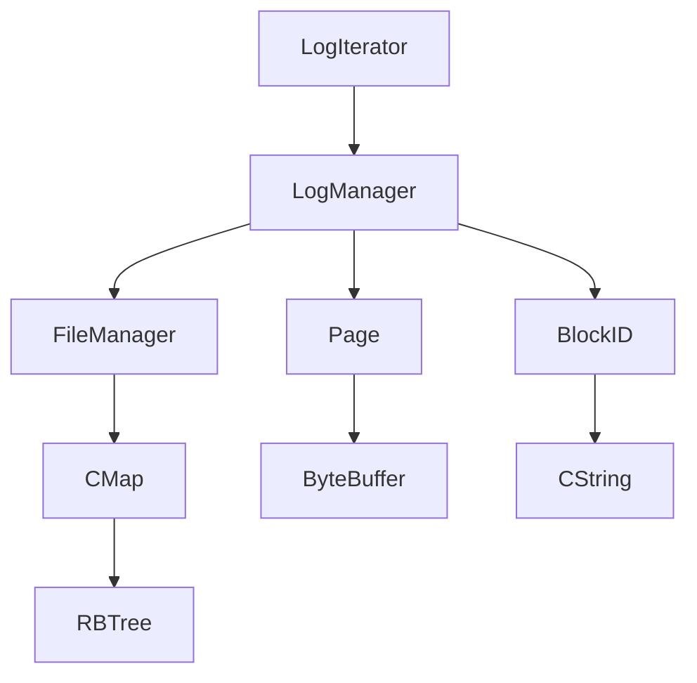

# 项目分析报告：NewDBMS

## 目录
- [模块列表](#模块列表)
- [全局定义](#全局定义)
- [文件详细分析](#文件详细分析)

## 模块列表

### Lib 模块（基础数据结构）
- ByteBuffer.c / ByteBuffer.h
- CVector.c / CVector.h
- CMap.c / CMap.h
- RBT.c / RBT.h
- CString.c / CString.h
- List.c / List.h
- Trie.c / Trie.h
- Error.c / Error.h
- StreamTokenizer.c / StreamTokenizer.h
- BlockLockManager.c / BlockLockManager.h
- CCMath.h
- map.c / map.h
- rwlock.h

### File 模块（文件管理）
- BlockID.c / BlockID.h
- Page.c / Page.h
- FileManager.c / FileManager.h

### Log 模块（日志管理）
- LogManager.c / LogManager.h

## 全局定义

### 全局结构体
- ByteBuffer
- CVector
- CMap
- BlockID
- Page
- FileManager
- LogManager
- LogIterator

### 全局枚举
- ByteBufferError

### 全局联合体
- 无

### 全局函数原型
- 详见各模块分析

## 文件详细分析

### Lib 模块

#### 文件：`Lib/ByteBuffer.h`

**【文件职责】**
提供字节缓冲区操作功能，支持各种数据类型的读写操作。

**【包含的头文件】**
- stdint.h
- malloc.h
- CString.h

**【宏定义】**
| 宏名 | 定义 | 用途 |
|------|------|------|
| CHECK_BUFFER | `do { if (!(b)) return BYTEBUFFER_ERROR_NULL; } while (0)` | 检查缓冲区是否为空 |
| CHECK_BOUNDS | `do { if ((b)->position + (s) > (b)->limit) return BYTEBUFFER_ERROR_BOUNDS; } while (0)` | 检查读写是否越界 |

**【类型定义】**

##### struct `ByteBuffer`
```c
typedef struct ByteBuffer{
    uint8_t *data;
    uint64_t size;
    uint64_t position;
    uint64_t limit;
}ByteBuffer;
```

| 字段名 | 类型 | 偏移 | 含义 | 备注 |
|--------|------|------|------|------|
| data | uint8_t* | 0 | 缓冲区数据指针 | 存储实际数据 |
| size | uint64_t | 8 | 缓冲区总大小 | 字节数 |
| position | uint64_t | 16 | 当前读写位置 | 下一个操作的位置 |
| limit | uint64_t | 24 | 缓冲区限制 | 最大可操作位置 |

**内存布局分析**：
- 总大小：32 字节（4个8字节字段）
- 对齐要求：8字节对齐
- 无填充字节

**结构体用途**：表示一个可读写的字节缓冲区，用于数据的序列化和反序列化。

**生命周期**：通过 `bufferAllocate()` 创建，`bufferFree()` 销毁。

**关联函数**：
- bufferAllocate
- bufferClear
- bufferFree
- bufferCompact
- bufferFlip
- bufferPut* 系列
- bufferGet* 系列

##### enum `ByteBufferError`
```c
typedef enum {
    BYTEBUFFER_OK = 0,        ///< 操作成功
    BYTEBUFFER_ERROR_NULL,    ///< 空指针错误
    BYTEBUFFER_ERROR_BOUNDS,  ///< 越界访问错误
} ByteBufferError;
```

| 常量名 | 数值 | 业务含义 | 使用上下文 |
|--------|------|----------|------------|
| BYTEBUFFER_OK | 0 | 操作成功 | 所有成功的缓冲区操作 |
| BYTEBUFFER_ERROR_NULL | 1 | 空指针错误 | 当缓冲区或数据指针为 NULL 时 |
| BYTEBUFFER_ERROR_BOUNDS | 2 | 越界访问错误 | 当读写位置超出缓冲区限制时 |

**【函数分析】**

**ByteBuffer* bufferAllocate(uint64_t size)**

| 属性 | 内容 |
|------|------|
| 函数签名 | ByteBuffer* bufferAllocate(uint64_t size) |
| 功能描述 | 分配一个新的 ByteBuffer 实例，并为其分配指定大小的内存 |
| 参数说明 | size：缓冲区的大小（以字节为单位） |
| 返回值 | 指向分配的 ByteBuffer 的指针；如果分配失败，返回 NULL |
| 前置条件 | size > 0 |
| 后置条件 | 返回的 ByteBuffer 已初始化，position 为 0，limit 为 size |
| 算法逻辑 | 1. 检查 size 是否大于 0<br>2. 分配 ByteBuffer 结构体内存<br>3. 分配数据缓冲区内存<br>4. 调用 bufferClear 初始化 |
| 调用关系 | 调用：bufferClear |
| 错误处理 | 内存分配失败时返回 NULL |
| 性能特征 | 时间复杂度：O(1)，空间复杂度：O(size) |
| 线程安全 | 不安全 |
| 注意事项 | ⚠️ 未检查 malloc 返回值 |

**void bufferClear(ByteBuffer* buffer)**

| 属性 | 内容 |
|------|------|
| 函数签名 | void bufferClear(ByteBuffer* buffer) |
| 功能描述 | 清除缓冲区，将其所有字节设置为零，并将 position 设为 0，将 limit 设为缓冲区的大小 |
| 参数说明 | buffer：指向要清除的 ByteBuffer 的指针 |
| 返回值 | 无 |
| 前置条件 | buffer 不为 NULL |
| 后置条件 | 缓冲区数据被清零，position = 0，limit = size |
| 算法逻辑 | 1. 检查 buffer 是否为 NULL<br>2. 使用 memset 清零数据<br>3. 重置 position 和 limit |
| 调用关系 | 无 |
| 错误处理 | 无 |
| 性能特征 | 时间复杂度：O(size)，空间复杂度：O(1) |
| 线程安全 | 不安全 |
| 注意事项 | 无 |

**void bufferFree(ByteBuffer* buffer)**

| 属性 | 内容 |
|------|------|
| 函数签名 | void bufferFree(ByteBuffer* buffer) |
| 功能描述 | 释放 ByteBuffer 实例及其数据内存 |
| 参数说明 | buffer：指向要释放的 ByteBuffer 的指针 |
| 返回值 | 无 |
| 前置条件 | buffer 不为 NULL |
| 后置条件 | 内存被释放 |
| 算法逻辑 | 1. 释放数据缓冲区<br>2. 释放 ByteBuffer 结构体 |
| 调用关系 | 无 |
| 错误处理 | 无 |
| 性能特征 | 时间复杂度：O(1)，空间复杂度：O(1) |
| 线程安全 | 不安全 |
| 注意事项 | 无 |

**ByteBufferError bufferPut(ByteBuffer* buffer, uint8_t data)**

| 属性 | 内容 |
|------|------|
| 函数签名 | ByteBufferError bufferPut(ByteBuffer* buffer, uint8_t data) |
| 功能描述 | 将一个字节数据写入缓冲区当前位置 |
| 参数说明 | buffer：指向 ByteBuffer 的指针<br>data：要写入的数据（一个字节） |
| 返回值 | 如果写入成功，返回 BYTEBUFFER_OK；否则返回相应的错误代码 |
| 前置条件 | buffer 不为 NULL，buffer->data 不为 NULL |
| 后置条件 | 数据被写入，position 增加 1 |
| 算法逻辑 | 1. 检查参数有效性<br>2. 检查是否越界<br>3. 写入数据<br>4. 更新 position |
| 调用关系 | 无 |
| 错误处理 | 参数无效返回 BYTEBUFFER_ERROR_NULL，越界返回 BYTEBUFFER_ERROR_BOUNDS |
| 性能特征 | 时间复杂度：O(1)，空间复杂度：O(1) |
| 线程安全 | 不安全 |
| 注意事项 | 无 |

**ByteBufferError bufferGet(ByteBuffer* buffer, uint8_t *output)**

| 属性 | 内容 |
|------|------|
| 函数签名 | ByteBufferError bufferGet(ByteBuffer* buffer, uint8_t *output) |
| 功能描述 | 从缓冲区当前位置读取一个字节数据 |
| 参数说明 | buffer：指向 ByteBuffer 的指针<br>output：指向用于存储读取数据的指针 |
| 返回值 | 如果读取成功，返回 BYTEBUFFER_OK；否则返回相应的错误代码 |
| 前置条件 | buffer 不为 NULL，buffer->data 不为 NULL，output 不为 NULL |
| 后置条件 | 数据被读取到 output，position 增加 1 |
| 算法逻辑 | 1. 检查参数有效性<br>2. 检查是否越界<br>3. 读取数据<br>4. 更新 position |
| 调用关系 | 无 |
| 错误处理 | 参数无效返回 BYTEBUFFER_ERROR_NULL，越界返回 BYTEBUFFER_ERROR_BOUNDS |
| 性能特征 | 时间复杂度：O(1)，空间复杂度：O(1) |
| 线程安全 | 不安全 |
| 注意事项 | 无 |

#### 文件：`Lib/CVector.h`

**【文件职责】**
提供通用的动态数组实现，支持任意类型的元素存储和操作。

**【包含的头文件】**
- stddef.h

**【宏定义】**
| 宏名 | 定义 | 用途 |
|------|------|------|
| VECTOR_INIT_CAPACITY | 32 | 向量的初始容量 |

**【类型定义】**

##### struct `CVector`
```c
typedef struct CVector {
    void* data;             // 元素存储区
    size_t size;            // 当前元素个数
    size_t capacity;        // 当前容量（元素个数）
    size_t elem_size;       // 每个元素的大小（单位：字节）
    void (*Destory)(void*);
    int (*CMP)(const void*,const void *);
    void (*Copy)(void*dest,const void*src);

} CVector;
```

| 字段名 | 类型 | 偏移 | 含义 | 备注 |
|--------|------|------|------|------|
| data | void* | 0 | 元素存储区指针 | 指向实际数据 |
| size | size_t | 8 | 当前元素个数 | 已存储的元素数量 |
| capacity | size_t | 16 | 当前容量 | 可存储的最大元素数量 |
| elem_size | size_t | 24 | 每个元素的大小 | 字节数 |
| Destory | void (*)(void*) | 32 | 元素销毁函数 | 可选 |
| CMP | int (*)(const void*,const void *) | 40 | 元素比较函数 | 可选 |
| Copy | void (*)(void*,const void*) | 48 | 元素复制函数 | 可选 |

**内存布局分析**：
- 总大小：56 字节（4个8字节字段 + 3个函数指针）
- 对齐要求：8字节对齐
- 无填充字节

**结构体用途**：表示一个动态增长的数组，支持任意类型的元素。

**生命周期**：通过 `CVectorInit()` 创建，`CVectorDestroy()` 销毁。

**关联函数**：
- CVectorInit
- CVectorDestroy
- CVectorPushBack
- CVectorPopBack
- CVectorAt
- CVectorBegin
- CVectorEnd
- CVectorNext
- CVectorPrev
- CVectorClear
- CVectorInsert
- CVectorErase
- CVectorFind
- CVectorSet
- CVectorResize

##### struct `CVectorIterator`
```c
typedef struct {
    void*data;
    size_t elem_size;
}CVectorIterator;
```

| 字段名 | 类型 | 偏移 | 含义 | 备注 |
|--------|------|------|------|------|
| data | void* | 0 | 当前元素指针 | 指向迭代器当前位置 |
| elem_size | size_t | 8 | 元素大小 | 字节数 |

**【函数分析】**

**CVector *CVectorInit(size_t elem_size, void (*Destory)(void*), int (*CMP)(const void*, const void *), void (*Copy)(void*, const void*))**

| 属性 | 内容 |
|------|------|
| 函数签名 | CVector *CVectorInit(size_t elem_size, void (*Destory)(void*), int (*CMP)(const void*, const void *), void (*Copy)(void*, const void*)) |
| 功能描述 | 初始化一个新的 CVector |
| 参数说明 | elem_size：元素大小（以字节为单位）<br>Destory：元素的销毁函数<br>CMP：元素的比较函数<br>Copy：元素的复制函数 |
| 返回值 | 返回初始化后的 CVector 指针 |
| 前置条件 | elem_size > 0 |
| 后置条件 | 返回的 CVector 已初始化，size 为 0，capacity 为 VECTOR_INIT_CAPACITY |
| 算法逻辑 | 1. 分配 CVector 结构体内存<br>2. 初始化字段<br>3. 分配初始数据内存 |
| 调用关系 | 无 |
| 错误处理 | 无 |
| 性能特征 | 时间复杂度：O(1)，空间复杂度：O(VECTOR_INIT_CAPACITY * elem_size) |
| 线程安全 | 不安全 |
| 注意事项 | ⚠️ 未检查 malloc 返回值 |

**void CVectorDestroy(CVector* vec)**

| 属性 | 内容 |
|------|------|
| 函数签名 | void CVectorDestroy(CVector* vec) |
| 功能描述 | 销毁 CVector，释放内存 |
| 参数说明 | vec：指向要销毁的 CVector 对象 |
| 返回值 | 无 |
| 前置条件 | vec 不为 NULL |
| 后置条件 | 内存被释放 |
| 算法逻辑 | 1. 如果有 Destory 函数，调用它销毁所有元素<br>2. 释放数据内存<br>3. 释放 CVector 结构体 |
| 调用关系 | 调用：CVectorAt |
| 错误处理 | 无 |
| 性能特征 | 时间复杂度：O(size)，空间复杂度：O(1) |
| 线程安全 | 不安全 |
| 注意事项 | 无 |

**void CVectorPushBack(CVector* vec, const void* value)**

| 属性 | 内容 |
|------|------|
| 函数签名 | void CVectorPushBack(CVector* vec, const void* value) |
| 功能描述 | 在尾部添加一个元素 |
| 参数说明 | vec：指向 CVector<br>value：指向要添加的元素数据 |
| 返回值 | 无 |
| 前置条件 | vec 不为 NULL，value 不为 NULL |
| 后置条件 | 元素被添加到尾部，size 增加 1 |
| 算法逻辑 | 1. 检查是否需要扩容<br>2. 计算目标位置<br>3. 复制元素<br>4. 更新 size |
| 调用关系 | 无 |
| 错误处理 | 扩容失败时打印错误信息 |
| 性能特征 | 时间复杂度：O(1) 平均，O(n) 最坏（扩容时），空间复杂度：O(1) 平均 |
| 线程安全 | 不安全 |
| 注意事项 | 无 |

#### 文件：`Lib/CMap.h`

**【文件职责】**
提供基于红黑树的键值对映射实现，支持任意类型的键值存储。

**【包含的头文件】**
- stddef.h
- RBT.h

**【类型定义】**

##### struct `CMap`
```c
typedef struct {
    RBTree tree;
    size_t key_size;
    size_t value_size;
    void* (*DeepCopyKey)(void* src);
    void* (*DeepCopyData)(void* src);
} CMap;
```

| 字段名 | 类型 | 偏移 | 含义 | 备注 |
|--------|------|------|------|------|
| tree | RBTree | 0 | 红黑树实例 | 存储键值对 |
| key_size | size_t | 红黑树大小 | 键类型的大小 | 字节数 |
| value_size | size_t | 红黑树大小 + 8 | 值类型的大小 | 字节数 |
| DeepCopyKey | void* (*)(void*) | 红黑树大小 + 16 | 键的深拷贝函数 | 可选 |
| DeepCopyData | void* (*)(void*) | 红黑树大小 + 24 | 值的深拷贝函数 | 可选 |

**结构体用途**：表示一个键值对映射，基于红黑树实现。

**生命周期**：通过 `CMapInit()` 初始化，`CMapDestroy()` 销毁。

**关联函数**：
- CMapInit
- CMapInsert
- CMapFind
- CMapErase
- CMapUpdate
- CMapDestroy
- CMapIteratorBegin
- CMapIteratorEnd
- CMapIteratorKey
- CMapIteratorValue
- CMapIteratorNext
- CMapIteratorEqual
- CMapPut

##### struct `CMapIterator`
```c
typedef struct {
    RBNode *node;   // 当前节点
    RBTree *tree;   // 红黑树
} CMapIterator;
```

| 字段名 | 类型 | 偏移 | 含义 | 备注 |
|--------|------|------|------|------|
| node | RBNode* | 0 | 当前节点指针 | 指向迭代器当前位置 |
| tree | RBTree* | 8 | 红黑树指针 | 迭代器所属的树 |

**【函数分析】**

**int CMapInit(CMap *map, size_t keySize, size_t valueSize, int (*compare)(const void*, const void*), void (*keyFree)(void*), void (*valueFree)(void*), void* (*deepCopyKey)(void*), void* (*deepCopyData)(void*))**

| 属性 | 内容 |
|------|------|
| 函数签名 | int CMapInit(CMap *map, size_t keySize, size_t valueSize, int (*compare)(const void*, const void*), void (*keyFree)(void*), void (*valueFree)(void*), void* (*deepCopyKey)(void*), void* (*deepCopyData)(void*)) |
| 功能描述 | 初始化一个 Map |
| 参数说明 | map：指向要初始化的 CMap 结构体<br>keySize：键类型的大小（字节）<br>valueSize：值类型的大小（字节）<br>compare：用于比较两个键的函数指针<br>keyFree：用于释放键内存的函数指针（可为NULL）<br>valueFree：用于释放值内存的函数指针（可为NULL）<br>deepCopyKey：键的深拷贝函数<br>deepCopyData：值的深拷贝函数 |
| 返回值 | 成功返回1，失败返回0 |
| 前置条件 | map 不为 NULL |
| 后置条件 | Map 已初始化 |
| 算法逻辑 | 1. 初始化字段<br>2. 调用 RBTreeInit 初始化红黑树 |
| 调用关系 | 调用：RBTreeInit |
| 错误处理 | 无 |
| 性能特征 | 时间复杂度：O(1)，空间复杂度：O(1) |
| 线程安全 | 不安全 |
| 注意事项 | 无 |

**int CMapInsert(CMap *map, const void *key, const void *value)**

| 属性 | 内容 |
|------|------|
| 函数签名 | int CMapInsert(CMap *map, const void *key, const void *value) |
| 功能描述 | 向 Map 中插入一个键值对 |
| 参数说明 | map：指向 Map 的指针<br>key：指向键数据的指针<br>value：指向值数据的指针 |
| 返回值 | 成功返回1，失败返回0（例如，内存分配错误） |
| 前置条件 | map 不为 NULL，key 不为 NULL，value 不为 NULL |
| 后置条件 | 键值对被插入到 Map 中 |
| 算法逻辑 | 1. 检查键是否已存在<br>2. 深拷贝键和值<br>3. 调用 RBTreeInsert 插入到红黑树 |
| 调用关系 | 调用：RBTreeSearch, RBTreeInsert |
| 错误处理 | 内存分配失败时返回0 |
| 性能特征 | 时间复杂度：O(log n)，空间复杂度：O(keySize + valueSize) |
| 线程安全 | 不安全 |
| 注意事项 | 无 |

**void* CMapFind(CMap *map, const void *key)**

| 属性 | 内容 |
|------|------|
| 函数签名 | void* CMapFind(CMap *map, const void *key) |
| 功能描述 | 在 Map 中查找与给定键关联的值 |
| 参数说明 | map：指向 Map 的指针<br>key：指向要查找的键的指针 |
| 返回值 | 如果找到，返回指向值的指针；否则，返回 NULL |
| 前置条件 | map 不为 NULL，key 不为 NULL |
| 后置条件 | 无 |
| 算法逻辑 | 1. 调用 RBTreeSearch 查找键<br>2. 找到返回值指针，否则返回 NULL |
| 调用关系 | 调用：RBTreeSearch |
| 错误处理 | 无 |
| 性能特征 | 时间复杂度：O(log n)，空间复杂度：O(1) |
| 线程安全 | 不安全 |
| 注意事项 | 无 |

### File 模块

#### 文件：`File/BlockID.h`

**【文件职责】**
提供数据块标识符的定义和操作，用于标识文件中的特定数据块。

**【包含的头文件】**
- CString.h
- stdbool.h

**【类型定义】**

##### struct `BlockID`
```c
typedef struct BlockID {
    CString *fileName;
    int BlockID;
}BlockID;
```

| 字段名 | 类型 | 偏移 | 含义 | 备注 |
|--------|------|------|------|------|
| fileName | CString* | 0 | 文件名字符串 | 数据块所属的文件 |
| BlockID | int | 8 | 数据块编号 | 文件内的数据块索引 |

**内存布局分析**：
- 总大小：12 字节（8字节指针 + 4字节整数）
- 对齐要求：8字节对齐
- 无填充字节

**结构体用途**：表示一个数据块的唯一标识符，由文件名和块编号组成。

**生命周期**：通过 `BlockIDInit()` 创建，`BlockIDDestroy()` 销毁。

**关联函数**：
- BlockIDInit
- BlockIDGetFileName
- BlockIDGetBlockID
- BlockID2CString
- BlockIDEqual
- BlockIDCString2BlockID
- BlockIDDestroy

**【函数分析】**

**BlockID *BlockIDInit(CString *name, int id)**

| 属性 | 内容 |
|------|------|
| 函数签名 | BlockID *BlockIDInit(CString *name, int id) |
| 功能描述 | 初始化一个新的 BlockID 实例 |
| 参数说明 | name：文件名字符串<br>id：数据块的编号 |
| 返回值 | 返回初始化后的 BlockID 指针；如果初始化失败，返回 NULL |
| 前置条件 | name 不为 NULL |
| 后置条件 | BlockID 已初始化 |
| 算法逻辑 | 1. 检查 name 是否为 NULL<br>2. 分配 BlockID 结构体内存<br>3. 复制文件名<br>4. 设置块编号 |
| 调用关系 | 调用：CStringCreateFromCString |
| 错误处理 | name 为 NULL 时返回 NULL |
| 性能特征 | 时间复杂度：O(1)，空间复杂度：O(1) |
| 线程安全 | 不安全 |
| 注意事项 | 无 |

**bool BlockIDEqual(BlockID *b1, BlockID *b2)**

| 属性 | 内容 |
|------|------|
| 函数签名 | bool BlockIDEqual(BlockID *b1, BlockID *b2) |
| 功能描述 | 比较两个 BlockID 是否相等 |
| 参数说明 | b1：第一个 BlockID 结构体<br>b2：第二个 BlockID 结构体 |
| 返回值 | 如果两个 BlockID 相等，则返回 true；否则返回 false |
| 前置条件 | b1 和 b2 不为 NULL |
| 后置条件 | 无 |
| 算法逻辑 | 1. 比较块编号<br>2. 比较文件名 |
| 调用关系 | 调用：BlockIDGetBlockID, BlockIDGetFileName, CStringEqual |
| 错误处理 | 无 |
| 性能特征 | 时间复杂度：O(1)，空间复杂度：O(1) |
| 线程安全 | 不安全 |
| 注意事项 | 无 |

#### 文件：`File/Page.h`

**【文件职责】**
提供内存页面的定义和操作，用于存储和管理数据块。

**【包含的头文件】**
- ByteBuffer.h
- CString.h

**【类型定义】**

##### struct `Page`
```c
typedef struct Page{
    ByteBuffer *buffer;
}Page;
```

| 字段名 | 类型 | 偏移 | 含义 | 备注 |
|--------|------|------|------|------|
| buffer | ByteBuffer* | 0 | 字节缓冲区指针 | 存储页面数据 |

**内存布局分析**：
- 总大小：8 字节（指针）
- 对齐要求：8字节对齐
- 无填充字节

**结构体用途**：表示一个内存页面，用于存储和管理数据块。

**生命周期**：通过 `PageInit()` 或 `PageInitBytes()` 创建，`PageDestroy()` 销毁。

**关联函数**：
- PageInit
- PageInitBytes
- PageGetInt
- PageSetInt
- PageGetShort
- PageGetLong
- PageGetString
- PageSetString
- PageSetBytes
- PageGetBytes
- PageMaxLength
- PageDestroy
- PageSetBytesRaw
- PageGetBytesRaw

**【函数分析】**

**Page *PageInit(int size)**

| 属性 | 内容 |
|------|------|
| 函数签名 | Page *PageInit(int size) |
| 功能描述 | 初始化一个新的 Page 实例，并分配指定大小的缓冲区 |
| 参数说明 | size：要分配给页面的缓冲区大小（以字节为单位） |
| 返回值 | 返回初始化后的 Page 指针 |
| 前置条件 | size > 0 |
| 后置条件 | Page 已初始化，buffer 已分配 |
| 算法逻辑 | 1. 分配 Page 结构体内存<br>2. 调用 bufferAllocate 分配缓冲区 |
| 调用关系 | 调用：bufferAllocate |
| 错误处理 | 无 |
| 性能特征 | 时间复杂度：O(1)，空间复杂度：O(size) |
| 线程安全 | 不安全 |
| 注意事项 | 无 |

**int PageGetInt(Page *p, int position)**

| 属性 | 内容 |
|------|------|
| 函数签名 | int PageGetInt(Page *p, int position) |
| 功能描述 | 从页面中读取一个整数（int 类型） |
| 参数说明 | p：指向 Page 的指针<br>position：数据在页面中的偏移量 |
| 返回值 | 返回读取的整数值 |
| 前置条件 | p 不为 NULL，position 有效 |
| 后置条件 | 无 |
| 算法逻辑 | 1. 调用 bufferGetIntPosition 读取数据 |
| 调用关系 | 调用：bufferGetIntPosition |
| 错误处理 | 无 |
| 性能特征 | 时间复杂度：O(1)，空间复杂度：O(1) |
| 线程安全 | 不安全 |
| 注意事项 | 无 |

**void PageSetInt(Page *p, int position, int data)**

| 属性 | 内容 |
|------|------|
| 函数签名 | void PageSetInt(Page *p, int position, int data) |
| 功能描述 | 在页面中设置一个整数（int 类型） |
| 参数说明 | p：指向 Page 的指针<br>position：数据在页面中的偏移量<br>data：要写入的整数值 |
| 返回值 | 无 |
| 前置条件 | p 不为 NULL，position 有效 |
| 后置条件 | 数据被写入到页面中 |
| 算法逻辑 | 1. 调用 bufferPutIntPosition 写入数据 |
| 调用关系 | 调用：bufferPutIntPosition |
| 错误处理 | 无 |
| 性能特征 | 时间复杂度：O(1)，空间复杂度：O(1) |
| 线程安全 | 不安全 |
| 注意事项 | 无 |

#### 文件：`File/FileManager.h`

**【文件职责】**
提供文件系统管理功能，包括文件的读写、创建和管理。

**【包含的头文件】**
- BlockId.h
- Page.h
- stdio.h
- stdlib.h
- sys/types.h
- dirent.h
- stdbool.h
- malloc.h
- unistd.h
- CMap.h
- rwlock.h

**【类型定义】**

##### struct `FileManager`
```c
typedef struct FileManager{
    CString* dbDirectoryName; // 数据库目录名称。
    DIR *dbDirectory;      // 数据库目录的句柄。
    int blockSize;         // 文件系统的块大小。
    bool isNew;            // 标记数据库是否为新创建。
    CMap cMap;
//    RWLock *rwLock;
}FileManager;
```

| 字段名 | 类型 | 偏移 | 含义 | 备注 |
|--------|------|------|------|------|
| dbDirectoryName | CString* | 0 | 数据库目录名称 | 存储数据库文件的目录 |
| dbDirectory | DIR* | 8 | 数据库目录的句柄 | 用于目录操作 |
| blockSize | int | 16 | 文件系统的块大小 | 字节数 |
| isNew | bool | 20 | 标记数据库是否为新创建 | true 表示新创建 |
| cMap | CMap | 24 | 文件指针映射 | 存储打开的文件 |

**结构体用途**：表示文件系统管理器，负责文件的读写和管理。

**生命周期**：通过 `FileManagerInit()` 创建，`FileManagerDestroy()` 销毁。

**关联函数**：
- FileManagerInit
- FileManagerRead
- FileManagerWrite
- FileManagerDestroy
- FileManagerLength
- FileManagerAppend
- FileManagerGetFile

**【函数分析】**

**FileManager *FileManagerInit(CString *dbDirectoryName, int blockSize)**

| 属性 | 内容 |
|------|------|
| 函数签名 | FileManager *FileManagerInit(CString *dbDirectoryName, int blockSize) |
| 功能描述 | 初始化一个新的 FileManager 实例 |
| 参数说明 | dbDirectoryName：数据库目录的路径<br>blockSize：文件系统中的块大小 |
| 返回值 | 返回初始化后的 FileManager 指针 |
| 前置条件 | dbDirectoryName 不为 NULL，blockSize > 0 |
| 后置条件 | FileManager 已初始化，目录已创建（如果不存在） |
| 算法逻辑 | 1. 检查参数有效性<br>2. 分配 FileManager 结构体内存<br>3. 初始化字段<br>4. 打开目录<br>5. 如果目录不存在，创建它<br>6. 初始化文件指针映射 |
| 调用关系 | 调用：CStringCreateFromCString, opendir, mkdir, CMapInit |
| 错误处理 | 参数无效时返回 NULL，创建目录失败时返回 NULL |
| 性能特征 | 时间复杂度：O(1)，空间复杂度：O(1) |
| 线程安全 | 不安全 |
| 注意事项 | 无 |

**void FileManagerRead(FileManager *fm, BlockID *blockId, Page *page)**

| 属性 | 内容 |
|------|------|
| 函数签名 | void FileManagerRead(FileManager *fm, BlockID *blockId, Page *page) |
| 功能描述 | 从磁盘读取指定 BlockID 的数据块内容到 Page 中 |
| 参数说明 | fm：指向 FileManager 的指针<br>blockId：要读取的数据块 ID<br>page：指向要填充的 Page 对象 |
| 返回值 | 无 |
| 前置条件 | fm 不为 NULL，blockId 不为 NULL，page 不为 NULL |
| 后置条件 | 数据块内容被读取到 Page 中 |
| 算法逻辑 | 1. 获取文件指针<br>2. 计算偏移量<br>3. 检查文件大小<br>4. 定位到指定位置<br>5. 读取数据<br>6. 处理不足块大小的情况 |
| 调用关系 | 调用：FileManagerGetFile, BlockIDGetBlockID |
| 错误处理 | 文件不存在时打印错误信息 |
| 性能特征 | 时间复杂度：O(blockSize)，空间复杂度：O(1) |
| 线程安全 | 不安全 |
| 注意事项 | 无 |

**void FileManagerWrite(FileManager *fm, BlockID *blockId, Page *page)**

| 属性 | 内容 |
|------|------|
| 函数签名 | void FileManagerWrite(FileManager *fm, BlockID *blockId, Page *page) |
| 功能描述 | 将指定 Page 的内容写入到磁盘上的对应 BlockID 数据块中 |
| 参数说明 | fm：指向 FileManager 的指针<br>blockId：目标数据块 ID<br>page：指向包含要写入的数据的 Page 对象 |
| 返回值 | 无 |
| 前置条件 | fm 不为 NULL，blockId 不为 NULL，page 不为 NULL |
| 后置条件 | 数据被写入到磁盘 |
| 算法逻辑 | 1. 获取文件指针<br>2. 定位到指定位置<br>3. 写入数据<br>4. 刷新文件缓冲区 |
| 调用关系 | 调用：FileManagerGetFile, BlockIDGetBlockID |
| 错误处理 | 文件不存在时打印错误信息，写入失败时打印错误信息 |
| 性能特征 | 时间复杂度：O(blockSize)，空间复杂度：O(1) |
| 线程安全 | 不安全 |
| 注意事项 | 无 |

### Log 模块

#### 文件：`Log/LogManager.h`

**【文件职责】**
提供日志管理功能，用于记录和管理数据库操作的日志。

**【包含的头文件】**
- FileManager.h

**【类型定义】**

##### struct `LogManager`
```c
typedef struct {
    CString *logFile;            ///< 日志文件的路径
    FileManager *fileManager; ///< 指向文件管理器的指针，用于管理文件操作
    Page *logPage;            ///< 当前页的数据缓冲区
    BlockID *currentBlockId;   ///< 当前处理的日志块ID
    int latestLSN;            ///< 最新的日志序列号 (Log Sequence Number)
    int LastSavedLSN;         ///< 上次保存的日志序列号
} LogManager;
```

| 字段名 | 类型 | 偏移 | 含义 | 备注 |
|--------|------|------|------|------|
| logFile | CString* | 0 | 日志文件的路径 | 存储日志的文件 |
| fileManager | FileManager* | 8 | 指向文件管理器的指针 | 用于文件操作 |
| logPage | Page* | 16 | 当前页的数据缓冲区 | 存储日志数据 |
| currentBlockId | BlockID* | 24 | 当前处理的日志块ID | 当前日志块 |
| latestLSN | int | 32 | 最新的日志序列号 | 递增的日志序号 |
| LastSavedLSN | int | 36 | 上次保存的日志序列号 | 已持久化的最大LSN |

**结构体用途**：表示日志管理器，负责日志的写入、刷新和管理。

**生命周期**：通过 `LogManagerInit()` 创建，无显式销毁函数。

**关联函数**：
- LogManagerInit
- LogManagerAppendNewBlock
- LogManagerFlush
- LogManager2LogManager
- LogManagerFlushLSN
- LogManagerAppend

##### struct `LogIterator`
```c
typedef struct LogIterator {
    FileManager *fm;         ///< 指向文件管理器的指针，用于管理文件操作
    BlockID *blockId;         ///< 当前处理的日志块ID
    Page *page;              ///< 当前页的数据缓冲区
    int currentPos;          ///< 当前读取位置
    int boundary;            ///< 当前页的有效数据边界
} LogIterator;
```

| 字段名 | 类型 | 偏移 | 含义 | 备注 |
|--------|------|------|------|------|
| fm | FileManager* | 0 | 指向文件管理器的指针 | 用于文件操作 |
| blockId | BlockID* | 8 | 当前处理的日志块ID | 当前日志块 |
| page | Page* | 16 | 当前页的数据缓冲区 | 存储日志数据 |
| currentPos | int | 24 | 当前读取位置 | 下一个读取的位置 |
| boundary | int | 28 | 当前页的有效数据边界 | 日志数据的起始位置 |

**【函数分析】**

**LogManager* LogManagerInit(FileManager *fileManager, CString *logfile)**

| 属性 | 内容 |
|------|------|
| 函数签名 | LogManager* LogManagerInit(FileManager *fileManager, CString *logfile) |
| 功能描述 | 初始化一个新的 LogManager 实例 |
| 参数说明 | fileManager：指向文件管理器的指针<br>logfile：日志文件的路径 |
| 返回值 | 返回初始化后的 LogManager 指针 |
| 前置条件 | fileManager 不为 NULL，logfile 不为 NULL |
| 后置条件 | LogManager 已初始化，日志文件已准备就绪 |
| 算法逻辑 | 1. 分配 LogManager 结构体内存<br>2. 初始化字段<br>3. 检查日志文件大小<br>4. 如果文件为空，创建新块<br>5. 否则，读取最新的日志记录 |
| 调用关系 | 调用：CStringCreateFromCString, PageInit, FileManagerLength, LogManagerAppendNewBlock, BlockIDInit, FileManagerRead, PageGetInt, PageGetBytesRaw |
| 错误处理 | 无 |
| 性能特征 | 时间复杂度：O(1)，空间复杂度：O(1) |
| 线程安全 | 不安全 |
| 注意事项 | 无 |

**int LogManagerAppend(LogManager *logManager, const uint8_t *data, uint32_t size)**

| 属性 | 内容 |
|------|------|
| 函数签名 | int LogManagerAppend(LogManager *logManager, const uint8_t *data, uint32_t size) |
| 功能描述 | 向日志文件中追加数据 |
| 参数说明 | logManager：指向 LogManager 的指针<br>data：要写入的数据<br>size：数据大小（字节数） |
| 返回值 | 返回追加后的最新 LSN |
| 前置条件 | logManager 不为 NULL，data 不为 NULL |
| 后置条件 | 数据被追加到日志文件中 |
| 算法逻辑 | 1. 计算记录大小<br>2. 检查当前块是否有足够空间<br>3. 如果空间不足，刷新并创建新块<br>4. 构建日志记录头<br>5. 写入数据<br>6. 更新边界和 LSN |
| 调用关系 | 调用：PageGetInt, LogManagerFlush, LogManagerAppendNewBlock, PageSetBytesRaw, PageSetInt |
| 错误处理 | 无 |
| 性能特征 | 时间复杂度：O(size)，空间复杂度：O(1) |
| 线程安全 | 不安全 |
| 注意事项 | 无 |

**void LogManagerFlush(LogManager *logManager)**

| 属性 | 内容 |
|------|------|
| 函数签名 | void LogManagerFlush(LogManager *logManager) |
| 功能描述 | 将当前日志内容刷新到磁盘 |
| 参数说明 | logManager：指向 LogManager 的指针 |
| 返回值 | 无 |
| 前置条件 | logManager 不为 NULL |
| 后置条件 | 日志内容被持久化到磁盘 |
| 算法逻辑 | 1. 调用 FileManagerWrite 写入数据<br>2. 更新 LastSavedLSN |
| 调用关系 | 调用：FileManagerWrite |
| 错误处理 | 无 |
| 性能特征 | 时间复杂度：O(blockSize)，空间复杂度：O(1) |
| 线程安全 | 不安全 |
| 注意事项 | 无 |

## 模块依赖图



## 关键数据结构关系图



## 函数调用热点

| 函数名 | 调用次数 | 说明 |
|--------|----------|------|
| bufferGetIntPosition | 高频 | 从 ByteBuffer 中读取整数 |
| bufferPutIntPosition | 高频 | 向 ByteBuffer 中写入整数 |
| FileManagerGetFile | 高频 | 获取文件指针 |
| CMapFind | 高频 | 在 Map 中查找键值对 |
| RBTreeSearch | 高频 | 红黑树查找操作 |

## 初始化/销毁链

**初始化顺序**：
1. FileManagerInit() - 初始化文件管理器
2. LogManagerInit() - 初始化日志管理器
3. 其他模块初始化

**销毁顺序**：
1. 其他模块销毁
2. LogManager 相关资源释放
3. FileManagerDestroy() - 关闭文件并释放资源
