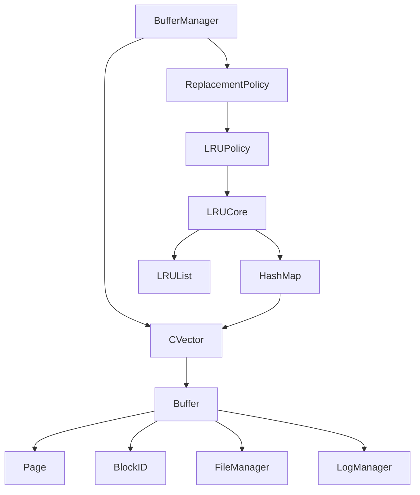

# 项目分析报告：NewDBMS - Buffer 模块

## 目录
- [模块列表](#模块列表)
- [全局定义](#全局定义)
- [文件详细分析](#文件详细分析)
- [模块依赖图](#模块依赖图)
- [关键数据结构关系图](#关键数据结构关系图)
- [函数调用热点](#函数调用热点)
- [初始化/销毁链](#初始化/销毁链)

## 模块列表

### Buffer 模块（缓冲区管理）
- Buffer.c / Buffer.h
- BufferManager.c / BufferManager.h
- LRU/LRUPolicy.c / LRU/LRUPolicy.h
- LRU/LRUCore.c / LRU/LRUCore.h
- ReplacementPolicy.h

## 全局定义

### 全局结构体
- Buffer
- BufferManager
- ReplacementPolicy
- LRUImpl
- LRUNode
- LRUList
- HashMap
- LRUCore

### 全局枚举
- 无

### 全局联合体
- 无

### 全局函数原型
- 详见各模块分析

## 文件详细分析

### Buffer 模块

#### 文件：`buffer/Buffer.h`

**【文件职责】**
提供缓冲区的定义和基本操作，用于管理内存中的数据块。

**【包含的头文件】**
- FileManager.h
- LogManager.h
- Page.h
- time.h

**【类型定义】**

##### struct `Buffer`
```c
typedef struct Buffer{
    FileManager *fileManager;
    LogManager *logManager;
    Page *page;
    BlockID *blockId;
    int pins;
    int txNum;
    int lsn;
    time_t lastUsed;   // 最近使用时间
    int frame_id;
}Buffer;
```

| 字段名 | 类型 | 偏移 | 含义 | 备注 |
|--------|------|------|------|------|
| fileManager | FileManager* | 0 | 文件管理器指针 | 用于文件操作 |
| logManager | LogManager* | 8 | 日志管理器指针 | 用于日志记录 |
| page | Page* | 16 | 内存页面指针 | 存储数据块内容 |
| blockId | BlockID* | 24 | 数据块标识符 | 标识缓冲区对应的磁盘块 |
| pins | int | 32 | 引用计数 | 记录缓冲区被引用的次数 |
| txNum | int | 36 | 事务号 | 最后修改缓冲区的事务 |
| lsn | int | 40 | 日志序列号 | 最后修改对应的日志记录 |
| lastUsed | time_t | 48 | 最近使用时间 | 用于替换策略 |
| frame_id | int | 56 | 帧编号 | 缓冲区在池中的唯一标识 |

**内存布局分析**：
- 总大小：60 字节（8字节指针 * 4 + 4字节整数 * 4 + 8字节 time_t）
- 对齐要求：8字节对齐
- 无填充字节

**结构体用途**：表示一个内存缓冲区，用于缓存磁盘数据块。

**生命周期**：通过 `BufferInit()` 创建，无显式销毁函数。

**关联函数**：
- BufferInit
- BufferSetModified
- BufferFlush
- BufferIsPinned
- BufferPin
- BufferUnPin
- BufferAssignToBlock

**【函数分析】**

**Buffer *BufferInit(FileManager *fileManager, LogManager *logManager)**

| 属性 | 内容 |
|------|------|
| 函数签名 | Buffer *BufferInit(FileManager *fileManager, LogManager *logManager) |
| 功能描述 | 初始化一个新的 Buffer |
| 参数说明 | fileManager：指向文件管理器的指针，用于文件操作<br>logManager：指向日志管理器的指针，用于日志记录 |
| 返回值 | 返回一个初始化后的 Buffer 指针 |
| 前置条件 | fileManager 和 logManager 不为 NULL |
| 后置条件 | Buffer 已初始化，pins 为 0，txNum 和 lsn 为 -1 |
| 算法逻辑 | 1. 分配 Buffer 结构体内存<br>2. 初始化字段<br>3. 分配 Page 内存<br>4. 设置初始状态 |
| 调用关系 | 调用：PageInit |
| 错误处理 | 无 |
| 性能特征 | 时间复杂度：O(1)，空间复杂度：O(1) |
| 线程安全 | 不安全 |
| 注意事项 | ⚠️ 未检查 malloc 返回值 |

**void BufferSetModified(Buffer *buffer, int txNum, int lsn)**

| 属性 | 内容 |
|------|------|
| 函数签名 | void BufferSetModified(Buffer *buffer, int txNum, int lsn) |
| 功能描述 | 将 Buffer 标记为已修改，并记录事务号和日志序列号 |
| 参数说明 | buffer：指向需要设置为修改状态的 Buffer<br>txNum：当前事务号，表示正在操作该缓冲区的事务<br>lsn：日志序列号，标识该缓冲区对应的日志操作 |
| 返回值 | 无 |
| 前置条件 | buffer 不为 NULL |
| 后置条件 | buffer->txNum = txNum，buffer->lsn = lsn（如果 lsn >= 0） |
| 算法逻辑 | 1. 设置事务号<br>2. 如果 lsn 有效，设置日志序列号 |
| 调用关系 | 无 |
| 错误处理 | 无 |
| 性能特征 | 时间复杂度：O(1)，空间复杂度：O(1) |
| 线程安全 | 不安全 |
| 注意事项 | 无 |

**void BufferFlush(Buffer *buffer)**

| 属性 | 内容 |
|------|------|
| 函数签名 | void BufferFlush(Buffer *buffer) |
| 功能描述 | 将 Buffer 中的修改内容刷新到磁盘，确保数据持久化 |
| 参数说明 | buffer：指向需要刷新的 Buffer |
| 返回值 | 无 |
| 前置条件 | buffer 不为 NULL，buffer->blockId 不为 NULL，buffer->txNum >= 0 |
| 后置条件 | 数据被写入磁盘，buffer->txNum 被重置为 -1 |
| 算法逻辑 | 1. 检查参数有效性<br>2. 如果有日志记录，刷新日志<br>3. 写入数据到磁盘<br>4. 重置事务号 |
| 调用关系 | 调用：LogManagerFlushLSN, FileManagerWrite |
| 错误处理 | 无 |
| 性能特征 | 时间复杂度：O(blockSize)，空间复杂度：O(1) |
| 线程安全 | 不安全 |
| 注意事项 | 无 |

**bool BufferIsPinned(Buffer *buffer)**

| 属性 | 内容 |
|------|------|
| 函数签名 | bool BufferIsPinned(Buffer *buffer) |
| 功能描述 | 检查 Buffer 是否已经被 Pin（即被引用） |
| 参数说明 | buffer：指向需要检查的 Buffer |
| 返回值 | 如果 Buffer 已被 Pin（即被引用），返回 true；否则返回 false |
| 前置条件 | buffer 不为 NULL |
| 后置条件 | 无 |
| 算法逻辑 | 1. 检查 pins 是否大于 0 |
| 调用关系 | 无 |
| 错误处理 | 无 |
| 性能特征 | 时间复杂度：O(1)，空间复杂度：O(1) |
| 线程安全 | 不安全 |
| 注意事项 | 无 |

**void BufferPin(Buffer *buffer)**

| 属性 | 内容 |
|------|------|
| 函数签名 | void BufferPin(Buffer *buffer) |
| 功能描述 | 将 Buffer 引用计数增加，表示该缓冲区被引用 |
| 参数说明 | buffer：指向需要 Pin 的 Buffer |
| 返回值 | 无 |
| 前置条件 | buffer 不为 NULL |
| 后置条件 | buffer->pins 增加 1，lastUsed 被更新 |
| 算法逻辑 | 1. 增加 pins 计数<br>2. 更新 lastUsed 时间 |
| 调用关系 | 无 |
| 错误处理 | 无 |
| 性能特征 | 时间复杂度：O(1)，空间复杂度：O(1) |
| 线程安全 | 不安全 |
| 注意事项 | 无 |

**void BufferUnPin(Buffer *buffer)**

| 属性 | 内容 |
|------|------|
| 函数签名 | void BufferUnPin(Buffer *buffer) |
| 功能描述 | 将 Buffer 引用计数减少，表示该缓冲区不再被引用 |
| 参数说明 | buffer：指向需要 UnPin 的 Buffer |
| 返回值 | 无 |
| 前置条件 | buffer 不为 NULL |
| 后置条件 | buffer->pins 减少 1，lastUsed 被更新 |
| 算法逻辑 | 1. 减少 pins 计数<br>2. 更新 lastUsed 时间 |
| 调用关系 | 无 |
| 错误处理 | 无 |
| 性能特征 | 时间复杂度：O(1)，空间复杂度：O(1) |
| 线程安全 | 不安全 |
| 注意事项 | 无 |

**void BufferAssignToBlock(Buffer *buffer, BlockID *blockId)**

| 属性 | 内容 |
|------|------|
| 函数签名 | void BufferAssignToBlock(Buffer *buffer, BlockID *blockId) |
| 功能描述 | 将 Buffer 分配给指定的块 ID |
| 参数说明 | buffer：指向需要分配块 ID 的 Buffer<br>blockId：要分配给 Buffer 的块 ID |
| 返回值 | 无 |
| 前置条件 | buffer 和 blockId 不为 NULL |
| 后置条件 | buffer->blockId 被设置为新的块 ID，数据被加载 |
| 算法逻辑 | 1. 刷新当前缓冲区<br>2. 初始化新的块 ID<br>3. 从磁盘读取数据<br>4. 重置 pins 计数 |
| 调用关系 | 调用：BufferFlush, BlockIDInit, FileManagerRead |
| 错误处理 | 无 |
| 性能特征 | 时间复杂度：O(blockSize)，空间复杂度：O(1) |
| 线程安全 | 不安全 |
| 注意事项 | 无 |

#### 文件：`buffer/BufferManager.h`

**【文件职责】**
提供缓冲区管理器的定义和操作，用于管理多个缓冲区。

**【包含的头文件】**
- Buffer.h
- time.h
- CVector.h
- ReplacementPolicy.h

**【宏定义】**
| 宏名 | 定义 | 用途 |
|------|------|------|
| MAX_TIME | 10 | 最大等待时间，用于超时机制（单位：秒） |

**【类型定义】**

##### struct `BufferManager`
```c
typedef struct BufferManager {
    CVector* bufferPool; // 缓冲池，存储所有的 Buffer 对象
    int bufferSize;       // 缓冲池的大小，即 Buffer 数组的最大容量
    int numAvailable;     // 当前可用的 Buffer 数量
    ReplacementPolicy *policy;
} BufferManager;
```

| 字段名 | 类型 | 偏移 | 含义 | 备注 |
|--------|------|------|------|------|
| bufferPool | CVector* | 0 | 缓冲池 | 存储所有 Buffer 指针 |
| bufferSize | int | 8 | 缓冲池大小 | Buffer 数量 |
| numAvailable | int | 12 | 可用 Buffer 数量 | 未被 Pin 的 Buffer 数量 |
| policy | ReplacementPolicy* | 16 | 替换策略 | 用于选择淘汰的 Buffer |

**结构体用途**：表示缓冲区管理器，负责管理多个缓冲区的分配和回收。

**生命周期**：通过 `BufferManagerInit()` 创建，无显式销毁函数。

**关联函数**：
- BufferManagerInit
- BufferManagerFlushAll
- BufferManagerUnpin
- BufferManagerFindExistingBuffer
- BufferManagerChooseUnPinnedBuffer
- BufferManagerTryToPin
- BufferManagerWaitTooLong
- BufferManagerPin

**【函数分析】**

**BufferManager *BufferManagerInit(FileManager *fileManager, LogManager *logManager, int numBuffs, ReplacementPolicy *policy)**

| 属性 | 内容 |
|------|------|
| 函数签名 | BufferManager *BufferManagerInit(FileManager *fileManager, LogManager *logManager, int numBuffs, ReplacementPolicy *policy) |
| 功能描述 | 初始化 BufferManager |
| 参数说明 | fileManager：文件管理器，用于文件操作<br>logManager：日志管理器，用于记录日志<br>numBuffs：缓冲池的大小，即要初始化的 Buffer 数量<br>policy：替换策略 |
| 返回值 | 返回一个初始化后的 BufferManager 指针 |
| 前置条件 | fileManager 和 logManager 不为 NULL，numBuffs > 0 |
| 后置条件 | BufferManager 已初始化，缓冲池已创建 |
| 算法逻辑 | 1. 分配 BufferManager 结构体内存<br>2. 初始化字段<br>3. 如果没有提供策略，创建 LRU 策略<br>4. 初始化缓冲池<br>5. 创建并添加 Buffer 实例 |
| 调用关系 | 调用：LRUPolicyCreate, CVectorInit, BufferInit, CVectorPushBack |
| 错误处理 | 无 |
| 性能特征 | 时间复杂度：O(numBuffs)，空间复杂度：O(numBuffs) |
| 线程安全 | 不安全 |
| 注意事项 | ⚠️ 未检查 malloc 返回值 |

**void BufferManagerFlushAll(BufferManager *bufferManager, int tx)**

| 属性 | 内容 |
|------|------|
| 函数签名 | void BufferManagerFlushAll(BufferManager *bufferManager, int tx) |
| 功能描述 | 刷新 BufferManager 中所有缓冲区的内容，确保数据持久化 |
| 参数说明 | bufferManager：指向要刷新的 BufferManager<br>tx：当前事务号 |
| 返回值 | 无 |
| 前置条件 | bufferManager 不为 NULL |
| 后置条件 | 所有属于指定事务的缓冲区都被刷新 |
| 算法逻辑 | 1. 遍历所有缓冲区<br>2. 检查是否属于指定事务<br>3. 如果是，调用 BufferFlush |
| 调用关系 | 调用：CVectorAt, BufferFlush |
| 错误处理 | 无 |
| 性能特征 | 时间复杂度：O(bufferSize)，空间复杂度：O(1) |
| 线程安全 | 不安全 |
| 注意事项 | 无 |

**void BufferManagerUnpin(BufferManager *bufferManager, Buffer *buffer)**

| 属性 | 内容 |
|------|------|
| 函数签名 | void BufferManagerUnpin(BufferManager *bufferManager, Buffer *buffer) |
| 功能描述 | 将指定的 Buffer 从 BufferManager 中取消引用（即 Unpin 操作） |
| 参数说明 | bufferManager：指向 BufferManager 的指针<br>buffer：要取消引用的 Buffer |
| 返回值 | 无 |
| 前置条件 | bufferManager 和 buffer 不为 NULL |
| 后置条件 | buffer->pins 减少 1，如果变为 0，numAvailable 增加 1 |
| 算法逻辑 | 1. 检查 Buffer 是否被 Pin<br>2. 调用 BufferUnPin<br>3. 如果 pins 变为 0，更新 numAvailable 并从替换策略中移除 |
| 调用关系 | 调用：BufferIsPinned, BufferUnPin, ReplacementPolicy->remove |
| 错误处理 | 无 |
| 性能特征 | 时间复杂度：O(1)，空间复杂度：O(1) |
| 线程安全 | 不安全 |
| 注意事项 | 无 |

**Buffer* BufferManagerFindExistingBuffer(BufferManager *bufferManager, BlockID *blockId)**

| 属性 | 内容 |
|------|------|
| 函数签名 | Buffer* BufferManagerFindExistingBuffer(BufferManager *bufferManager, BlockID *blockId) |
| 功能描述 | 在 BufferManager 中查找已存在的缓存区，如果该缓存区已被加载则返回对应的 Buffer |
| 参数说明 | bufferManager：指向 BufferManager 的指针<br>blockId：要查找的块 ID |
| 返回值 | 如果找到对应的 Buffer，返回 Buffer 指针；否则返回 NULL |
| 前置条件 | bufferManager 和 blockId 不为 NULL |
| 后置条件 | 无 |
| 算法逻辑 | 1. 遍历所有缓冲区<br>2. 检查是否存在匹配的 blockId<br>3. 如果找到，返回对应的 Buffer |
| 调用关系 | 调用：CVectorAt, BlockIDEqual |
| 错误处理 | 无 |
| 性能特征 | 时间复杂度：O(bufferSize)，空间复杂度：O(1) |
| 线程安全 | 不安全 |
| 注意事项 | 无 |

**Buffer* BufferManagerChooseUnPinnedBuffer(BufferManager* bufferManager)**

| 属性 | 内容 |
|------|------|
| 函数签名 | Buffer* BufferManagerChooseUnPinnedBuffer(BufferManager* bufferManager) |
| 功能描述 | 选择一个未被 Pin 的 Buffer（即可以被分配给新请求的缓冲区） |
| 参数说明 | bufferManager：指向 BufferManager 的指针 |
| 返回值 | 返回一个未被 Pin 的 Buffer 指针；如果没有可用的缓冲区，则返回 NULL |
| 前置条件 | bufferManager 不为 NULL |
| 后置条件 | 无 |
| 算法逻辑 | 1. 遍历所有缓冲区<br>2. 检查是否未被 Pin<br>3. 如果找到，返回对应的 Buffer |
| 调用关系 | 调用：CVectorAt, BufferIsPinned |
| 错误处理 | 无 |
| 性能特征 | 时间复杂度：O(bufferSize)，空间复杂度：O(1) |
| 线程安全 | 不安全 |
| 注意事项 | 无 |

**Buffer* BufferManagerTryToPin(BufferManager *bufferManager, BlockID *blockId)**

| 属性 | 内容 |
|------|------|
| 函数签名 | Buffer* BufferManagerTryToPin(BufferManager *bufferManager, BlockID *blockId) |
| 功能描述 | 尝试将指定块 ID 的 Buffer 加入缓冲池，如果找到了则进行 Pin 操作 |
| 参数说明 | bufferManager：指向 BufferManager 的指针<br>blockId：要 Pin 的块 ID |
| 返回值 | 如果操作成功，返回对应的 Buffer 指针；否则返回 NULL |
| 前置条件 | bufferManager 和 blockId 不为 NULL |
| 后置条件 | 找到或分配的 Buffer 被 Pin |
| 算法逻辑 | 1. 查找是否已存在该块的 Buffer<br>2. 如果存在，Pin 它并返回<br>3. 如果不存在，尝试找一个未被 Pin 的 Buffer<br>4. 如果没有，使用替换策略选择一个淘汰的 Buffer<br>5. 分配新块并 Pin |
| 调用关系 | 调用：BufferManagerFindExistingBuffer, BufferIsPinned, BufferManagerChooseUnPinnedBuffer, ReplacementPolicy->evict, CVectorAt, BufferAssignToBlock, ReplacementPolicy->record_access, BufferPin |
| 错误处理 | 无 |
| 性能特征 | 时间复杂度：O(bufferSize)，空间复杂度：O(1) |
| 线程安全 | 不安全 |
| 注意事项 | 无 |

**Buffer *BufferManagerPin(BufferManager *bufferManager, BlockID *blockId)**

| 属性 | 内容 |
|------|------|
| 函数签名 | Buffer *BufferManagerPin(BufferManager *bufferManager, BlockID *blockId) |
| 功能描述 | 将指定块 ID 的 Buffer 加入缓冲池并进行 Pin 操作 |
| 参数说明 | bufferManager：指向 BufferManager 的指针<br>blockId：要 Pin 的块 ID |
| 返回值 | 返回 Pin 操作后的 Buffer 指针 |
| 前置条件 | bufferManager 和 blockId 不为 NULL |
| 后置条件 | 找到或分配的 Buffer 被 Pin |
| 算法逻辑 | 1. 尝试 Pin 缓冲区<br>2. 如果失败且未超时，等待后重试<br>3. 如果超时，返回 NULL |
| 调用关系 | 调用：BufferManagerTryToPin, BufferManagerWaitTooLong, sleep |
| 错误处理 | 超时返回 NULL |
| 性能特征 | 时间复杂度：O(bufferSize)，空间复杂度：O(1) |
| 线程安全 | 不安全 |
| 注意事项 | 无 |

#### 文件：`buffer/LRU/LRUPolicy.h`

**【文件职责】**
提供 LRU（最近最少使用）替换策略的定义。

**【包含的头文件】**
- ReplacementPolicy.h

**【函数分析】**

**ReplacementPolicy* LRUPolicyCreate(int capacity)**

| 属性 | 内容 |
|------|------|
| 函数签名 | ReplacementPolicy* LRUPolicyCreate(int capacity) |
| 功能描述 | 创建一个新的 LRU 替换策略实例 |
| 参数说明 | capacity：缓存容量 |
| 返回值 | 返回初始化后的 ReplacementPolicy 指针 |
| 前置条件 | capacity > 0 |
| 后置条件 | 替换策略已初始化 |
| 算法逻辑 | 1. 分配 ReplacementPolicy 结构体内存<br>2. 分配 LRUImpl 结构体内存<br>3. 创建 LRUCore<br>4. 设置回调函数 |
| 调用关系 | 调用：LRUCoreCreate |
| 错误处理 | 无 |
| 性能特征 | 时间复杂度：O(1)，空间复杂度：O(1) |
| 线程安全 | 不安全 |
| 注意事项 | ⚠️ 未检查 malloc 返回值 |

#### 文件：`buffer/LRU/LRUCore.h`

**【文件职责】**
提供 LRU 策略的核心实现，包括链表和哈希表。

**【包含的头文件】**
- CVector.h

**【类型定义】**

##### struct `LRUNode`
```c
typedef struct LRUNode{
    struct LRUNode* next;
    struct LRUNode* prev;
    struct LRUNode*hNext;
    int key,data;
}LRUNode;
```

| 字段名 | 类型 | 偏移 | 含义 | 备注 |
|--------|------|------|------|------|
| next | LRUNode* | 0 | 双向链表的下一个节点 | 用于 LRU 顺序 |
| prev | LRUNode* | 8 | 双向链表的前一个节点 | 用于 LRU 顺序 |
| hNext | LRUNode* | 16 | 哈希表的下一个节点 | 用于哈希冲突链 |
| key | int | 24 | 节点的键 | 帧编号 |
| data | int | 28 | 节点的数据 | 未使用 |

##### struct `LRUList`
```c
typedef struct LRUList{
    LRUNode* head;
    LRUNode* tail;
}LRUList;
```

| 字段名 | 类型 | 偏移 | 含义 | 备注 |
|--------|------|------|------|------|
| head | LRUNode* | 0 | 双向链表的头节点 | 最近使用的节点 |
| tail | LRUNode* | 8 | 双向链表的尾节点 | 最久未使用的节点 |

##### struct `HashMap`
```c
typedef struct HashMap{
    CVector* table;
    int size;
}HashMap;
```

| 字段名 | 类型 | 偏移 | 含义 | 备注 |
|--------|------|------|------|------|
| table | CVector* | 0 | 哈希表数组 | 存储 LRUNode 链表 |
| size | int | 8 | 哈希表大小 | 数组长度 |

##### struct `LRUCore`
```c
typedef struct LRUCore{
    LRUList*list;
    HashMap* map;
}LRUCore;
```

| 字段名 | 类型 | 偏移 | 含义 | 备注 |
|--------|------|------|------|------|
| list | LRUList* | 0 | LRU 双向链表 | 维护使用顺序 |
| map | HashMap* | 8 | 哈希表 | 快速查找节点 |

**【函数分析】**

**LRUCore* LRUCoreCreate()**

| 属性 | 内容 |
|------|------|
| 函数签名 | LRUCore* LRUCoreCreate() |
| 功能描述 | 创建一个新的 LRUCore 实例 |
| 参数说明 | 无 |
| 返回值 | 返回初始化后的 LRUCore 指针 |
| 前置条件 | 无 |
| 后置条件 | LRUCore 已初始化 |
| 算法逻辑 | 1. 分配 LRUCore 结构体内存<br>2. 初始化 list 和 map |
| 调用关系 | 无 |
| 错误处理 | 无 |
| 性能特征 | 时间复杂度：O(1)，空间复杂度：O(1) |
| 线程安全 | 不安全 |
| 注意事项 | ⚠️ 未检查 malloc 返回值 |

**void LRUCoreAccess(LRUCore* core, int key)**

| 属性 | 内容 |
|------|------|
| 函数签名 | void LRUCoreAccess(LRUCore* core, int key) |
| 功能描述 | 记录对指定 key 的访问 |
| 参数说明 | core：指向 LRUCore 的指针<br>key：被访问的 key |
| 返回值 | 无 |
| 前置条件 | core 不为 NULL |
| 后置条件 | key 对应的节点被移到链表头部 |
| 算法逻辑 | 1. 在哈希表中查找 key<br>2. 如果找到，将节点移到链表头部<br>3. 如果没找到，创建新节点并添加到链表头部和哈希表 |
| 调用关系 | 无 |
| 错误处理 | 无 |
| 性能特征 | 时间复杂度：O(1) 平均，空间复杂度：O(1) |
| 线程安全 | 不安全 |
| 注意事项 | 无 |

**int LRUCoreVictim(LRUCore* core)**

| 属性 | 内容 |
|------|------|
| 函数签名 | int LRUCoreVictim(LRUCore* core) |
| 功能描述 | 选择一个要淘汰的 key |
| 参数说明 | core：指向 LRUCore 的指针 |
| 返回值 | 返回要淘汰的 key |
| 前置条件 | core 不为 NULL |
| 后置条件 | 无 |
| 算法逻辑 | 1. 选择链表尾部的节点（最久未使用）<br>2. 返回其 key |
| 调用关系 | 无 |
| 错误处理 | 无 |
| 性能特征 | 时间复杂度：O(1)，空间复杂度：O(1) |
| 线程安全 | 不安全 |
| 注意事项 | 无 |

**void LRUCoreRemove(LRUCore* core, int key)**

| 属性 | 内容 |
|------|------|
| 函数签名 | void LRUCoreRemove(LRUCore* core, int key) |
| 功能描述 | 从 LRUCore 中移除指定 key |
| 参数说明 | core：指向 LRUCore 的指针<br>key：要移除的 key |
| 返回值 | 无 |
| 前置条件 | core 不为 NULL |
| 后置条件 | key 对应的节点被移除 |
| 算法逻辑 | 1. 在哈希表中查找 key<br>2. 如果找到，从链表和哈希表中移除节点 |
| 调用关系 | 无 |
| 错误处理 | 无 |
| 性能特征 | 时间复杂度：O(1) 平均，空间复杂度：O(1) |
| 线程安全 | 不安全 |
| 注意事项 | 无 |

## 模块依赖图

```mermaid
graph TD
    subgraph Buffer
        Buffer
        BufferManager
        LRUPolicy
        LRUCore
        ReplacementPolicy
    end

    subgraph Lib
        CVector
    end

    subgraph File
        FileManager
        Page
        BlockID
    end

    subgraph Log
        LogManager
    end

    Buffer --> FileManager
    Buffer --> LogManager
    Buffer --> Page
    Buffer --> BlockID
    BufferManager --> Buffer
    BufferManager --> CVector
    BufferManager --> ReplacementPolicy
    LRUPolicy --> ReplacementPolicy
    LRUPolicy --> LRUCore
    LRUCore --> CVector
```

## 关键数据结构关系图



## 函数调用热点

| 函数名 | 调用次数 | 说明 |
|--------|----------|------|
| BufferManagerTryToPin | 高频 | 尝试 Pin 缓冲区 |
| BufferManagerFindExistingBuffer | 高频 | 查找已存在的缓冲区 |
| BufferPin | 高频 | Pin 缓冲区 |
| BufferUnPin | 高频 | UnPin 缓冲区 |
| LRUCoreAccess | 高频 | 记录 LRU 访问 |

## 初始化/销毁链

**初始化顺序**：
1. FileManagerInit() - 初始化文件管理器
2. LogManagerInit() - 初始化日志管理器
3. LRUPolicyCreate() - 创建 LRU 替换策略
4. BufferManagerInit() - 初始化缓冲区管理器
5. BufferInit() - 初始化单个缓冲区

**销毁顺序**：
1. 其他模块销毁
2. LRUCoreDestroy() - 销毁 LRU 核心
3. 缓冲区相关资源释放
4. FileManagerDestroy() - 关闭文件并释放资源
