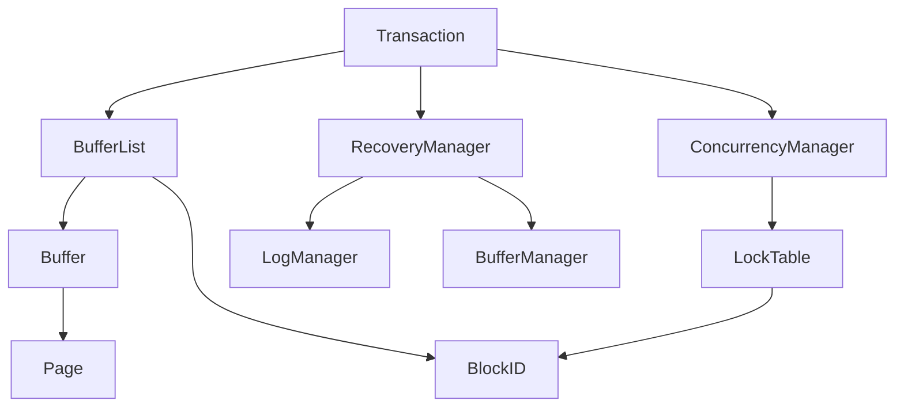

# 项目分析报告：NewDBMS - TX 模块

## 目录
- [模块列表](#模块列表)
- [全局定义](#全局定义)
- [文件详细分析](#文件详细分析)
- [模块依赖图](#模块依赖图)
- [关键数据结构关系图](#关键数据结构关系图)
- [函数调用热点](#函数调用热点)
- [初始化/销毁链](#初始化/销毁链)

## 模块列表

### TX 模块（事务管理）
- Transaction.c / Transaction.h
- BufferList.c / BufferList.h
- concurrency/ConcurrencyManager.c / concurrency/ConcurrencyManager.h
- concurrency/LockTable.c / concurrency/LockTable.h
- recovery/RecoveryManager.c / recovery/RecoveryManager.h
- recovery/LogRecord.c / recovery/LogRecord.h

## 全局定义

### 全局结构体
- Transaction
- ConCurrencyManager
- LockTable
- RecoveryManager
- BufferList
- BlockIDNode
- BufferTEMP
- IntNode

### 全局枚举
- TransactionStatus
- LogRecordCode（在 LogRecord.h 中）

### 全局联合体
- 无

### 全局函数原型
- 详见各模块分析

## 文件详细分析

### TX 模块

#### 文件：`tx/Transaction.h`

**【文件职责】**
提供事务管理的核心定义和操作，用于管理数据库事务的执行。

**【包含的头文件】**
- concurrency/ConcurrencyManager.h
- BufferManager.h
- BufferList.h

**【宏定义】**
| 宏名 | 定义 | 用途 |
|------|------|------|
| Transaction_END_OF_FILE | (-1) | 表示文件结束 |

**【类型定义】**

##### enum `TransactionStatus`
```c
typedef enum {
    TX_TRANSACTION_COMMIT,  ///< 事务已提交
    TX_TRANSACTION_ROLLBACK,  ///< 事务已回滚
    TX_TRANSACTION_RUN,  ///< 事务正在运行
    TX_TRANSACTION_RECOVERY,  ///< 事务正在恢复
} TransactionStatus;
```

| 常量名 | 数值 | 业务含义 | 使用上下文 |
|--------|------|----------|------------|
| TX_TRANSACTION_COMMIT | 0 | 事务已提交 | 事务成功完成 |
| TX_TRANSACTION_ROLLBACK | 1 | 事务已回滚 | 事务失败并回滚 |
| TX_TRANSACTION_RUN | 2 | 事务正在运行 | 事务正在执行中 |
| TX_TRANSACTION_RECOVERY | 3 | 事务正在恢复 | 系统启动时的恢复过程 |

##### struct `Transaction`
```c
typedef struct Transaction{
    TransactionStatus code;  ///< 事务状态
    RecoveryManager *recoveryManager;  ///< 恢复管理器
    ConCurrencyManager *conCurrencyManager;  ///< 并发管理器
    BufferManager *bufferManager;  ///< 缓冲管理器
    FileManager *fileManager;  ///< 文件管理器
    int txNum;  ///< 事务编号
    BufferList *bufferList;  ///< 缓冲区列表
}Transaction;
```

| 字段名 | 类型 | 偏移 | 含义 | 备注 |
|--------|------|------|------|------|
| code | TransactionStatus | 0 | 事务状态 | 枚举值 |
| recoveryManager | RecoveryManager* | 4 | 恢复管理器 | 用于事务恢复 |
| conCurrencyManager | ConCurrencyManager* | 8 | 并发管理器 | 用于并发控制 |
| bufferManager | BufferManager* | 12 | 缓冲管理器 | 用于缓冲区管理 |
| fileManager | FileManager* | 16 | 文件管理器 | 用于文件操作 |
| txNum | int | 20 | 事务编号 | 唯一标识 |
| bufferList | BufferList* | 24 | 缓冲区列表 | 管理事务使用的缓冲区 |

**内存布局分析**：
- 总大小：28 字节（4字节枚举 + 8字节指针 * 5 + 4字节整数）
- 对齐要求：4字节对齐
- 无填充字节

**结构体用途**：表示一个数据库事务，管理事务的执行、并发控制和恢复。

**生命周期**：通过 `TransactionInit()` 创建，无显式销毁函数。

**关联函数**：
- TransactionInit
- TransactionCommit
- TransactionRollback
- TransactionRecover
- TransactionPin
- TransactionUnPin
- TransactionGetInt
- TransactionGetString
- TransactionSetInt
- TransactionSetString
- TransactionSize
- TransactionAppend
- TransactionBlockSize
- TransactionAvailableBuffs
- TransactionToSting

**【函数分析】**

**Transaction* TransactionInit(FileManager* fileManager, LogManager* logManager, BufferManager* bufferManager)**

| 属性 | 内容 |
|------|------|
| 函数签名 | Transaction* TransactionInit(FileManager* fileManager, LogManager* logManager, BufferManager* bufferManager) |
| 功能描述 | 初始化一个新的 Transaction 实例 |
| 参数说明 | fileManager：文件管理器指针<br>logManager：日志管理器指针<br>bufferManager：缓冲管理器指针 |
| 返回值 | 返回初始化后的 Transaction 指针 |
| 前置条件 | fileManager、logManager 和 bufferManager 不为 NULL |
| 后置条件 | Transaction 已初始化，状态为 TX_TRANSACTION_RUN |
| 算法逻辑 | 1. 分配 Transaction 结构体内存<br>2. 生成事务编号<br>3. 初始化各个管理器<br>4. 设置初始状态 |
| 调用关系 | 调用：TransactionNextTxNumber, RecoveryManagerInit, ConCurrencyManagerInit, BufferListInit |
| 错误处理 | 无 |
| 性能特征 | 时间复杂度：O(1)，空间复杂度：O(1) |
| 线程安全 | 不安全 |
| 注意事项 | ⚠️ 未检查 malloc 返回值 |

**void TransactionCommit(Transaction* transaction)**

| 属性 | 内容 |
|------|------|
| 函数签名 | void TransactionCommit(Transaction* transaction) |
| 功能描述 | 提交事务 |
| 参数说明 | transaction：指向 Transaction 实例的指针 |
| 返回值 | 无 |
| 前置条件 | transaction 不为 NULL |
| 后置条件 | 事务被提交，状态变为 TX_TRANSACTION_COMMIT |
| 算法逻辑 | 1. 调用恢复管理器提交事务<br>2. 打印提交信息<br>3. 释放并发管理器的锁<br>4. 取消固定所有缓冲区<br>5. 更新事务状态 |
| 调用关系 | 调用：RecoveryCommit, ConCurrencyManagerRelease, BufferListUnpinAll |
| 错误处理 | 无 |
| 性能特征 | 时间复杂度：O(n)，空间复杂度：O(1) |
| 线程安全 | 不安全 |
| 注意事项 | 无 |

**void TransactionRollback(Transaction* transaction)**

| 属性 | 内容 |
|------|------|
| 函数签名 | void TransactionRollback(Transaction* transaction) |
| 功能描述 | 回滚事务 |
| 参数说明 | transaction：指向 Transaction 实例的指针 |
| 返回值 | 无 |
| 前置条件 | transaction 不为 NULL |
| 后置条件 | 事务被回滚，状态变为 TX_TRANSACTION_ROLLBACK |
| 算法逻辑 | 1. 调用恢复管理器回滚事务<br>2. 打印回滚信息<br>3. 释放并发管理器的锁<br>4. 取消固定所有缓冲区<br>5. 更新事务状态 |
| 调用关系 | 调用：RecoveryRollback, ConCurrencyManagerRelease, BufferListUnpinAll |
| 错误处理 | 无 |
| 性能特征 | 时间复杂度：O(n)，空间复杂度：O(1) |
| 线程安全 | 不安全 |
| 注意事项 | 无 |

**int TransactionGetInt(Transaction* transaction, BlockID *blockId, int offset)**

| 属性 | 内容 |
|------|------|
| 函数签名 | int TransactionGetInt(Transaction* transaction, BlockID *blockId, int offset) |
| 功能描述 | 从指定块中获取整数值 |
| 参数说明 | transaction：指向 Transaction 实例的指针<br>blockId：块 ID<br>offset：偏移量 |
| 返回值 | 返回读取的整数值 |
| 前置条件 | transaction 和 blockId 不为 NULL |
| 后置条件 | 无 |
| 算法逻辑 | 1. 获取共享锁<br>2. 获取缓冲区<br>3. 从页面读取整数 |
| 调用关系 | 调用：ConCurrencyManagerSLock, BufferListGetBuffer, PageGetInt |
| 错误处理 | 无 |
| 性能特征 | 时间复杂度：O(1)，空间复杂度：O(1) |
| 线程安全 | 不安全 |
| 注意事项 | 无 |

**void TransactionSetInt(Transaction* transaction, BlockID *blockId, int offset, int val, bool okToLog)**

| 属性 | 内容 |
|------|------|
| 函数签名 | void TransactionSetInt(Transaction* transaction, BlockID *blockId, int offset, int val, bool okToLog) |
| 功能描述 | 在指定块中设置整数值 |
| 参数说明 | transaction：指向 Transaction 实例的指针<br>blockId：块 ID<br>offset：偏移量<br>val：要设置的整数值<br>okToLog：是否记录日志 |
| 返回值 | 无 |
| 前置条件 | transaction 和 blockId 不为 NULL |
| 后置条件 | 整数值被设置，缓冲区被标记为修改 |
| 算法逻辑 | 1. 获取排他锁<br>2. 获取缓冲区<br>3. 如果需要，记录日志<br>4. 设置整数值<br>5. 标记缓冲区为修改 |
| 调用关系 | 调用：ConCurrencyManagerXLock, BufferListGetBuffer, RecoverySetInt, PageSetInt, BufferSetModified |
| 错误处理 | 无 |
| 性能特征 | 时间复杂度：O(1)，空间复杂度：O(1) |
| 线程安全 | 不安全 |
| 注意事项 | 无 |

#### 文件：`tx/BufferList.h`

**【文件职责】**
提供缓冲区列表的定义和操作，用于管理事务使用的缓冲区。

**【包含的头文件】**
- CMap.h
- Buffer.h
- BufferManager.h
- map.h

**【类型定义】**

##### struct `BlockIDNode`
```c
typedef struct BlockIDNode{
    BlockID *blockId;  ///< 指向BlockID的指针
    struct BlockIDNode* next;  ///< 指向下一个BlockIDNode的指针
}BlockIDNode;
```

| 字段名 | 类型 | 偏移 | 含义 | 备注 |
|--------|------|------|------|------|
| blockId | BlockID* | 0 | 指向BlockID的指针 | 数据块标识符 |
| next | BlockIDNode* | 8 | 指向下一个BlockIDNode的指针 | 链表节点 |

##### struct `BufferTEMP`
```c
typedef struct BufferTEMP{
    Buffer *buffer;  ///< 指向Buffer的指针
}BufferTEMP;
```

| 字段名 | 类型 | 偏移 | 含义 | 备注 |
|--------|------|------|------|------|
| buffer | Buffer* | 0 | 指向Buffer的指针 | 缓冲区指针 |

##### struct `BufferList`
```c
typedef struct BufferList{
    map_Buffer_t *buffers;  ///< Buffer映射表
    BlockIDNode *pin;  ///< 固定的BlockID链表
    BufferManager *bufferManager;  ///< 缓冲管理器
}BufferList;
```

| 字段名 | 类型 | 偏移 | 含义 | 备注 |
|--------|------|------|------|------|
| buffers | map_Buffer_t* | 0 | Buffer映射表 | 存储BlockID到Buffer的映射 |
| pin | BlockIDNode* | 8 | 固定的BlockID链表 | 记录被固定的缓冲区 |
| bufferManager | BufferManager* | 16 | 缓冲管理器 | 用于缓冲区操作 |

**【函数分析】**

**BufferList *BufferListInit(BufferManager *bufferManager)**

| 属性 | 内容 |
|------|------|
| 函数签名 | BufferList *BufferListInit(BufferManager *bufferManager) |
| 功能描述 | 初始化一个新的BufferList实例 |
| 参数说明 | bufferManager：指向BufferManager的指针 |
| 返回值 | 返回初始化后的BufferList指针 |
| 前置条件 | bufferManager 不为 NULL |
| 后置条件 | BufferList 已初始化 |
| 算法逻辑 | 1. 分配 BufferList 结构体内存<br>2. 初始化字段<br>3. 初始化映射表<br>4. 初始化固定链表 |
| 调用关系 | 调用：map_init |
| 错误处理 | 无 |
| 性能特征 | 时间复杂度：O(1)，空间复杂度：O(1) |
| 线程安全 | 不安全 |
| 注意事项 | ⚠️ 未检查 malloc 返回值 |

**Buffer* BufferListGetBuffer(BufferList *bufferList, BlockID *blockId)**

| 属性 | 内容 |
|------|------|
| 函数签名 | Buffer* BufferListGetBuffer(BufferList *bufferList, BlockID *blockId) |
| 功能描述 | 获取指定BlockID对应的Buffer |
| 参数说明 | bufferList：指向BufferList的指针<br>blockId：指向BlockID的指针 |
| 返回值 | 返回对应的Buffer指针 |
| 前置条件 | bufferList 和 blockId 不为 NULL |
| 后置条件 | 无 |
| 算法逻辑 | 1. 在映射表中查找BlockID对应的Buffer |
| 调用关系 | 调用：map_get, BlockID2CString |
| 错误处理 | 无 |
| 性能特征 | 时间复杂度：O(1) 平均，空间复杂度：O(1) |
| 线程安全 | 不安全 |
| 注意事项 | 无 |

**void BufferListPin(BufferList *bufferList, BlockID *blockId)**

| 属性 | 内容 |
|------|------|
| 函数签名 | void BufferListPin(BufferList *bufferList, BlockID *blockId) |
| 功能描述 | 固定指定的BlockID对应的Buffer |
| 参数说明 | bufferList：指向BufferList的指针<br>blockId：指向BlockID的指针 |
| 返回值 | 无 |
| 前置条件 | bufferList 和 blockId 不为 NULL |
| 后置条件 | Buffer 被固定，添加到固定链表中 |
| 算法逻辑 | 1. 调用BufferManagerPin固定缓冲区<br>2. 创建BufferTEMP并存储到映射表<br>3. 创建BlockIDNode并添加到固定链表 |
| 调用关系 | 调用：BufferManagerPin, BufferTEMPInit, map_set, BlockID2CString, BlockIDInit |
| 错误处理 | 无 |
| 性能特征 | 时间复杂度：O(1)，空间复杂度：O(1) |
| 线程安全 | 不安全 |
| 注意事项 | 无 |

**void BufferListUnpin(BufferList *bufferList, BlockID *blockId)**

| 属性 | 内容 |
|------|------|
| 函数签名 | void BufferListUnpin(BufferList *bufferList, BlockID *blockId) |
| 功能描述 | 取消固定指定的BlockID对应的Buffer |
| 参数说明 | bufferList：指向BufferList的指针<br>blockId：指向BlockID的指针 |
| 返回值 | 无 |
| 前置条件 | bufferList 和 blockId 不为 NULL |
| 后置条件 | Buffer 被取消固定，从固定链表中移除 |
| 算法逻辑 | 1. 从映射表中获取Buffer<br>2. 调用BufferManagerUnpin取消固定<br>3. 从固定链表中移除BlockIDNode<br>4. 如果Buffer不再被固定，从映射表中移除 |
| 调用关系 | 调用：map_get, BufferManagerUnpin, BlockIDEqual, map_remove |
| 错误处理 | 无 |
| 性能特征 | 时间复杂度：O(n)，空间复杂度：O(1) |
| 线程安全 | 不安全 |
| 注意事项 | 无 |

#### 文件：`tx/concurrency/ConcurrencyManager.h`

**【文件职责】**
提供并发管理器的定义和操作，用于管理事务的并发控制。

**【包含的头文件】**
- map.h
- LockTable.h

**【类型定义】**

##### struct `ConCurrencyManager`
```c
typedef struct ConCurrencyManager{
    map_str_t * mapStr;  ///< 用于存储锁信息的映射
}ConCurrencyManager;
```

| 字段名 | 类型 | 偏移 | 含义 | 备注 |
|--------|------|------|------|------|
| mapStr | map_str_t* | 0 | 用于存储锁信息的映射 | 记录事务持有的锁 |

**【函数分析】**

**ConCurrencyManager * ConCurrencyManagerInit()**

| 属性 | 内容 |
|------|------|
| 函数签名 | ConCurrencyManager * ConCurrencyManagerInit() |
| 功能描述 | 初始化一个新的 ConCurrencyManager 实例 |
| 参数说明 | 无 |
| 返回值 | 返回初始化后的 ConCurrencyManager 指针 |
| 前置条件 | 无 |
| 后置条件 | ConCurrencyManager 已初始化 |
| 算法逻辑 | 1. 分配 ConCurrencyManager 结构体内存<br>2. 初始化映射表<br>3. 如果锁表未初始化，初始化锁表 |
| 调用关系 | 调用：map_init, LockTableInit |
| 错误处理 | 无 |
| 性能特征 | 时间复杂度：O(1)，空间复杂度：O(1) |
| 线程安全 | 不安全 |
| 注意事项 | ⚠️ 未检查 malloc 返回值 |

**void ConCurrencyManagerSLock(ConCurrencyManager *conCurrencyManager, BlockID *blockId)**

| 属性 | 内容 |
|------|------|
| 函数签名 | void ConCurrencyManagerSLock(ConCurrencyManager *conCurrencyManager, BlockID *blockId) |
| 功能描述 | 获取指定块的共享锁（S锁） |
| 参数说明 | conCurrencyManager：指向 ConCurrencyManager 实例的指针<br>blockId：指向 BlockID 实例的指针，表示要获取锁的块 |
| 返回值 | 无 |
| 前置条件 | conCurrencyManager 和 blockId 不为 NULL |
| 后置条件 | 获得共享锁 |
| 算法逻辑 | 1. 检查是否已持有锁<br>2. 如果没有，获取共享锁<br>3. 记录锁信息 |
| 调用关系 | 调用：BlockIDInit, BlockID2CString, map_get, LockTableSLock, map_set |
| 错误处理 | 无 |
| 性能特征 | 时间复杂度：O(1) 平均，空间复杂度：O(1) |
| 线程安全 | 不安全 |
| 注意事项 | 无 |

**void ConCurrencyManagerXLock(ConCurrencyManager *conCurrencyManager, BlockID* blockId)**

| 属性 | 内容 |
|------|------|
| 函数签名 | void ConCurrencyManagerXLock(ConCurrencyManager *conCurrencyManager, BlockID* blockId) |
| 功能描述 | 获取指定块的排他锁（X锁） |
| 参数说明 | conCurrencyManager：指向 ConCurrencyManager 实例的指针<br>blockId：指向 BlockID 实例的指针，表示要获取锁的块 |
| 返回值 | 无 |
| 前置条件 | conCurrencyManager 和 blockId 不为 NULL |
| 后置条件 | 获得排他锁 |
| 算法逻辑 | 1. 检查是否已持有排他锁<br>2. 如果已持有共享锁，升级为排他锁<br>3. 否则，直接获取排他锁<br>4. 记录锁信息 |
| 调用关系 | 调用：ConCurrencyManagerHasXLock, map_get, LockTableUpgrade, map_set, LockTableXLock |
| 错误处理 | 无 |
| 性能特征 | 时间复杂度：O(1) 平均，空间复杂度：O(1) |
| 线程安全 | 不安全 |
| 注意事项 | 无 |

**void ConCurrencyManagerRelease(ConCurrencyManager *conCurrencyManager)**

| 属性 | 内容 |
|------|------|
| 函数签名 | void ConCurrencyManagerRelease(ConCurrencyManager *conCurrencyManager) |
| 功能描述 | 释放当前事务持有的所有锁 |
| 参数说明 | conCurrencyManager：指向 ConCurrencyManager 实例的指针 |
| 返回值 | 无 |
| 前置条件 | conCurrencyManager 不为 NULL |
| 后置条件 | 所有锁被释放 |
| 算法逻辑 | 1. 遍历所有持有锁的块<br>2. 释放每个块的锁<br>3. 从映射表中移除锁信息 |
| 调用关系 | 调用：map_iter, map_next, LockTableUnLock, BlockIDCString2BlockID, map_remove |
| 错误处理 | 无 |
| 性能特征 | 时间复杂度：O(n)，空间复杂度：O(1) |
| 线程安全 | 不安全 |
| 注意事项 | 无 |

#### 文件：`tx/concurrency/LockTable.h`

**【文件职责】**
提供锁表的定义和操作，用于管理块的锁状态。

**【包含的头文件】**
- map.h
- time.h
- BlockId.h
- Error.h

**【宏定义】**
| 宏名 | 定义 | 用途 |
|------|------|------|
| LockTableTime | 1 | 锁等待时间阈值 |

**【类型定义】**

##### struct `LockTable`
```c
typedef struct LockTable{
    map_int_t *Locks;  ///< 用于存储块锁信息的映射
}LockTable;
```

| 字段名 | 类型 | 偏移 | 含义 | 备注 |
|--------|------|------|------|------|
| Locks | map_int_t* | 0 | 用于存储块锁信息的映射 | 记录块的锁状态 |

**【函数分析】**

**LockTable * LockTableInit()**

| 属性 | 内容 |
|------|------|
| 函数签名 | LockTable * LockTableInit() |
| 功能描述 | 初始化一个新的 LockTable 实例 |
| 参数说明 | 无 |
| 返回值 | 返回初始化后的 LockTable 指针 |
| 前置条件 | 无 |
| 后置条件 | LockTable 已初始化 |
| 算法逻辑 | 1. 分配 LockTable 结构体内存<br>2. 初始化映射表 |
| 调用关系 | 调用：map_init |
| 错误处理 | 无 |
| 性能特征 | 时间复杂度：O(1)，空间复杂度：O(1) |
| 线程安全 | 不安全 |
| 注意事项 | ⚠️ 未检查 malloc 返回值 |

**void LockTableSLock(LockTable* lockTable, BlockID *blockId, Error *error)**

| 属性 | 内容 |
|------|------|
| 函数签名 | void LockTableSLock(LockTable* lockTable, BlockID *blockId, Error *error) |
| 功能描述 | 为指定块获取共享锁（S锁） |
| 参数说明 | lockTable：指向 LockTable 实例的指针<br>blockId：指向 BlockID 实例的指针<br>error：指向 Error 实例的指针，用于存储错误信息 |
| 返回值 | 无 |
| 前置条件 | lockTable、blockId 和 error 不为 NULL |
| 后置条件 | 获得共享锁 |
| 算法逻辑 | 1. 等待直到排他锁被释放<br>2. 如果超时，设置错误信息<br>3. 否则，增加共享锁计数 |
| 调用关系 | 调用：LockTableHasXLock, LockTableWaitToLong, LockTableGetLocalVal, map_set |
| 错误处理 | 超时设置错误信息 |
| 性能特征 | 时间复杂度：O(1) 平均，空间复杂度：O(1) |
| 线程安全 | 不安全 |
| 注意事项 | 无 |

**void LockTableXLock(LockTable* lockTable, BlockID *blockId, Error *error)**

| 属性 | 内容 |
|------|------|
| 函数签名 | void LockTableXLock(LockTable* lockTable, BlockID *blockId, Error *error) |
| 功能描述 | 为指定块获取排他锁（X锁） |
| 参数说明 | lockTable：指向 LockTable 实例的指针<br>blockId：指向 BlockID 实例的指针<br>error：指向 Error 实例的指针，用于存储错误信息 |
| 返回值 | 无 |
| 前置条件 | lockTable、blockId 和 error 不为 NULL |
| 后置条件 | 获得排他锁 |
| 算法逻辑 | 1. 等待直到其他共享锁被释放<br>2. 如果超时，设置错误信息<br>3. 否则，设置排他锁 |
| 调用关系 | 调用：LockTableHasSOtherLock, LockTableWaitToLong, map_set |
| 错误处理 | 超时设置错误信息 |
| 性能特征 | 时间复杂度：O(1) 平均，空间复杂度：O(1) |
| 线程安全 | 不安全 |
| 注意事项 | 无 |

**void LockTableUnLock(LockTable* lockTable, BlockID *blockId)**

| 属性 | 内容 |
|------|------|
| 函数签名 | void LockTableUnLock(LockTable* lockTable, BlockID *blockId) |
| 功能描述 | 释放指定块的锁 |
| 参数说明 | lockTable：指向 LockTable 实例的指针<br>blockId：指向 BlockID 实例的指针 |
| 返回值 | 无 |
| 前置条件 | lockTable 和 blockId 不为 NULL |
| 后置条件 | 锁被释放 |
| 算法逻辑 | 1. 获取当前锁值<br>2. 如果是共享锁且计数大于1，减少计数<br>3. 否则，移除锁 |
| 调用关系 | 调用：map_get, map_set, map_remove |
| 错误处理 | 无 |
| 性能特征 | 时间复杂度：O(1) 平均，空间复杂度：O(1) |
| 线程安全 | 不安全 |
| 注意事项 | 无 |

#### 文件：`tx/recovery/RecoveryManager.h`

**【文件职责】**
提供恢复管理器的定义和操作，用于管理事务的恢复。

**【包含的头文件】**
- LogManager.h
- BufferManager.h
- recovery/LogRecord.h

**【类型定义】**

##### struct `RecoveryManager`
```c
typedef struct RecoveryManager{
    LogManager *logManager;
    BufferManager *bufferManager;
    Transaction *transaction;
    int txNum;
}RecoveryManager;
```

| 字段名 | 类型 | 偏移 | 含义 | 备注 |
|--------|------|------|------|------|
| logManager | LogManager* | 0 | 日志管理器 | 用于日志记录 |
| bufferManager | BufferManager* | 8 | 缓冲管理器 | 用于缓冲区操作 |
| transaction | Transaction* | 12 | 事务 | 关联的事务 |
| txNum | int | 16 | 事务编号 | 唯一标识 |

##### struct `IntNode`
```c
typedef struct IntNode{
    int data;
    struct IntNode*next;
}IntNode;
```

| 字段名 | 类型 | 偏移 | 含义 | 备注 |
|--------|------|------|------|------|
| data | int | 0 | 数据 | 存储整数 |
| next | IntNode* | 4 | 下一个节点 | 链表节点 |

**【函数分析】**

**RecoveryManager *RecoveryManagerInit(Transaction* transaction, int txNum, LogManager *logManager, BufferManager *bufferManager)**

| 属性 | 内容 |
|------|------|
| 函数签名 | RecoveryManager *RecoveryManagerInit(Transaction* transaction, int txNum, LogManager *logManager, BufferManager *bufferManager) |
| 功能描述 | 初始化一个新的 RecoveryManager 实例 |
| 参数说明 | transaction：事务指针<br>txNum：事务编号<br>logManager：日志管理器<br>bufferManager：缓冲管理器 |
| 返回值 | 返回初始化后的 RecoveryManager 指针 |
| 前置条件 | 所有参数不为 NULL |
| 后置条件 | RecoveryManager 已初始化 |
| 算法逻辑 | 1. 分配 RecoveryManager 结构体内存<br>2. 初始化字段<br>3. 写入开始记录到日志 |
| 调用关系 | 调用：StartRecordWriteToLog |
| 错误处理 | 无 |
| 性能特征 | 时间复杂度：O(1)，空间复杂度：O(1) |
| 线程安全 | 不安全 |
| 注意事项 | ⚠️ 未检查 malloc 返回值 |

**void RecoveryCommit(RecoveryManager *recoveryManager)**

| 属性 | 内容 |
|------|------|
| 函数签名 | void RecoveryCommit(RecoveryManager *recoveryManager) |
| 功能描述 | 提交事务 |
| 参数说明 | recoveryManager：指向 RecoveryManager 实例的指针 |
| 返回值 | 无 |
| 前置条件 | recoveryManager 不为 NULL |
| 后置条件 | 事务被提交 |
| 算法逻辑 | 1. 刷新所有缓冲区<br>2. 写入提交记录到日志<br>3. 刷新日志 |
| 调用关系 | 调用：BufferManagerFlushAll, CommitRecordWriteToLog, LogManagerFlushLSN |
| 错误处理 | 无 |
| 性能特征 | 时间复杂度：O(n)，空间复杂度：O(1) |
| 线程安全 | 不安全 |
| 注意事项 | 无 |

**void RecoveryRollback(RecoveryManager* recoveryManager)**

| 属性 | 内容 |
|------|------|
| 函数签名 | void RecoveryRollback(RecoveryManager* recoveryManager) |
| 功能描述 | 回滚事务 |
| 参数说明 | recoveryManager：指向 RecoveryManager 实例的指针 |
| 返回值 | 无 |
| 前置条件 | recoveryManager 不为 NULL |
| 后置条件 | 事务被回滚 |
| 算法逻辑 | 1. 执行回滚操作<br>2. 刷新所有缓冲区<br>3. 写入回滚记录到日志<br>4. 刷新日志 |
| 调用关系 | 调用：RecoveryDoRollback, BufferManagerFlushAll, RollbackRecordWriteToLog, LogManagerFlushLSN |
| 错误处理 | 无 |
| 性能特征 | 时间复杂度：O(n)，空间复杂度：O(1) |
| 线程安全 | 不安全 |
| 注意事项 | 无 |

**int RecoverySetInt(RecoveryManager* recoveryManager, Buffer* buffer, int offset, int newVal)**

| 属性 | 内容 |
|------|------|
| 函数签名 | int RecoverySetInt(RecoveryManager* recoveryManager, Buffer* buffer, int offset, int newVal) |
| 功能描述 | 记录设置整数的操作到日志 |
| 参数说明 | recoveryManager：指向 RecoveryManager 实例的指针<br>buffer：缓冲区<br>offset：偏移量<br>newVal：新值 |
| 返回值 | 返回日志序列号 |
| 前置条件 | 所有参数不为 NULL |
| 后置条件 | 操作被记录到日志 |
| 算法逻辑 | 1. 读取旧值<br>2. 获取块 ID<br>3. 写入设置整数记录到日志 |
| 调用关系 | 调用：PageGetInt, SetIntRecordWriteToLog |
| 错误处理 | 无 |
| 性能特征 | 时间复杂度：O(1)，空间复杂度：O(1) |
| 线程安全 | 不安全 |
| 注意事项 | 无 |

## 模块依赖图

```mermaid
graph TD
    subgraph TX
        Transaction
        BufferList
        ConcurrencyManager
        LockTable
        RecoveryManager
    end

    subgraph Buffer
        BufferManager
        Buffer
    end

    subgraph File
        FileManager
        BlockID
    end

    subgraph Log
        LogManager
    end

    Transaction --> BufferList
    Transaction --> ConcurrencyManager
    Transaction --> RecoveryManager
    Transaction --> BufferManager
    Transaction --> FileManager
    BufferList --> BufferManager
    BufferList --> Buffer
    BufferList --> BlockID
    ConcurrencyManager --> LockTable
    ConcurrencyManager --> BlockID
    RecoveryManager --> LogManager
    RecoveryManager --> BufferManager
    RecoveryManager --> Transaction
```

## 关键数据结构关系图



## 函数调用热点

| 函数名 | 调用次数 | 说明 |
|--------|----------|------|
| TransactionGetInt | 高频 | 读取整数数据 |
| TransactionSetInt | 高频 | 设置整数数据 |
| TransactionGetString | 高频 | 读取字符串数据 |
| TransactionSetString | 高频 | 设置字符串数据 |
| BufferListGetBuffer | 高频 | 获取缓冲区 |
| ConCurrencyManagerSLock | 高频 | 获取共享锁 |
| ConCurrencyManagerXLock | 高频 | 获取排他锁 |
| RecoverySetInt | 高频 | 记录整数修改 |
| RecoverySetString | 高频 | 记录字符串修改 |

## 初始化/销毁链

**初始化顺序**：
1. FileManagerInit() - 初始化文件管理器
2. LogManagerInit() - 初始化日志管理器
3. BufferManagerInit() - 初始化缓冲管理器
4. TransactionInit() - 初始化事务
   - RecoveryManagerInit() - 初始化恢复管理器
   - ConCurrencyManagerInit() - 初始化并发管理器
     - LockTableInit() - 初始化锁表
   - BufferListInit() - 初始化缓冲区列表

**销毁顺序**：
1. TransactionCommit() / TransactionRollback() - 提交或回滚事务
   - ConCurrencyManagerRelease() - 释放锁
   - BufferListUnpinAll() - 取消固定所有缓冲区
2. 其他资源释放
