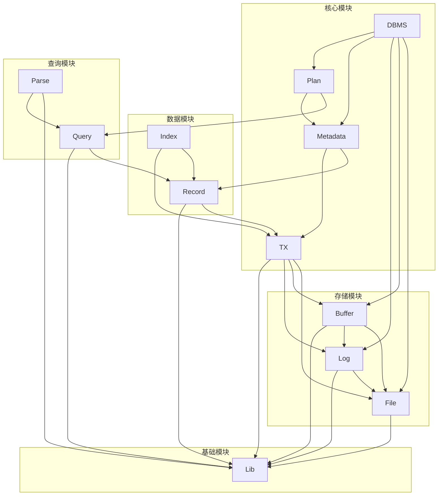
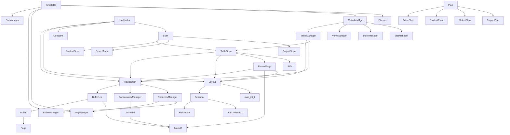

# 项目分析报告：NewDBMS

## 目录
- [模块列表](#模块列表)
- [全局定义](#全局定义)
- [文件详细分析](#文件详细分析)
- [模块依赖图](#模块依赖图)
- [关键数据结构关系图](#关键数据结构关系图)
- [函数调用热点](#函数调用热点)
- [初始化/销毁链](#初始化/销毁链)

## 模块列表

| 模块 | 主要职责 | 文件列表 |
|------|---------|--------|
| Lib | 基础数据结构 | ByteBuffer.c/h, CVector.c/h, CMap.c/h, RBT.c/h, List.c/h, Trie.c/h, CString.c/h, StreamTokenizer.c/h, Error.c/h |
| File | 文件管理 | BlockID.c/h, Page.c/h, FileManager.c/h |
| Log | 日志管理 | LogManager.c/h |
| Buffer | 缓冲区管理 | Buffer.c/h, BufferManager.c/h, LRU/LRUPolicy.c/h, LRU/LRUCore.c/h |
| TX | 事务管理 | Transaction.c/h, TransactionManager.c/h, BufferList.c/h, concurrency/ConcurrencyManager.c/h, concurrency/LockTable.c/h, concurrency/DeadlockDetector.c/h, recovery/RecoveryManager.c/h, recovery/LogRecord.c/h |
| Record | 记录管理 | Schema.c/h, Layout.c/h, RID.c/h, RecordPage.c/h, TableScan.c/h |
| Metadata | 元数据管理 | TableManager.c/h, ViewManager.c/h, IndexManager.c/h, StatManager.c/h, MetadataManager.c/h, IndexInfo.c/h, StatInfo.c/h |
| Index | 索引管理 | HashIndex.c/h |
| Query | 查询处理 | Constant.c/h, Expression.c/h, Scan.c/h, SelectScan.c/h, ProjectScan.c/h, ProductScan.c/h, Term.c/h, Predicate.c/h, UpdateScan.c/h |
| Plan | 查询计划 | Plan.c/h, TablePlan.c/h, SelectPlan.c/h, ProjectPlan.c/h, ProductPlan.c/h, 
asicQueryPlanner.c/h, BasicUpdatePlanner.c/h, BetterQueryPlanner.c/h, OptimizedProductPlan.c/h, Planner.c/h |
| Parse | SQL解析 | Lexer.c/h, Parser.c/h, PredParser.c/h, CreateTableData.c/h, CreateIndexData.c/h, CreateViewData.c/h, InsertData.c/h, DeleteData.c/h, ModifyData.c/h, QueryData.c/h |
| DBMS | 系统入口 | DBMS.c/h |

## 全局定义

### 全局结构体

| 结构体名 | 所在文件 | 主要用途 |
|---------|---------|--------|
| ByteBuffer | Lib/ByteBuffer.h | 字节缓冲区，用于数据序列化和反序列化 |
| CVector | Lib/CVector.h | 通用动态数组 |
| CMap | Lib/CMap.h | 基于红黑树的哈希表 |
| RBT | Lib/RBT.h | 红黑树实现 |
| List | Lib/List.h | 链表实现 |
| Trie | Lib/Trie.h | 前缀树实现 |
| CString | Lib/CString.h | 字符串处理 |
| BlockID | File/BlockID.h | 块标识符 |
| Page | File/Page.h | 内存页抽象 |
| FileManager | File/FileManager.h | 文件系统管理 |
| LogManager | Log/LogManager.h | 日志管理 |
| Buffer | Buffer/Buffer.h | 缓冲区管理 |
| BufferManager | Buffer/BufferManager.h | 缓冲区池管理 |
| Transaction | TX/Transaction.h | 事务管理 |
| ConcurrencyManager | TX/concurrency/ConcurrencyManager.h | 并发控制 |
| LockTable | TX/concurrency/LockTable.h | 锁表管理 |
| DeadlockDetector | TX/concurrency/DeadlockDetector.h | 死锁检测 |
| RecoveryManager | TX/recovery/RecoveryManager.h | 恢复管理 |
| LogRecord | TX/recovery/LogRecord.h | 日志记录 |
| Schema | Record/Schema.h | 表结构定义 |
| Layout | Record/Layout.h | 记录布局 |
| RID | Record/RID.h | 记录标识符 |
| RecordPage | Record/RecordPage.h | 记录页管理 |
| TableScan | Record/TableScan.h | 表扫描 |
| TableManager | Metadata/TableManager.h | 表管理 |
| ViewManager | Metadata/ViewManager.h | 视图管理 |
| IndexManager | Metadata/IndexManager.h | 索引管理 |
| StatManager | Metadata/StatManager.h | 统计信息管理 |
| MetadataManager | Metadata/MetadataManager.h | 元数据管理 |
| HashIndex | Index/HashIndex.h | 哈希索引实现 |
| Constant | Query/Constant.h | 常量值 |
| Expression | Query/Expression.h | 查询表达式 |
| Scan | Query/Scan.h | 扫描器接口 |
| SelectScan | Query/SelectScan.h | 选择扫描 |
| ProjectScan | Query/ProjectScan.h | 投影扫描 |
| ProductScan | Query/ProductScan.h | 乘积扫描 |
| Term | Query/Term.h | 查询条件术语 |
| Predicate | Query/Predicate.h | 查询谓词 |
| Plan | Plan/Plan.h | 查询计划 |
| TablePlan | Plan/TablePlan.h | 表查询计划 |
| SelectPlan | Plan/SelectPlan.h | 选择查询计划 |
| ProjectPlan | Plan/ProjectPlan.h | 投影查询计划 |
| ProductPlan | Plan/ProductPlan.h | 乘积查询计划 |
| Planner | Plan/Planner.h | 查询计划生成器 |
| Lexer | Parse/Lexer.h | 词法分析器 |
| Parser | Parse/Parser.h | 语法分析器 |
| SimpleDB | DBMS/DBMS.h | 数据库系统入口 |

### 全局枚举

| 枚举名 | 所在文件 | 主要用途 |
|-------|---------|--------|
| ByteBufferError | Lib/ByteBuffer.h | 字节缓冲区错误类型 |
| CVectorError | Lib/CVector.h | 向量错误类型 |
| RecordPageCode | Record/RecordPage.h | 记录页状态 |
| ScanCode | Query/Scan.h | 扫描类型 |
| PLAN_CODE | Plan/Plan.h | 计划类型 |
| TransactionStatus | TX/Transaction.h | 事务状态 |
| LogRecordCode | TX/recovery/LogRecord.h | 日志记录类型 |

### 全局联合体

| 联合体名 | 所在文件 | 主要用途 |
|---------|---------|--------|
| ScanUnion | Query/Scan.h | 不同类型扫描的联合 |
| PlanUnion | Plan/Plan.h | 不同类型计划的联合 |
| Constant.value | Query/Constant.h | 常量值的联合 |

## 文件详细分析

### Lib 模块

#### 文件：`Lib/ByteBuffer.h`

**【文件职责】**
提供字节缓冲区操作功能，支持各种数据类型的读写操作。

**【包含的头文件】**
- stdint.h
- malloc.h
- CString.h

**【宏定义】**
| 宏名 | 定义 | 用途 |
|------|------|------|
| CHECK_BUFFER | `do { if (!(b)) return BYTEBUFFER_ERROR_NULL; } while (0)` | 检查缓冲区是否为空 |
| CHECK_BOUNDS | `do { if ((b)->position + (s) > (b)->limit) return BYTEBUFFER_ERROR_BOUNDS; } while (0)` | 检查读写是否越界 |

**【类型定义】**

##### struct `ByteBuffer`
```c
typedef struct ByteBuffer{
    uint8_t *data;
    uint64_t size;
    uint64_t position;
    uint64_t limit;
}ByteBuffer;
```

| 字段名 | 类型 | 偏移 | 含义 | 备注 |
|--------|------|------|------|------|
| data | uint8_t* | 0 | 缓冲区数据指针 | 存储实际数据 |
| size | uint64_t | 8 | 缓冲区总大小 | 字节数 |
| position | uint64_t | 16 | 当前读写位置 | 下一个操作的位置 |
| limit | uint64_t | 24 | 缓冲区限制 | 最大可操作位置 |

**内存布局分析**：
- 总大小：32 字节（4个8字节字段）
- 对齐要求：8字节对齐
- 无填充字节

**结构体用途**：表示一个可读写的字节缓冲区，用于数据的序列化和反序列化。

**生命周期**：通过 `bufferAllocate()` 创建，`bufferFree()` 销毁。

**关联函数**：
- bufferAllocate
- bufferClear
- bufferFree
- bufferCompact
- bufferFlip
- bufferPut* 系列
- bufferGet* 系列

##### enum `ByteBufferError`
```c
typedef enum {
    BYTEBUFFER_OK = 0,        ///< 操作成功
    BYTEBUFFER_ERROR_NULL,    ///< 空指针错误
    BYTEBUFFER_ERROR_BOUNDS,  ///< 越界访问错误
} ByteBufferError;
```

| 常量名 | 数值 | 业务含义 | 使用上下文 |
|--------|------|----------|------------|
| BYTEBUFFER_OK | 0 | 操作成功 | 所有成功的缓冲区操作 |
| BYTEBUFFER_ERROR_NULL | 1 | 空指针错误 | 当缓冲区或数据指针为 NULL 时 |
| BYTEBUFFER_ERROR_BOUNDS | 2 | 越界访问错误 | 当读写位置超出缓冲区限制时 |

**【函数分析】**

**ByteBuffer* bufferAllocate(uint64_t size)**

| 属性 | 内容 |
|------|------|
| 函数签名 | ByteBuffer* bufferAllocate(uint64_t size) |
| 功能描述 | 分配一个新的 ByteBuffer 实例，并为其分配指定大小的内存 |
| 参数说明 | size：缓冲区的大小（以字节为单位） |
| 返回值 | 指向分配的 ByteBuffer 的指针；如果分配失败，返回 NULL |
| 前置条件 | size > 0 |
| 后置条件 | 返回的 ByteBuffer 已初始化，position 为 0，limit 为 size |
| 算法逻辑 | 1. 检查 size 是否大于 0<br>2. 分配 ByteBuffer 结构体内存<br>3. 分配数据缓冲区内存<br>4. 调用 bufferClear 初始化 |
| 调用关系 | 调用：bufferClear |
| 错误处理 | 内存分配失败时返回 NULL |
| 性能特征 | 时间复杂度：O(1)，空间复杂度：O(size) |
| 线程安全 | 不安全 |
| 注意事项 | ⚠️ 未检查 malloc 返回值 |

**void bufferClear(ByteBuffer* buffer)**

| 属性 | 内容 |
|------|------|
| 函数签名 | void bufferClear(ByteBuffer* buffer) |
| 功能描述 | 清除缓冲区，将其所有字节设置为零，并将 position 设为 0，将 limit 设为缓冲区的大小 |
| 参数说明 | buffer：指向要清除的 ByteBuffer 的指针 |
| 返回值 | 无 |
| 前置条件 | buffer 不为 NULL |
| 后置条件 | 缓冲区数据被清零，position = 0，limit = size |
| 算法逻辑 | 1. 检查 buffer 是否为 NULL<br>2. 使用 memset 清零数据<br>3. 重置 position 和 limit |
| 调用关系 | 无 |
| 错误处理 | 无 |
| 性能特征 | 时间复杂度：O(size)，空间复杂度：O(1) |
| 线程安全 | 不安全 |
| 注意事项 | 无 |

**void bufferFree(ByteBuffer* buffer)**

| 属性 | 内容 |
|------|------|
| 函数签名 | void bufferFree(ByteBuffer* buffer) |
| 功能描述 | 释放 ByteBuffer 实例及其数据内存 |
| 参数说明 | buffer：指向要释放的 ByteBuffer 的指针 |
| 返回值 | 无 |
| 前置条件 | buffer 不为 NULL |
| 后置条件 | 内存被释放 |
| 算法逻辑 | 1. 释放数据缓冲区<br>2. 释放 ByteBuffer 结构体 |
| 调用关系 | 无 |
| 错误处理 | 无 |
| 性能特征 | 时间复杂度：O(1)，空间复杂度：O(1) |
| 线程安全 | 不安全 |
| 注意事项 | 无 |

**ByteBufferError bufferPut(ByteBuffer* buffer, uint8_t data)**

| 属性 | 内容 |
|------|------|
| 函数签名 | ByteBufferError bufferPut(ByteBuffer* buffer, uint8_t data) |
| 功能描述 | 将一个字节数据写入缓冲区当前位置 |
| 参数说明 | buffer：指向 ByteBuffer 的指针<br>data：要写入的数据（一个字节） |
| 返回值 | 如果写入成功，返回 BYTEBUFFER_OK；否则返回相应的错误代码 |
| 前置条件 | buffer 不为 NULL，buffer->data 不为 NULL |
| 后置条件 | 数据被写入，position 增加 1 |
| 算法逻辑 | 1. 检查参数有效性<br>2. 检查是否越界<br>3. 写入数据<br>4. 更新 position |
| 调用关系 | 无 |
| 错误处理 | 参数无效返回 BYTEBUFFER_ERROR_NULL，越界返回 BYTEBUFFER_ERROR_BOUNDS |
| 性能特征 | 时间复杂度：O(1)，空间复杂度：O(1) |
| 线程安全 | 不安全 |
| 注意事项 | 无 |

**ByteBufferError bufferGet(ByteBuffer* buffer, uint8_t *output)**

| 属性 | 内容 |
|------|------|
| 函数签名 | ByteBufferError bufferGet(ByteBuffer* buffer, uint8_t *output) |
| 功能描述 | 从缓冲区当前位置读取一个字节数据 |
| 参数说明 | buffer：指向 ByteBuffer 的指针<br>output：指向用于存储读取数据的指针 |
| 返回值 | 如果读取成功，返回 BYTEBUFFER_OK；否则返回相应的错误代码 |
| 前置条件 | buffer 不为 NULL，buffer->data 不为 NULL，output 不为 NULL |
| 后置条件 | 数据被读取到 output，position 增加 1 |
| 算法逻辑 | 1. 检查参数有效性<br>2. 检查是否越界<br>3. 读取数据<br>4. 更新 position |
| 调用关系 | 无 |
| 错误处理 | 参数无效返回 BYTEBUFFER_ERROR_NULL，越界返回 BYTEBUFFER_ERROR_BOUNDS |
| 性能特征 | 时间复杂度：O(1)，空间复杂度：O(1) |
| 线程安全 | 不安全 |
| 注意事项 | 无 |

#### 文件：`Lib/CVector.h`

**【文件职责】**
提供通用的动态数组实现，支持任意类型的元素存储和操作。

**【包含的头文件】**
- stddef.h

**【宏定义】**
| 宏名 | 定义 | 用途 |
|------|------|------|
| VECTOR_INIT_CAPACITY | 32 | 向量的初始容量 |

**【类型定义】**

##### struct `CVector`
```c
typedef struct CVector {
    void* data;             // 元素存储区
    size_t size;            // 当前元素个数
    size_t capacity;        // 当前容量（元素个数）
    size_t elem_size;       // 每个元素的大小（单位：字节）
    void (*Destory)(void*);
    int (*CMP)(const void*,const void *);
    void (*Copy)(void*dest,const void*src);

} CVector;
```

| 字段名 | 类型 | 偏移 | 含义 | 备注 |
|--------|------|------|------|------|
| data | void* | 0 | 元素存储区指针 | 指向实际数据 |
| size | size_t | 8 | 当前元素个数 | 已存储的元素数量 |
| capacity | size_t | 16 | 当前容量 | 可存储的最大元素数量 |
| elem_size | size_t | 24 | 每个元素的大小 | 字节数 |
| Destory | void (*)(void*) | 32 | 元素销毁函数 | 可选 |
| CMP | int (*)(const void*,const void *) | 40 | 元素比较函数 | 可选 |
| Copy | void (*)(void*,const void*) | 48 | 元素复制函数 | 可选 |

**内存布局分析**：
- 总大小：56 字节（4个8字节字段 + 3个函数指针）
- 对齐要求：8字节对齐
- 无填充字节

**结构体用途**：表示一个动态增长的数组，支持任意类型的元素。

**生命周期**：通过 `CVectorInit()` 创建，`CVectorDestroy()` 销毁。

**关联函数**：
- CVectorInit
- CVectorDestroy
- CVectorPushBack
- CVectorPopBack
- CVectorAt
- CVectorBegin
- CVectorEnd
- CVectorNext
- CVectorPrev
- CVectorClear
- CVectorInsert
- CVectorErase
- CVectorFind
- CVectorSet
- CVectorResize

##### struct `CVectorIterator`
```c
typedef struct {
    void*data;
    size_t elem_size;
}CVectorIterator;
```

| 字段名 | 类型 | 偏移 | 含义 | 备注 |
|--------|------|------|------|------|
| data | void* | 0 | 当前元素指针 | 指向迭代器当前位置 |
| elem_size | size_t | 8 | 元素大小 | 字节数 |

**【函数分析】**

**CVector *CVectorInit(size_t elem_size, void (*Destory)(void*), int (*CMP)(const void*, const void *), void (*Copy)(void*, const void*))**

| 属性 | 内容 |
|------|------|
| 函数签名 | CVector *CVectorInit(size_t elem_size, void (*Destory)(void*), int (*CMP)(const void*, const void *), void (*Copy)(void*, const void*)) |
| 功能描述 | 初始化一个新的 CVector |
| 参数说明 | elem_size：元素大小（以字节为单位）<br>Destory：元素的销毁函数<br>CMP：元素的比较函数<br>Copy：元素的复制函数 |
| 返回值 | 返回初始化后的 CVector 指针 |
| 前置条件 | elem_size > 0 |
| 后置条件 | 返回的 CVector 已初始化，size 为 0，capacity 为 VECTOR_INIT_CAPACITY |
| 算法逻辑 | 1. 分配 CVector 结构体内存<br>2. 初始化字段<br>3. 分配初始数据内存 |
| 调用关系 | 无 |
| 错误处理 | 无 |
| 性能特征 | 时间复杂度：O(1)，空间复杂度：O(VECTOR_INIT_CAPACITY * elem_size) |
| 线程安全 | 不安全 |
| 注意事项 | ⚠️ 未检查 malloc 返回值 |

**void CVectorDestroy(CVector* vec)**

| 属性 | 内容 |
|------|------|
| 函数签名 | void CVectorDestroy(CVector* vec) |
| 功能描述 | 销毁 CVector，释放内存 |
| 参数说明 | vec：指向要销毁的 CVector 对象 |
| 返回值 | 无 |
| 前置条件 | vec 不为 NULL |
| 后置条件 | 内存被释放 |
| 算法逻辑 | 1. 如果有 Destory 函数，调用它销毁所有元素<br>2. 释放数据内存<br>3. 释放 CVector 结构体 |
| 调用关系 | 调用：CVectorAt |
| 错误处理 | 无 |
| 性能特征 | 时间复杂度：O(size)，空间复杂度：O(1) |
| 线程安全 | 不安全 |
| 注意事项 | 无 |

**void CVectorPushBack(CVector* vec, const void* value)**

| 属性 | 内容 |
|------|------|
| 函数签名 | void CVectorPushBack(CVector* vec, const void* value) |
| 功能描述 | 在尾部添加一个元素 |
| 参数说明 | vec：指向 CVector<br>value：指向要添加的元素数据 |
| 返回值 | 无 |
| 前置条件 | vec 不为 NULL，value 不为 NULL |
| 后置条件 | 元素被添加到尾部，size 增加 1 |
| 算法逻辑 | 1. 检查是否需要扩容<br>2. 计算目标位置<br>3. 复制元素<br>4. 更新 size |
| 调用关系 | 无 |
| 错误处理 | 扩容失败时打印错误信息 |
| 性能特征 | 时间复杂度：O(1) 平均，O(n) 最坏（扩容时），空间复杂度：O(1) 平均 |
| 线程安全 | 不安全 |
| 注意事项 | 无 |

### File 模块

#### 文件：`File/BlockID.h`

**【文件职责】**
提供数据块标识符的定义和操作，用于标识文件中的特定数据块。

**【包含的头文件】**
- CString.h
- stdbool.h

**【类型定义】**

##### struct `BlockID`
```c
typedef struct BlockID {
    CString *fileName;
    int BlockID;
}BlockID;
```

| 字段名 | 类型 | 偏移 | 含义 | 备注 |
|--------|------|------|------|------|
| fileName | CString* | 0 | 文件名字符串 | 数据块所属的文件 |
| BlockID | int | 8 | 数据块编号 | 文件内的数据块索引 |

**内存布局分析**：
- 总大小：12 字节（8字节指针 + 4字节整数）
- 对齐要求：8字节对齐
- 无填充字节

**结构体用途**：表示一个数据块的唯一标识符，由文件名和块编号组成。

**生命周期**：通过 `BlockIDInit()` 创建，`BlockIDDestroy()` 销毁。

**关联函数**：
- BlockIDInit
- BlockIDGetFileName
- BlockIDGetBlockID
- BlockID2CString
- BlockIDEqual
- BlockIDCString2BlockID
- BlockIDDestroy

**【函数分析】**

**BlockID *BlockIDInit(CString *name, int id)**

| 属性 | 内容 |
|------|------|
| 函数签名 | BlockID *BlockIDInit(CString *name, int id) |
| 功能描述 | 初始化一个新的 BlockID 实例 |
| 参数说明 | name：文件名字符串<br>id：数据块的编号 |
| 返回值 | 返回初始化后的 BlockID 指针；如果初始化失败，返回 NULL |
| 前置条件 | name 不为 NULL |
| 后置条件 | BlockID 已初始化 |
| 算法逻辑 | 1. 检查 name 是否为 NULL<br>2. 分配 BlockID 结构体内存<br>3. 复制文件名<br>4. 设置块编号 |
| 调用关系 | 调用：CStringCreateFromCString |
| 错误处理 | name 为 NULL 时返回 NULL |
| 性能特征 | 时间复杂度：O(1)，空间复杂度：O(1) |
| 线程安全 | 不安全 |
| 注意事项 | 无 |

**bool BlockIDEqual(BlockID *b1, BlockID *b2)**

| 属性 | 内容 |
|------|------|
| 函数签名 | bool BlockIDEqual(BlockID *b1, BlockID *b2) |
| 功能描述 | 比较两个 BlockID 是否相等 |
| 参数说明 | b1：第一个 BlockID 结构体<br>b2：第二个 BlockID 结构体 |
| 返回值 | 如果两个 BlockID 相等，则返回 true；否则返回 false |
| 前置条件 | b1 和 b2 不为 NULL |
| 后置条件 | 无 |
| 算法逻辑 | 1. 比较块编号<br>2. 比较文件名 |
| 调用关系 | 调用：BlockIDGetBlockID, BlockIDGetFileName, CStringEqual |
| 错误处理 | 无 |
| 性能特征 | 时间复杂度：O(1)，空间复杂度：O(1) |
| 线程安全 | 不安全 |
| 注意事项 | 无 |

#### 文件：`File/Page.h`

**【文件职责】**
提供内存页面的定义和操作，用于存储和管理数据块。

**【包含的头文件】**
- ByteBuffer.h
- CString.h

**【类型定义】**

##### struct `Page`
```c
typedef struct Page{
    ByteBuffer *buffer;
}Page;
```

| 字段名 | 类型 | 偏移 | 含义 | 备注 |
|--------|------|------|------|------|
| buffer | ByteBuffer* | 0 | 字节缓冲区指针 | 存储页面数据 |

**内存布局分析**：
- 总大小：8 字节（指针）
- 对齐要求：8字节对齐
- 无填充字节

**结构体用途**：表示一个内存页面，用于存储和管理数据块。

**生命周期**：通过 `PageInit()` 或 `PageInitBytes()` 创建，`PageDestroy()` 销毁。

**关联函数**：
- PageInit
- PageInitBytes
- PageGetInt
- PageSetInt
- PageGetShort
- PageGetLong
- PageGetString
- PageSetString
- PageSetBytes
- PageGetBytes
- PageMaxLength
- PageDestroy
- PageSetBytesRaw
- PageGetBytesRaw

**【函数分析】**

**Page *PageInit(int size)**

| 属性 | 内容 |
|------|------|
| 函数签名 | Page *PageInit(int size) |
| 功能描述 | 初始化一个新的 Page 实例，并分配指定大小的缓冲区 |
| 参数说明 | size：要分配给页面的缓冲区大小（以字节为单位） |
| 返回值 | 返回初始化后的 Page 指针 |
| 前置条件 | size > 0 |
| 后置条件 | Page 已初始化，buffer 已分配 |
| 算法逻辑 | 1. 分配 Page 结构体内存<br>2. 调用 bufferAllocate 分配缓冲区 |
| 调用关系 | 调用：bufferAllocate |
| 错误处理 | 无 |
| 性能特征 | 时间复杂度：O(1)，空间复杂度：O(size) |
| 线程安全 | 不安全 |
| 注意事项 | 无 |

**int PageGetInt(Page *p, int position)**

| 属性 | 内容 |
|------|------|
| 函数签名 | int PageGetInt(Page *p, int position) |
| 功能描述 | 从页面中读取一个整数（int 类型） |
| 参数说明 | p：指向 Page 的指针<br>position：数据在页面中的偏移量 |
| 返回值 | 返回读取的整数值 |
| 前置条件 | p 不为 NULL，position 有效 |
| 后置条件 | 无 |
| 算法逻辑 | 1. 调用 bufferGetIntPosition 读取数据 |
| 调用关系 | 调用：bufferGetIntPosition |
| 错误处理 | 无 |
| 性能特征 | 时间复杂度：O(1)，空间复杂度：O(1) |
| 线程安全 | 不安全 |
| 注意事项 | 无 |

**void PageSetInt(Page *p, int position, int data)**

| 属性 | 内容 |
|------|------|
| 函数签名 | void PageSetInt(Page *p, int position, int data) |
| 功能描述 | 在页面中设置一个整数（int 类型） |
| 参数说明 | p：指向 Page 的指针<br>position：数据在页面中的偏移量<br>data：要写入的整数值 |
| 返回值 | 无 |
| 前置条件 | p 不为 NULL，position 有效 |
| 后置条件 | 数据被写入到页面中 |
| 算法逻辑 | 1. 调用 bufferPutIntPosition 写入数据 |
| 调用关系 | 调用：bufferPutIntPosition |
| 错误处理 | 无 |
| 性能特征 | 时间复杂度：O(1)，空间复杂度：O(1) |
| 线程安全 | 不安全 |
| 注意事项 | 无 |

#### 文件：`File/FileManager.h`

**【文件职责】**
提供文件系统管理功能，包括文件的读写、创建和管理。

**【包含的头文件】**
- BlockId.h
- Page.h
- stdio.h
- stdlib.h
- sys/types.h
- dirent.h
- stdbool.h
- malloc.h
- unistd.h
- CMap.h
- rwlock.h

**【类型定义】**

##### struct `FileManager`
```c
typedef struct FileManager{
    CString* dbDirectoryName; // 数据库目录名称。
    DIR *dbDirectory;      // 数据库目录的句柄。
    int blockSize;         // 文件系统的块大小。
    bool isNew;            // 标记数据库是否为新创建。
    CMap cMap;
//    RWLock *rwLock;
}FileManager;
```

| 字段名 | 类型 | 偏移 | 含义 | 备注 |
|--------|------|------|------|------|
| dbDirectoryName | CString* | 0 | 数据库目录名称 | 存储数据库文件的目录 |
| dbDirectory | DIR* | 8 | 数据库目录的句柄 | 用于目录操作 |
| blockSize | int | 16 | 文件系统的块大小 | 字节数 |
| isNew | bool | 20 | 标记数据库是否为新创建 | true 表示新创建 |
| cMap | CMap | 24 | 文件指针映射 | 存储打开的文件 |

**结构体用途**：表示文件系统管理器，负责文件的读写和管理。

**生命周期**：通过 `FileManagerInit()` 创建，`FileManagerDestroy()` 销毁。

**关联函数**：
- FileManagerInit
- FileManagerRead
- FileManagerWrite
- FileManagerDestroy
- FileManagerLength
- FileManagerAppend
- FileManagerGetFile

**【函数分析】**

**FileManager *FileManagerInit(CString *dbDirectoryName, int blockSize)**

| 属性 | 内容 |
|------|------|
| 函数签名 | FileManager *FileManagerInit(CString *dbDirectoryName, int blockSize) |
| 功能描述 | 初始化一个新的 FileManager 实例 |
| 参数说明 | dbDirectoryName：数据库目录的路径<br>blockSize：文件系统中的块大小 |
| 返回值 | 返回初始化后的 FileManager 指针 |
| 前置条件 | dbDirectoryName 不为 NULL，blockSize > 0 |
| 后置条件 | FileManager 已初始化，目录已创建（如果不存在） |
| 算法逻辑 | 1. 检查参数有效性<br>2. 分配 FileManager 结构体内存<br>3. 初始化字段<br>4. 打开目录<br>5. 如果目录不存在，创建它<br>6. 初始化文件指针映射 |
| 调用关系 | 调用：CStringCreateFromCString, opendir, mkdir, CMapInit |
| 错误处理 | 参数无效时返回 NULL，创建目录失败时返回 NULL |
| 性能特征 | 时间复杂度：O(1)，空间复杂度：O(1) |
| 线程安全 | 不安全 |
| 注意事项 | 无 |

**void FileManagerRead(FileManager *fm, BlockID *blockId, Page *page)**

| 属性 | 内容 |
|------|------|
| 函数签名 | void FileManagerRead(FileManager *fm, BlockID *blockId, Page *page) |
| 功能描述 | 从磁盘读取指定 BlockID 的数据块内容到 Page 中 |
| 参数说明 | fm：指向 FileManager 的指针<br>blockId：要读取的数据块 ID<br>page：指向要填充的 Page 对象 |
| 返回值 | 无 |
| 前置条件 | fm 不为 NULL，blockId 不为 NULL，page 不为 NULL |
| 后置条件 | 数据块内容被读取到 Page 中 |
| 算法逻辑 | 1. 获取文件指针<br>2. 计算偏移量<br>3. 检查文件大小<br>4. 定位到指定位置<br>5. 读取数据<br>6. 处理不足块大小的情况 |
| 调用关系 | 调用：FileManagerGetFile, BlockIDGetBlockID |
| 错误处理 | 文件不存在时打印错误信息 |
| 性能特征 | 时间复杂度：O(blockSize)，空间复杂度：O(1) |
| 线程安全 | 不安全 |
| 注意事项 | 无 |

**void FileManagerWrite(FileManager *fm, BlockID *blockId, Page *page)**

| 属性 | 内容 |
|------|------|
| 函数签名 | void FileManagerWrite(FileManager *fm, BlockID *blockId, Page *page) |
| 功能描述 | 将指定 Page 的内容写入到磁盘上的对应 BlockID 数据块中 |
| 参数说明 | fm：指向 FileManager 的指针<br>blockId：目标数据块 ID<br>page：指向包含要写入的数据的 Page 对象 |
| 返回值 | 无 |
| 前置条件 | fm 不为 NULL，blockId 不为 NULL，page 不为 NULL |
| 后置条件 | 数据被写入到磁盘 |
| 算法逻辑 | 1. 获取文件指针<br>2. 定位到指定位置<br>3. 写入数据<br>4. 刷新文件缓冲区 |
| 调用关系 | 调用：FileManagerGetFile, BlockIDGetBlockID |
| 错误处理 | 文件不存在时打印错误信息，写入失败时打印错误信息 |
| 性能特征 | 时间复杂度：O(blockSize)，空间复杂度：O(1) |
| 线程安全 | 不安全 |
| 注意事项 | 无 |

### Log 模块

#### 文件：`Log/LogManager.h`

**【文件职责】**
提供日志管理功能，用于记录和管理数据库操作的日志。

**【包含的头文件】**
- FileManager.h

**【类型定义】**

##### struct `LogManager`
```c
typedef struct {
    CString *logFile;            ///< 日志文件的路径
    FileManager *fileManager; ///< 指向文件管理器的指针，用于管理文件操作
    Page *logPage;            ///< 当前页的数据缓冲区
    BlockID *currentBlockId;   ///< 当前处理的日志块ID
    int latestLSN;            ///< 最新的日志序列号 (Log Sequence Number)
    int LastSavedLSN;         ///< 上次保存的日志序列号
} LogManager;
```

| 字段名 | 类型 | 偏移 | 含义 | 备注 |
|--------|------|------|------|------|
| logFile | CString* | 0 | 日志文件的路径 | 存储日志的文件 |
| fileManager | FileManager* | 8 | 指向文件管理器的指针 | 用于文件操作 |
| logPage | Page* | 16 | 当前页的数据缓冲区 | 存储日志数据 |
| currentBlockId | BlockID* | 24 | 当前处理的日志块ID | 当前日志块 |
| latestLSN | int | 32 | 最新的日志序列号 | 递增的日志序号 |
| LastSavedLSN | int | 36 | 上次保存的日志序列号 | 已持久化的最大LSN |

**结构体用途**：表示日志管理器，负责日志的写入、刷新和管理。

**生命周期**：通过 `LogManagerInit()` 创建，无显式销毁函数。

**关联函数**：
- LogManagerInit
- LogManagerAppendNewBlock
- LogManagerFlush
- LogManager2LogManager
- LogManagerFlushLSN
- LogManagerAppend

##### struct `LogIterator`
```c
typedef struct LogIterator {
    FileManager *fm;         ///< 指向文件管理器的指针，用于管理文件操作
    BlockID *blockId;         ///< 当前处理的日志块ID
    Page *page;              ///< 当前页的数据缓冲区
    int currentPos;          ///< 当前读取位置
    int boundary;            ///< 当前页的有效数据边界
} LogIterator;
```

| 字段名 | 类型 | 偏移 | 含义 | 备注 |
|--------|------|------|------|------|
| fm | FileManager* | 0 | 指向文件管理器的指针 | 用于文件操作 |
| blockId | BlockID* | 8 | 当前处理的日志块ID | 当前日志块 |
| page | Page* | 16 | 当前页的数据缓冲区 | 存储日志数据 |
| currentPos | int | 24 | 当前读取位置 | 下一个读取的位置 |
| boundary | int | 28 | 当前页的有效数据边界 | 日志数据的起始位置 |

**【函数分析】**

**LogManager* LogManagerInit(FileManager *fileManager, CString *logfile)**

| 属性 | 内容 |
|------|------|
| 函数签名 | LogManager* LogManagerInit(FileManager *fileManager, CString *logfile) |
| 功能描述 | 初始化一个新的 LogManager 实例 |
| 参数说明 | fileManager：指向文件管理器的指针<br>logfile：日志文件的路径 |
| 返回值 | 返回初始化后的 LogManager 指针 |
| 前置条件 | fileManager 不为 NULL，logfile 不为 NULL |
| 后置条件 | LogManager 已初始化，日志文件已准备就绪 |
| 算法逻辑 | 1. 分配 LogManager 结构体内存<br>2. 初始化字段<br>3. 检查日志文件大小<br>4. 如果文件为空，创建新块<br>5. 否则，读取最新的日志记录 |
| 调用关系 | 调用：CStringCreateFromCString, PageInit, FileManagerLength, LogManagerAppendNewBlock, BlockIDInit, FileManagerRead, PageGetInt, PageGetBytesRaw |
| 错误处理 | 无 |
| 性能特征 | 时间复杂度：O(1)，空间复杂度：O(1) |
| 线程安全 | 不安全 |
| 注意事项 | 无 |

**int LogManagerAppend(LogManager *logManager, const uint8_t *data, uint32_t size)**

| 属性 | 内容 |
|------|------|
| 函数签名 | int LogManagerAppend(LogManager *logManager, const uint8_t *data, uint32_t size) |
| 功能描述 | 向日志文件中追加数据 |
| 参数说明 | logManager：指向 LogManager 的指针<br>data：要写入的数据<br>size：数据大小（字节数） |
| 返回值 | 返回追加后的最新 LSN |
| 前置条件 | logManager 不为 NULL，data 不为 NULL |
| 后置条件 | 数据被追加到日志文件中 |
| 算法逻辑 | 1. 计算记录大小<br>2. 检查当前块是否有足够空间<br>3. 如果空间不足，刷新并创建新块<br>4. 构建日志记录头<br>5. 写入数据<br>6. 更新边界和 LSN |
| 调用关系 | 调用：PageGetInt, LogManagerFlush, LogManagerAppendNewBlock, PageSetBytesRaw, PageSetInt |
| 错误处理 | 无 |
| 性能特征 | 时间复杂度：O(size)，空间复杂度：O(1) |
| 线程安全 | 不安全 |
| 注意事项 | 无 |

**void LogManagerFlush(LogManager *logManager)**

| 属性 | 内容 |
|------|------|
| 函数签名 | void LogManagerFlush(LogManager *logManager) |
| 功能描述 | 将当前日志内容刷新到磁盘 |
| 参数说明 | logManager：指向 LogManager 的指针 |
| 返回值 | 无 |
| 前置条件 | logManager 不为 NULL |
| 后置条件 | 日志内容被持久化到磁盘 |
| 算法逻辑 | 1. 调用 FileManagerWrite 写入数据<br>2. 更新 LastSavedLSN |
| 调用关系 | 调用：FileManagerWrite |
| 错误处理 | 无 |
| 性能特征 | 时间复杂度：O(blockSize)，空间复杂度：O(1) |
| 线程安全 | 不安全 |
| 注意事项 | 无 |

### Buffer 模块

#### 文件：`buffer/Buffer.h`

**【文件职责】**
提供缓冲区的定义和基本操作，用于管理内存中的数据块。

**【包含的头文件】**
- FileManager.h
- LogManager.h
- Page.h
- time.h

**【类型定义】**

##### struct `Buffer`
```c
typedef struct Buffer{
    FileManager *fileManager;
    LogManager *logManager;
    Page *page;
    BlockID *blockId;
    int pins;
    int txNum;
    int lsn;
    time_t lastUsed;   // 最近使用时间
    int frame_id;
}Buffer;
```

| 字段名 | 类型 | 偏移 | 含义 | 备注 |
|--------|------|------|------|------|
| fileManager | FileManager* | 0 | 文件管理器指针 | 用于文件操作 |
| logManager | LogManager* | 8 | 日志管理器指针 | 用于日志记录 |
| page | Page* | 16 | 内存页面指针 | 存储数据块内容 |
| blockId | BlockID* | 24 | 数据块标识符 | 标识缓冲区对应的磁盘块 |
| pins | int | 32 | 引用计数 | 记录缓冲区被引用的次数 |
| txNum | int | 36 | 事务号 | 最后修改缓冲区的事务 |
| lsn | int | 40 | 日志序列号 | 最后修改对应的日志记录 |
| lastUsed | time_t | 48 | 最近使用时间 | 用于替换策略 |
| frame_id | int | 56 | 帧编号 | 缓冲区在池中的唯一标识 |

**内存布局分析**：
- 总大小：60 字节（8字节指针 * 4 + 4字节整数 * 4 + 8字节 time_t）
- 对齐要求：8字节对齐
- 无填充字节

**结构体用途**：表示一个内存缓冲区，用于缓存磁盘数据块。

**生命周期**：通过 `BufferInit()` 创建，无显式销毁函数。

**关联函数**：
- BufferInit
- BufferSetModified
- BufferFlush
- BufferIsPinned
- BufferPin
- BufferUnPin
- BufferAssignToBlock

**【函数分析】**

**Buffer *BufferInit(FileManager *fileManager, LogManager *logManager)**

| 属性 | 内容 |
|------|------|
| 函数签名 | Buffer *BufferInit(FileManager *fileManager, LogManager *logManager) |
| 功能描述 | 初始化一个新的 Buffer |
| 参数说明 | fileManager：指向文件管理器的指针，用于文件操作<br>logManager：指向日志管理器的指针，用于日志记录 |
| 返回值 | 返回一个初始化后的 Buffer 指针 |
| 前置条件 | fileManager 和 logManager 不为 NULL |
| 后置条件 | Buffer 已初始化，pins 为 0，txNum 和 lsn 为 -1 |
| 算法逻辑 | 1. 分配 Buffer 结构体内存<br>2. 初始化字段<br>3. 分配 Page 内存<br>4. 设置初始状态 |
| 调用关系 | 调用：PageInit |
| 错误处理 | 无 |
| 性能特征 | 时间复杂度：O(1)，空间复杂度：O(1) |
| 线程安全 | 不安全 |
| 注意事项 | ⚠️ 未检查 malloc 返回值 |

**void BufferSetModified(Buffer *buffer, int txNum, int lsn)**

| 属性 | 内容 |
|------|------|
| 函数签名 | void BufferSetModified(Buffer *buffer, int txNum, int lsn) |
| 功能描述 | 将 Buffer 标记为已修改，并记录事务号和日志序列号 |
| 参数说明 | buffer：指向需要设置为修改状态的 Buffer<br>txNum：当前事务号，表示正在操作该缓冲区的事务<br>lsn：日志序列号，标识该缓冲区对应的日志操作 |
| 返回值 | 无 |
| 前置条件 | buffer 不为 NULL |
| 后置条件 | buffer->txNum = txNum，buffer->lsn = lsn（如果 lsn >= 0） |
| 算法逻辑 | 1. 设置事务号<br>2. 如果 lsn 有效，设置日志序列号 |
| 调用关系 | 无 |
| 错误处理 | 无 |
| 性能特征 | 时间复杂度：O(1)，空间复杂度：O(1) |
| 线程安全 | 不安全 |
| 注意事项 | 无 |

**void BufferFlush(Buffer *buffer)**

| 属性 | 内容 |
|------|------|
| 函数签名 | void BufferFlush(Buffer *buffer) |
| 功能描述 | 将 Buffer 中的修改内容刷新到磁盘，确保数据持久化 |
| 参数说明 | buffer：指向需要刷新的 Buffer |
| 返回值 | 无 |
| 前置条件 | buffer 不为 NULL，buffer->blockId 不为 NULL，buffer->txNum >= 0 |
| 后置条件 | 数据被写入磁盘，buffer->txNum 被重置为 -1 |
| 算法逻辑 | 1. 检查参数有效性<br>2. 如果有日志记录，刷新日志<br>3. 写入数据到磁盘<br>4. 重置事务号 |
| 调用关系 | 调用：LogManagerFlushLSN, FileManagerWrite |
| 错误处理 | 无 |
| 性能特征 | 时间复杂度：O(blockSize)，空间复杂度：O(1) |
| 线程安全 | 不安全 |
| 注意事项 | 无 |

#### 文件：`buffer/BufferManager.h`

**【文件职责】**
提供缓冲区管理器的定义和操作，用于管理多个缓冲区。

**【包含的头文件】**
- Buffer.h
- time.h
- CVector.h
- ReplacementPolicy.h

**【宏定义】**
| 宏名 | 定义 | 用途 |
|------|------|------|
| MAX_TIME | 10 | 最大等待时间，用于超时机制（单位：秒） |

**【类型定义】**

##### struct `BufferManager`
```c
typedef struct BufferManager {
    CVector* bufferPool; // 缓冲池，存储所有的 Buffer 对象
    int bufferSize;       // 缓冲池的大小，即 Buffer 数组的最大容量
    int numAvailable;     // 当前可用的 Buffer 数量
    ReplacementPolicy *policy;
} BufferManager;
```

| 字段名 | 类型 | 偏移 | 含义 | 备注 |
|--------|------|------|------|------|
| bufferPool | CVector* | 0 | 缓冲池 | 存储所有 Buffer 指针 |
| bufferSize | int | 8 | 缓冲池大小 | Buffer 数量 |
| numAvailable | int | 12 | 可用 Buffer 数量 | 未被 Pin 的 Buffer 数量 |
| policy | ReplacementPolicy* | 16 | 替换策略 | 用于选择淘汰的 Buffer |

**结构体用途**：表示缓冲区管理器，负责管理多个缓冲区的分配和回收。

**生命周期**：通过 `BufferManagerInit()` 创建，无显式销毁函数。

**关联函数**：
- BufferManagerInit
- BufferManagerFlushAll
- BufferManagerUnpin
- BufferManagerFindExistingBuffer
- BufferManagerChooseUnPinnedBuffer
- BufferManagerTryToPin
- BufferManagerWaitTooLong
- BufferManagerPin

**【函数分析】**

**BufferManager *BufferManagerInit(FileManager *fileManager, LogManager *logManager, int numBuffs, ReplacementPolicy *policy)**

| 属性 | 内容 |
|------|------|
| 函数签名 | BufferManager *BufferManagerInit(FileManager *fileManager, LogManager *logManager, int numBuffs, ReplacementPolicy *policy) |
| 功能描述 | 初始化 BufferManager |
| 参数说明 | fileManager：文件管理器，用于文件操作<br>logManager：日志管理器，用于记录日志<br>numBuffs：缓冲池的大小，即要初始化的 Buffer 数量<br>policy：替换策略 |
| 返回值 | 返回一个初始化后的 BufferManager 指针 |
| 前置条件 | fileManager 和 logManager 不为 NULL，numBuffs > 0 |
| 后置条件 | BufferManager 已初始化，缓冲池已创建 |
| 算法逻辑 | 1. 分配 BufferManager 结构体内存<br>2. 初始化字段<br>3. 如果没有提供策略，创建 LRU 策略<br>4. 初始化缓冲池<br>5. 创建并添加 Buffer 实例 |
| 调用关系 | 调用：LRUPolicyCreate, CVectorInit, BufferInit, CVectorPushBack |
| 错误处理 | 无 |
| 性能特征 | 时间复杂度：O(numBuffs)，空间复杂度：O(numBuffs) |
| 线程安全 | 不安全 |
| 注意事项 | ⚠️ 未检查 malloc 返回值 |

**void BufferManagerFlushAll(BufferManager *bufferManager, int tx)**

| 属性 | 内容 |
|------|------|
| 函数签名 | void BufferManagerFlushAll(BufferManager *bufferManager, int tx) |
| 功能描述 | 刷新 BufferManager 中所有缓冲区的内容，确保数据持久化 |
| 参数说明 | bufferManager：指向要刷新的 BufferManager<br>tx：当前事务号 |
| 返回值 | 无 |
| 前置条件 | bufferManager 不为 NULL |
| 后置条件 | 所有属于指定事务的缓冲区都被刷新 |
| 算法逻辑 | 1. 遍历所有缓冲区<br>2. 检查是否属于指定事务<br>3. 如果是，调用 BufferFlush |
| 调用关系 | 调用：CVectorAt, BufferFlush |
| 错误处理 | 无 |
| 性能特征 | 时间复杂度：O(bufferSize)，空间复杂度：O(1) |
| 线程安全 | 不安全 |
| 注意事项 | 无 |

**Buffer* BufferManagerFindExistingBuffer(BufferManager *bufferManager, BlockID *blockId)**

| 属性 | 内容 |
|------|------|
| 函数签名 | Buffer* BufferManagerFindExistingBuffer(BufferManager *bufferManager, BlockID *blockId) |
| 功能描述 | 在 BufferManager 中查找已存在的缓存区，如果该缓存区已被加载则返回对应的 Buffer |
| 参数说明 | bufferManager：指向 BufferManager 的指针<br>blockId：要查找的块 ID |
| 返回值 | 如果找到对应的 Buffer，返回 Buffer 指针；否则返回 NULL |
| 前置条件 | bufferManager 和 blockId 不为 NULL |
| 后置条件 | 无 |
| 算法逻辑 | 1. 遍历所有缓冲区<br>2. 检查是否存在匹配的 blockId<br>3. 如果找到，返回对应的 Buffer |
| 调用关系 | 调用：CVectorAt, BlockIDEqual |
| 错误处理 | 无 |
| 性能特征 | 时间复杂度：O(bufferSize)，空间复杂度：O(1) |
| 线程安全 | 不安全 |
| 注意事项 | 无 |

**Buffer *BufferManagerPin(BufferManager *bufferManager, BlockID *blockId)**

| 属性 | 内容 |
|------|------|
| 函数签名 | Buffer *BufferManagerPin(BufferManager *bufferManager, BlockID *blockId) |
| 功能描述 | 将指定块 ID 的 Buffer 加入缓冲池并进行 Pin 操作 |
| 参数说明 | bufferManager：指向 BufferManager 的指针<br>blockId：要 Pin 的块 ID |
| 返回值 | 返回 Pin 操作后的 Buffer 指针 |
| 前置条件 | bufferManager 和 blockId 不为 NULL |
| 后置条件 | 找到或分配的 Buffer 被 Pin |
| 算法逻辑 | 1. 尝试 Pin 缓冲区<br>2. 如果失败且未超时，等待后重试<br>3. 如果超时，返回 NULL |
| 调用关系 | 调用：BufferManagerTryToPin, BufferManagerWaitTooLong, sleep |
| 错误处理 | 超时返回 NULL |
| 性能特征 | 时间复杂度：O(bufferSize)，空间复杂度：O(1) |
| 线程安全 | 不安全 |
| 注意事项 | 无 |

### TX 模块

#### 文件：`tx/Transaction.h`

**【文件职责】**
提供事务管理的核心定义和操作，用于管理数据库事务的执行。

**【包含的头文件】**
- concurrency/ConcurrencyManager.h
- BufferManager.h
- BufferList.h

**【宏定义】**
| 宏名 | 定义 | 用途 |
|------|------|------|
| Transaction_END_OF_FILE | (-1) | 表示文件结束 |

**【类型定义】**

##### enum `TransactionStatus`
```c
typedef enum {
    TX_TRANSACTION_COMMIT,  ///< 事务已提交
    TX_TRANSACTION_ROLLBACK,  ///< 事务已回滚
    TX_TRANSACTION_RUN,  ///< 事务正在运行
    TX_TRANSACTION_RECOVERY,  ///< 事务正在恢复
} TransactionStatus;
```

| 常量名 | 数值 | 业务含义 | 使用上下文 |
|--------|------|----------|------------|
| TX_TRANSACTION_COMMIT | 0 | 事务已提交 | 事务成功完成 |
| TX_TRANSACTION_ROLLBACK | 1 | 事务已回滚 | 事务失败并回滚 |
| TX_TRANSACTION_RUN | 2 | 事务正在运行 | 事务正在执行中 |
| TX_TRANSACTION_RECOVERY | 3 | 事务正在恢复 | 系统启动时的恢复过程 |

##### struct `Transaction`
```c
typedef struct Transaction{
    TransactionStatus code;  ///< 事务状态
    RecoveryManager *recoveryManager;  ///< 恢复管理器
    ConCurrencyManager *conCurrencyManager;  ///< 并发管理器
    BufferManager *bufferManager;  ///< 缓冲管理器
    FileManager *fileManager;  ///< 文件管理器
    int txNum;  ///< 事务编号
    BufferList *bufferList;  ///< 缓冲区列表
}Transaction;
```

| 字段名 | 类型 | 偏移 | 含义 | 备注 |
|--------|------|------|------|------|
| code | TransactionStatus | 0 | 事务状态 | 枚举值 |
| recoveryManager | RecoveryManager* | 4 | 恢复管理器 | 用于事务恢复 |
| conCurrencyManager | ConCurrencyManager* | 8 | 并发管理器 | 用于并发控制 |
| bufferManager | BufferManager* | 12 | 缓冲管理器 | 用于缓冲区管理 |
| fileManager | FileManager* | 16 | 文件管理器 | 用于文件操作 |
| txNum | int | 20 | 事务编号 | 唯一标识 |
| bufferList | BufferList* | 24 | 缓冲区列表 | 管理事务使用的缓冲区 |

**内存布局分析**：
- 总大小：28 字节（4字节枚举 + 8字节指针 * 5 + 4字节整数）
- 对齐要求：4字节对齐
- 无填充字节

**结构体用途**：表示一个数据库事务，管理事务的执行、并发控制和恢复。

**生命周期**：通过 `TransactionInit()` 创建，无显式销毁函数。

**关联函数**：
- TransactionInit
- TransactionCommit
- TransactionRollback
- TransactionRecover
- TransactionPin
- TransactionUnPin
- TransactionGetInt
- TransactionGetString
- TransactionSetInt
- TransactionSetString
- TransactionSize
- TransactionAppend
- TransactionBlockSize
- TransactionAvailableBuffs
- TransactionToSting

**【函数分析】**

**Transaction* TransactionInit(FileManager* fileManager, LogManager* logManager, BufferManager* bufferManager)**

| 属性 | 内容 |
|------|------|
| 函数签名 | Transaction* TransactionInit(FileManager* fileManager, LogManager* logManager, BufferManager* bufferManager) |
| 功能描述 | 初始化一个新的 Transaction 实例 |
| 参数说明 | fileManager：文件管理器指针<br>logManager：日志管理器指针<br>bufferManager：缓冲管理器指针 |
| 返回值 | 返回初始化后的 Transaction 指针 |
| 前置条件 | fileManager、logManager 和 bufferManager 不为 NULL |
| 后置条件 | Transaction 已初始化，状态为 TX_TRANSACTION_RUN |
| 算法逻辑 | 1. 分配 Transaction 结构体内存<br>2. 生成事务编号<br>3. 初始化各个管理器<br>4. 设置初始状态 |
| 调用关系 | 调用：TransactionNextTxNumber, RecoveryManagerInit, ConCurrencyManagerInit, BufferListInit |
| 错误处理 | 无 |
| 性能特征 | 时间复杂度：O(1)，空间复杂度：O(1) |
| 线程安全 | 不安全 |
| 注意事项 | ⚠️ 未检查 malloc 返回值 |

**void TransactionCommit(Transaction* transaction)**

| 属性 | 内容 |
|------|------|
| 函数签名 | void TransactionCommit(Transaction* transaction) |
| 功能描述 | 提交事务 |
| 参数说明 | transaction：指向 Transaction 实例的指针 |
| 返回值 | 无 |
| 前置条件 | transaction 不为 NULL |
| 后置条件 | 事务被提交，状态变为 TX_TRANSACTION_COMMIT |
| 算法逻辑 | 1. 调用恢复管理器提交事务<br>2. 打印提交信息<br>3. 释放并发管理器的锁<br>4. 取消固定所有缓冲区<br>5. 更新事务状态 |
| 调用关系 | 调用：RecoveryCommit, ConCurrencyManagerRelease, BufferListUnpinAll |
| 错误处理 | 无 |
| 性能特征 | 时间复杂度：O(n)，空间复杂度：O(1) |
| 线程安全 | 不安全 |
| 注意事项 | 无 |

**void TransactionRollback(Transaction* transaction)**

| 属性 | 内容 |
|------|------|
| 函数签名 | void TransactionRollback(Transaction* transaction) |
| 功能描述 | 回滚事务 |
| 参数说明 | transaction：指向 Transaction 实例的指针 |
| 返回值 | 无 |
| 前置条件 | transaction 不为 NULL |
| 后置条件 | 事务被回滚，状态变为 TX_TRANSACTION_ROLLBACK |
| 算法逻辑 | 1. 调用恢复管理器回滚事务<br>2. 打印回滚信息<br>3. 释放并发管理器的锁<br>4. 取消固定所有缓冲区<br>5. 更新事务状态 |
| 调用关系 | 调用：RecoveryRollback, ConCurrencyManagerRelease, BufferListUnpinAll |
| 错误处理 | 无 |
| 性能特征 | 时间复杂度：O(n)，空间复杂度：O(1) |
| 线程安全 | 不安全 |
| 注意事项 | 无 |

**int TransactionGetInt(Transaction* transaction, BlockID *blockId, int offset)**

| 属性 | 内容 |
|------|------|
| 函数签名 | int TransactionGetInt(Transaction* transaction, BlockID *blockId, int offset) |
| 功能描述 | 从指定块中获取整数值 |
| 参数说明 | transaction：指向 Transaction 实例的指针<br>blockId：块 ID<br>offset：偏移量 |
| 返回值 | 返回读取的整数值 |
| 前置条件 | transaction 和 blockId 不为 NULL |
| 后置条件 | 无 |
| 算法逻辑 | 1. 获取共享锁<br>2. 获取缓冲区<br>3. 从页面读取整数 |
| 调用关系 | 调用：ConCurrencyManagerSLock, BufferListGetBuffer, PageGetInt |
| 错误处理 | 无 |
| 性能特征 | 时间复杂度：O(1)，空间复杂度：O(1) |
| 线程安全 | 不安全 |
| 注意事项 | 无 |

**void TransactionSetInt(Transaction* transaction, BlockID *blockId, int offset, int val, bool okToLog)**

| 属性 | 内容 |
|------|------|
| 函数签名 | void TransactionSetInt(Transaction* transaction, BlockID *blockId, int offset, int val, bool okToLog) |
| 功能描述 | 在指定块中设置整数值 |
| 参数说明 | transaction：指向 Transaction 实例的指针<br>blockId：块 ID<br>offset：偏移量<br>val：要设置的整数值<br>okToLog：是否记录日志 |
| 返回值 | 无 |
| 前置条件 | transaction 和 blockId 不为 NULL |
| 后置条件 | 整数值被设置，缓冲区被标记为修改 |
| 算法逻辑 | 1. 获取排他锁<br>2. 获取缓冲区<br>3. 如果需要，记录日志<br>4. 设置整数值<br>5. 标记缓冲区为修改 |
| 调用关系 | 调用：ConCurrencyManagerXLock, BufferListGetBuffer, RecoverySetInt, PageSetInt, BufferSetModified |
| 错误处理 | 无 |
| 性能特征 | 时间复杂度：O(1)，空间复杂度：O(1) |
| 线程安全 | 不安全 |
| 注意事项 | 无 |

### Record 模块

#### 文件：`record/Schema.h`

**【文件职责】**
提供表结构的定义和操作，用于管理数据库表的模式信息。

**【包含的头文件】**
- CString.h
- map.h
- stdbool.h

**【类型定义】**

##### struct `Schema`
```c
typedef struct Schema {
    FieldNode *fields;
    map_FileInfo_t *MapFileInfo;
} Schema;
```

| 字段名 | 类型 | 偏移 | 含义 | 备注 |
|--------|------|------|------|------|
| fields | FieldNode* | 0 | 字段链表 | 存储字段信息 |
| MapFileInfo | map_FileInfo_t* | 8 | 字段信息映射 | 用于快速查找字段 |

**内存布局分析**：
- 总大小：16 字节（8字节指针 * 2）
- 对齐要求：8字节对齐
- 无填充字节

**结构体用途**：表示数据库表的模式信息，包含字段定义。

**生命周期**：通过 `SchemaInit()` 创建，`SchemaFree()` 销毁。

**关联函数**：
- SchemaInit
- SchemaFree
- SchemaAddField
- SchemaAddIntField
- SchemaAddStringField
- SchemaType
- SchemaLength
- SchemaAdd
- SchemaAddAll
- SchemaHasField

**【函数分析】**

**Schema* SchemaInit()**

| 属性 | 内容 |
|------|------|
| 函数签名 | Schema* SchemaInit() |
| 功能描述 | 初始化一个新的表结构 |
| 参数说明 | 无 |
| 返回值 | 初始化后的 Schema 指针，失败返回 NULL |
| 前置条件 | 无 |
| 后置条件 | 表结构已初始化，字段链表为空 |
| 算法逻辑 | 1. 分配 Schema 结构体<br>2. 初始化字段链表为 NULL<br>3. 初始化字段信息映射 |
| 调用关系 | 调用：malloc, map_init |
| 错误处理 | 内存分配失败返回 NULL |
| 性能特征 | 时间复杂度：O(1)，空间复杂度：O(1) |
| 线程安全 | 非线程安全 |
| 注意事项 | 需调用 SchemaFree 释放资源 |

**void SchemaAddField(Schema *schema, CString *FldName, int type, int length)**

| 属性 | 内容 |
|------|------|
| 函数签名 | void SchemaAddField(Schema *schema, CString *FldName, int type, int length) |
| 功能描述 | 向 Schema 中添加字段 |
| 参数说明 | schema：指向 Schema 实例的指针<br>FldName：字段名<br>type：字段类型<br>length：字段长度 |
| 返回值 | 无 |
| 前置条件 | schema 和 FldName 不为 NULL |
| 后置条件 | 字段被添加到 Schema 中 |
| 算法逻辑 | 1. 检查参数有效性<br>2. 创建新的字段节点<br>3. 添加到字段链表<br>4. 创建文件信息并添加到映射 |
| 调用关系 | 调用：CStringCreateFromCString, FileInfoInit, map_set |
| 错误处理 | 无 |
| 性能特征 | 时间复杂度：O(1)，空间复杂度：O(1) |
| 线程安全 | 非线程安全 |
| 注意事项 | 无 |

#### 文件：`record/Layout.h`

**【文件职责】**
提供记录布局的定义和操作，用于管理记录的字段偏移和大小。

**【包含的头文件】**
- Schema.h
- Page.h
- CString.h

**【类型定义】**

##### struct `Layout`
```c
typedef struct Layout{
    Schema *schema;    ///< 表的模式信息
    map_int_t *offsets; ///< 字段名到偏移量的映射
    int SlotSize;      ///< 每个记录槽的大小（字节）
}Layout;
```

| 字段名 | 类型 | 偏移 | 含义 | 备注 |
|--------|------|------|------|------|
| schema | Schema* | 0 | 表的模式信息 | 包含字段定义 |
| offsets | map_int_t* | 8 | 字段名到偏移量的映射 | 用于快速查找字段偏移 |
| SlotSize | int | 16 | 每个记录槽的大小 | 字节数 |

**内存布局分析**：
- 总大小：20 字节（8字节指针 * 2 + 4字节整数）
- 对齐要求：4字节对齐
- 无填充字节

**结构体用途**：表示表的记录布局，包含字段的偏移量和记录大小。

**生命周期**：通过 `LayoutInit()` 创建，无显式销毁函数。

**关联函数**：
- LayoutInit
- LayoutOffset

**【函数分析】**

**Layout * LayoutInit(Schema*schema, map_int_t* mapInt, int SloSize)**

| 属性 | 内容 |
|------|------|
| 函数签名 | Layout * LayoutInit(Schema*schema, map_int_t* mapInt, int SloSize) |
| 功能描述 | 初始化一个新的 Layout 实例 |
| 参数说明 | schema：表的模式信息<br>mapInt：字段名到偏移量的映射<br>SloSize：每个记录槽的大小（字节） |
| 返回值 | 初始化后的 Layout 指针 |
| 前置条件 | schema 不为 NULL |
| 后置条件 | Layout 已初始化 |
| 算法逻辑 | 1. 分配 Layout 结构体内存<br>2. 初始化字段<br>3. 如果没有提供映射，计算字段偏移量 |
| 调用关系 | 调用：malloc, map_init, SchemaType, SchemaLength, LayoutLengthInBytes |
| 错误处理 | 无 |
| 性能特征 | 时间复杂度：O(n)，空间复杂度：O(1) |
| 线程安全 | 非线程安全 |
| 注意事项 | 无 |

**int LayoutOffset(Layout* layout, CString *FldName)**

| 属性 | 内容 |
|------|------|
| 函数签名 | int LayoutOffset(Layout* layout, CString *FldName) |
| 功能描述 | 获取指定字段名的偏移量 |
| 参数说明 | layout：指向 Layout 实例的指针<br>FldName：字段名 |
| 返回值 | 字段的偏移量 |
| 前置条件 | layout 和 FldName 不为 NULL |
| 后置条件 | 无 |
| 算法逻辑 | 1. 从映射中获取字段偏移量 |
| 调用关系 | 调用：map_get |
| 错误处理 | 无 |
| 性能特征 | 时间复杂度：O(1)，空间复杂度：O(1) |
| 线程安全 | 非线程安全 |
| 注意事项 | 无 |

#### 文件：`record/RID.h`

**【文件职责】**
提供记录标识符的定义和操作，用于唯一标识一条记录。

**【包含的头文件】**
- malloc.h
- stdbool.h
- string.h
- stdio.h

**【类型定义】**

##### struct `RID`
```c
typedef struct RID{
    int BlockNum; ///< 记录所在的块号
    int Slot;     ///< 记录在块内的槽号
}RID;
```

| 字段名 | 类型 | 偏移 | 含义 | 备注 |
|--------|------|------|------|------|
| BlockNum | int | 0 | 记录所在的块号 | 数据块的编号 |
| Slot | int | 4 | 记录在块内的槽号 | 块内的记录索引 |

**内存布局分析**：
- 总大小：8 字节（4字节整数 * 2）
- 对齐要求：4字节对齐
- 无填充字节

**结构体用途**：表示记录的唯一标识符，由块号和槽号组成。

**生命周期**：通过 `RIDInit()` 创建，无显式销毁函数。

**关联函数**：
- RIDInit
- RIDEqual
- RIDToString

**【函数分析】**

**RID* RIDInit(int BlockNum, int Slot)**

| 属性 | 内容 |
|------|------|
| 函数签名 | RID* RIDInit(int BlockNum, int Slot) |
| 功能描述 | 初始化一个新的 RID 实例 |
| 参数说明 | BlockNum：记录所在的块号<br>Slot：记录在块内的槽号 |
| 返回值 | 初始化后的 RID 指针 |
| 前置条件 | 无 |
| 后置条件 | RID 已初始化 |
| 算法逻辑 | 1. 分配 RID 结构体内存<br>2. 设置块号和槽号 |
| 调用关系 | 调用：malloc |
| 错误处理 | 无 |
| 性能特征 | 时间复杂度：O(1)，空间复杂度：O(1) |
| 线程安全 | 非线程安全 |
| 注意事项 | ⚠️ 未检查 malloc 返回值 |

**bool RIDEqual(RID *rid1, RID *rid2)**

| 属性 | 内容 |
|------|------|
| 函数签名 | bool RIDEqual(RID *rid1, RID *rid2) |
| 功能描述 | 检查两个 RID 是否相等 |
| 参数说明 | rid1：第一个 RID 实例<br>rid2：第二个 RID 实例 |
| 返回值 | 如果两个 RID 相等，返回 true；否则返回 false |
| 前置条件 | rid1 和 rid2 不为 NULL |
| 后置条件 | 无 |
| 算法逻辑 | 1. 比较块号和槽号 |
| 调用关系 | 无 |
| 错误处理 | 无 |
| 性能特征 | 时间复杂度：O(1)，空间复杂度：O(1) |
| 线程安全 | 非线程安全 |
| 注意事项 | 无 |

### Metadata 模块

#### 文件：`metadata/TableManager.h`

**【文件职责】**
提供表管理的定义和操作，用于创建和管理数据库表。

**【包含的头文件】**
- Layout.h
- Transaction.h
- TableScan.h
- CString.h

**【宏定义】**
| 宏名 | 定义 | 用途 |
|------|------|------|
| TABLE_MANAGER_MAX_NAME | 16 | 定义表名最大长度 |

**【类型定义】**

##### struct `TableManager`
```c
typedef struct TableManager {
    Layout *tableCatalogLayout; ///< 表目录的布局
    Layout *fieldCatalogLayout; ///< 字段目录的布局
} TableManager;
```

| 字段名 | 类型 | 偏移 | 含义 | 备注 |
|--------|------|------|------|------|
| tableCatalogLayout | Layout* | 0 | 表目录的布局 | 存储表信息的布局 |
| fieldCatalogLayout | Layout* | 8 | 字段目录的布局 | 存储字段信息的布局 |

**内存布局分析**：
- 总大小：16 字节（8字节指针 * 2）
- 对齐要求：8字节对齐
- 无填充字节

**结构体用途**：表示表管理器，负责表的创建和管理。

**生命周期**：通过 `TableManagerInit()` 创建，无显式销毁函数。

**关联函数**：
- TableManagerInit
- TableManagerCreateTable
- TableManagerGetLayout

**【函数分析】**

**TableManager *TableManagerInit(bool isNew, Transaction *transaction)**

| 属性 | 内容 |
|------|------|
| 函数签名 | TableManager *TableManagerInit(bool isNew, Transaction *transaction) |
| 功能描述 | 初始化表管理器 |
| 参数说明 | isNew：是否是新数据库<br>transaction：当前事务 |
| 返回值 | 初始化后的 TableManager 指针 |
| 前置条件 | transaction 已初始化 |
| 后置条件 | 表管理器已初始化 |
| 算法逻辑 | 1. 分配 TableManager 结构体内存<br>2. 初始化表目录和字段目录的模式<br>3. 如果是新数据库，创建目录表 |
| 调用关系 | 调用：SchemaInit, SchemaAddStringField, SchemaAddIntField, LayoutInit, TableManagerCreateTable |
| 错误处理 | 无 |
| 性能特征 | 时间复杂度：O(1)，空间复杂度：O(1) |
| 线程安全 | 非线程安全 |
| 注意事项 | 无 |

**void TableManagerCreateTable(TableManager *tableManager, CString *tblname, Schema *sch, Transaction *transaction)**

| 属性 | 内容 |
|------|------|
| 函数签名 | void TableManagerCreateTable(TableManager *tableManager, CString *tblname, Schema *sch, Transaction *transaction) |
| 功能描述 | 创建一个新的表 |
| 参数说明 | tableManager：指向 TableManager 的指针<br>tblname：表的名称<br>sch：表的模式信息<br>transaction：当前事务 |
| 返回值 | 无 |
| 前置条件 | 所有参数不为 NULL |
| 后置条件 | 表被创建，信息被写入目录 |
| 算法逻辑 | 1. 创建表布局<br>2. 向表目录中插入表信息<br>3. 向字段目录中插入字段信息 |
| 调用关系 | 调用：LayoutInit, TableScanInit, TableScanInsert, TableScanSetString, TableScanSetInt, TableScanClose |
| 错误处理 | 无 |
| 性能特征 | 时间复杂度：O(n)，空间复杂度：O(1) |
| 线程安全 | 非线程安全 |
| 注意事项 | 无 |

### Index 模块

#### 文件：`index/HashIndex.h`

**【文件职责】**
提供哈希索引的定义和操作，用于快速查找记录。

**【包含的头文件】**
- Transaction.h
- Layout.h
- Constant.h
- TableScan.h

**【宏定义】**
| 宏名 | 定义 | 用途 |
|------|------|------|
| HASH_INDEX_NUM_BUCKETS | 100 | 定义哈希索引桶的数量 |

**【类型定义】**

##### struct `HashIndex`
```c
typedef struct HashIndex {
    Transaction *transaction; ///< 指向当前事务的指针
    char *idxname;            ///< 索引名称
    Layout *layout;           ///< 表布局信息
    Constant *constant;       ///< 当前处理的常量值
    Scan *scan;               ///< 扫描器，用于遍历表数据
} HashIndex;
```

| 字段名 | 类型 | 偏移 | 含义 | 备注 |
|--------|------|------|------|------|
| transaction | Transaction* | 0 | 事务指针 | 用于操作 |
| idxname | char* | 8 | 索引名称 | 索引标识 |
| layout | Layout* | 16 | 表布局 | 用于记录格式 |
| constant | Constant* | 24 | 当前常量 | 用于搜索 |
| scan | Scan* | 32 | 扫描器 | 用于遍历 |

**内存布局分析**：
- 总大小：40 字节（8字节指针 * 5）
- 对齐要求：8字节对齐
- 无填充字节

**结构体用途**：实现基于哈希的索引，用于快速查找记录。

**生命周期**：通过 `HashIndexInit()` 创建，`HashIndexClose()` 释放。

**关联函数**：
- HashIndexInit
- HashIndexClose
- HashBeforeFirst
- HashIndexNext
- HashIndexGetDataRID
- HashIndexInsert
- HashIndexDelete
- HashIndexSearchCost

**【函数分析】**

**HashIndex* HashIndexInit(Transaction* transaction, char *idxname, Layout* layout)**

| 属性 | 内容 |
|------|------|
| 函数签名 | HashIndex* HashIndexInit(Transaction* transaction, char *idxname, Layout* layout) |
| 功能描述 | 初始化哈希索引 |
| 参数说明 | transaction：事务指针<br>idxname：索引名称<br>layout：表布局 |
| 返回值 | 初始化后的 HashIndex 指针 |
| 前置条件 | transaction 和 layout 已初始化 |
| 后置条件 | 哈希索引已初始化 |
| 算法逻辑 | 1. 分配 HashIndex 结构体<br>2. 初始化字段<br>3. 复制索引名称 |
| 调用关系 | 调用：malloc, strdup |
| 错误处理 | 无 |
| 性能特征 | 时间复杂度：O(1)，空间复杂度：O(1) |
| 线程安全 | 非线程安全 |
| 注意事项 | ⚠️ 未检查 malloc 返回值 |

**void HashIndexInsert(HashIndex* hashIndex, Constant* val, RID* rid)**

| 属性 | 内容 |
|------|------|
| 函数签名 | void HashIndexInsert(HashIndex* hashIndex, Constant* val, RID* rid) |
| 功能描述 | 向哈希索引中插入一个新的键值对 |
| 参数说明 | hashIndex：指向 HashIndex 的指针<br>val：要插入的键值<br>rid：对应的数据记录ID |
| 返回值 | 无 |
| 前置条件 | 所有参数不为 NULL |
| 后置条件 | 键值对被插入到索引中 |
| 算法逻辑 | 1. 定位到对应的桶<br>2. 插入记录 |
| 调用关系 | 调用：HashBeforeFirst, TableScanInsert, TableScanSetInt, TableScanSetVal |
| 错误处理 | 无 |
| 性能特征 | 时间复杂度：O(1) 平均，空间复杂度：O(1) |
| 线程安全 | 非线程安全 |
| 注意事项 | 无 |

### Query 模块

#### 文件：`query/Constant.h`

**【文件职责】**
提供常量值的定义和操作，用于表示查询中的常量。

**【包含的头文件】**
- stdbool.h
- CString.h

**【类型定义】**

##### struct `Constant`
```c
typedef struct Constant{
    bool isInt; ///< 标记常量是否为整数类型
    union {
        int ival;     ///< 整数值
        CString *sval; ///< 字符串值
    } value;     ///< 常量的值
} Constant;
```

| 字段名 | 类型 | 偏移 | 含义 | 备注 |
|--------|------|------|------|------|
| isInt | bool | 0 | 是否为整数 | 类型标志 |
| value.ival | int | 4 | 整数值 | 当 isInt 为 true 时有效 |
| value.sval | CString* | 4 | 字符串值 | 当 isInt 为 false 时有效 |

**内存布局分析**：
- 总大小：12 字节（4字节 bool + 8字节联合）
- 对齐要求：4字节对齐
- 无填充字节

**结构体用途**：表示数据库中的常量值，可以是整数或字符串。

**生命周期**：通过 `ConstantInitInt` 或 `ConstantInitString` 创建，`ConstantFree` 释放。

**关联函数**：
- ConstantInitInt
- ConstantInitString
- ConstantInitCString
- ConstantAsInt
- ConstantAsString
- ConstantAsCString
- ConstantCompareTo
- ConstantEquals
- ConstantHashCode
- ConstantToString
- ConstantFree

**【函数分析】**

**Constant* ConstantInitInt(int ival)**

| 属性 | 内容 |
|------|------|
| 函数签名 | Constant* ConstantInitInt(int ival) |
| 功能描述 | 创建一个新的整数常量 |
| 参数说明 | ival：整数值 |
| 返回值 | 初始化后的 Constant 指针 |
| 前置条件 | 无 |
| 后置条件 | 常量已初始化，类型为整数 |
| 算法逻辑 | 1. 分配 Constant 结构体<br>2. 设置 isInt 为 true<br>3. 存储整数值 |
| 调用关系 | 调用：malloc |
| 错误处理 | 无 |
| 性能特征 | 时间复杂度：O(1)，空间复杂度：O(1) |
| 线程安全 | 非线程安全 |
| 注意事项 | ⚠️ 未检查 malloc 返回值 |

**Constant* ConstantInitString(const char *sval)**

| 属性 | 内容 |
|------|------|
| 函数签名 | Constant* ConstantInitString(const char *sval) |
| 功能描述 | 创建一个新的字符串常量 |
| 参数说明 | sval：字符串值 |
| 返回值 | 初始化后的 Constant 指针 |
| 前置条件 | sval 不为 NULL |
| 后置条件 | 常量已初始化，类型为字符串 |
| 算法逻辑 | 1. 分配 Constant 结构体<br>2. 设置 isInt 为 false<br>3. 存储字符串值 |
| 调用关系 | 调用：malloc, CStringCreateFromCStr |
| 错误处理 | 无 |
| 性能特征 | 时间复杂度：O(1)，空间复杂度：O(1) |
| 线程安全 | 非线程安全 |
| 注意事项 | ⚠️ 未检查 malloc 返回值 |

### Plan 模块

#### 文件：`plan/Plan.h`

**【文件职责】**
提供查询计划的定义和操作，用于生成和执行查询计划。

**【包含的头文件】**
- Scan.h
- Schema.h
- TablePlan.h
- ProductPlan.h
- SelectPlan.h
- ProjectPlan.h
- CString.h

**【类型定义】**

##### enum `PLAN_CODE`
```c
typedef enum PLAN_CODE{
    PLAN_SELECT_CODE,         ///< 选择计划类型
    PLAN_TABLE_CODE,          ///< 表计划类型
    PLAN_BASIC_QUERY_CODE,    ///< 基本查询计划类型
    PLAN_BASIC_UPDATE_CODE,   ///< 基本更新计划类型
    PLAN_OPTIMIZED_PRODUCT_CODE, ///< 优化后的乘积计划类型
    PLAN_PRODUCT_CODE,        ///< 乘积计划类型
    PLAN_PROJECT_CODE,        ///< 投影计划类型
}PLAN_CODE;
```

| 常量名 | 数值 | 业务含义 | 使用上下文 |
|--------|------|----------|------------|
| PLAN_SELECT_CODE | 0 | 选择计划类型 | 用于过滤记录 |
| PLAN_TABLE_CODE | 1 | 表计划类型 | 用于表扫描 |
| PLAN_BASIC_QUERY_CODE | 2 | 基本查询计划类型 | 用于基本查询 |
| PLAN_BASIC_UPDATE_CODE | 3 | 基本更新计划类型 | 用于基本更新 |
| PLAN_OPTIMIZED_PRODUCT_CODE | 4 | 优化后的乘积计划类型 | 用于优化的连接操作 |
| PLAN_PRODUCT_CODE | 5 | 乘积计划类型 | 用于笛卡尔积操作 |
| PLAN_PROJECT_CODE | 6 | 投影计划类型 | 用于字段投影 |

##### struct `Plan`
```c
typedef struct Plan{
    Scan *(*open)(void *plan);             ///< 打开扫描器的函数指针
    int (*blocksAccessed)(void *plan);     ///< 计算访问块数的函数指针
    int (*recordsOutput)(void *data);      ///< 计算输出记录数的函数指针
    int (*distinctValues)(void *data,CString *fldname); ///< 计算不同值数量的函数指针
    Schema *(*schema)(void *data);         ///< 获取模式信息的函数指针

    PLAN_CODE code;         ///< 计划类型
    PlanUnion planUnion;    ///< 计划数据联合
}Plan;
```

| 字段名 | 类型 | 偏移 | 含义 | 备注 |
|--------|------|------|------|------|
| open | Scan*(*)(void*) | 0 | 打开扫描器 | 函数指针 |
| blocksAccessed | int(*)(void*) | 8 | 计算访问块数 | 函数指针 |
| recordsOutput | int(*)(void*) | 16 | 计算输出记录数 | 函数指针 |
| distinctValues | int(*)(void*, CString*) | 24 | 计算不同值数量 | 函数指针 |
| schema | Schema*(*)(void*) | 32 | 获取模式信息 | 函数指针 |
| code | PLAN_CODE | 40 | 计划类型 | 枚举值 |
| planUnion | PlanUnion | 44 | 计划数据 | 联合类型 |

**内存布局分析**：
- 总大小：52 字节（8字节指针 * 5 + 4字节枚举 + 联合）
- 对齐要求：4字节对齐
- 无填充字节

**结构体用途**：表示查询计划，包含执行查询的各种方法。

**生命周期**：通过 `PlanInit()` 创建，无显式销毁函数。

**关联函数**：
- PlanInit

**【函数分析】**

**Plan *PlanInit(void *data, PLAN_CODE code)**

| 属性 | 内容 |
|------|------|
| 函数签名 | Plan *PlanInit(void *data, PLAN_CODE code) |
| 功能描述 | 初始化一个查询计划 |
| 参数说明 | data：计划数据<br>code：计划类型 |
| 返回值 | 初始化后的 Plan 指针 |
| 前置条件 | 无 |
| 后置条件 | 计划已初始化，设置了相应的函数指针 |
| 算法逻辑 | 1. 分配 Plan 结构体<br>2. 根据计划类型设置函数指针<br>3. 存储计划数据 |
| 调用关系 | 调用：malloc |
| 错误处理 | 无 |
| 性能特征 | 时间复杂度：O(1)，空间复杂度：O(1) |
| 线程安全 | 非线程安全 |
| 注意事项 | ⚠️ 未检查 malloc 返回值 |

### Parse 模块

#### 文件：`parse/Lexer.h`

**【文件职责】**
提供词法分析器的定义和操作，用于将 SQL 语句分解为词法单元。

**【包含的头文件】**
- stdio.h
- stdlib.h
- stdbool.h
- string.h
- ctype.h
- Trie.h
- StreamTokenizer.h

**【类型定义】**

##### struct `Lexer`
```c
typedef struct Lexer{
    StreamTokenizer *tokenizer;
    Trie *keyWords;
}Lexer;
```

| 字段名 | 类型 | 偏移 | 含义 | 备注 |
|--------|------|------|------|------|
| tokenizer | StreamTokenizer* | 0 | 流分词器 | 用于分词 |
| keyWords | Trie* | 8 | 关键字树 | 存储 SQL 关键字 |

**内存布局分析**：
- 总大小：16 字节（8字节指针 * 2）
- 对齐要求：8字节对齐
- 无填充字节

**结构体用途**：词法分析器，用于将 SQL 语句分解为词法单元。

**生命周期**：通过 `LexerInit()` 创建，无显式销毁函数。

**关联函数**：
- LexerInit
- LexerMatchDelim
- LexerMathIntConstant
- LexerMatchStringConstant
- LexerMatchKeyWord
- LexerMatchId
- LexerEatDelim
- LexerEatIntConstant
- LexerEatStringConstant
- LexerEatKeyWord
- LexerEatIDConstant
- LexerEatId

**【函数分析】**

**Lexer* LexerInit(char *s)**

| 属性 | 内容 |
|------|------|
| 函数签名 | Lexer* LexerInit(char *s) |
| 功能描述 | 初始化词法分析器 |
| 参数说明 | s：要解析的字符串 |
| 返回值 | 初始化后的 Lexer 指针 |
| 前置条件 | s 不为 NULL |
| 后置条件 | 词法分析器已初始化，加载了 SQL 关键字 |
| 算法逻辑 | 1. 分配 Lexer 结构体<br>2. 初始化流分词器<br>3. 初始化关键字树<br>4. 加载 SQL 关键字 |
| 调用关系 | 调用：malloc, StreamTokenizerInit, TrieInit, TrieInsert |
| 错误处理 | 无 |
| 性能特征 | 时间复杂度：O(1)，空间复杂度：O(关键字数量) |
| 线程安全 | 非线程安全 |
| 注意事项 | ⚠️ 未检查 malloc 返回值 |

### DBMS 模块

#### 文件：`DBMS/DBMS.h`

**【文件职责】**
提供数据库管理系统的入口定义和操作，用于初始化和管理数据库系统。

**【包含的头文件】**
- FileManager.h
- BufferManager.h
- LogManager.h
- Transaction.h
- MetadataManager.h
- Planner.h
- windows.h

**【宏定义】**
| 宏名 | 定义 | 用途 |
|------|------|------|
| SIMPLE_DB_INIT_VAL | (-1) | 初始化值 |
| BLOCK_SIZE | 4096 | 块大小 |
| BUFFER_SIZE | 8 | 缓冲区大小 |
| LOG_FILE | "SimpleDB.log" | 日志文件名 |

**【类型定义】**

##### struct `SimpleDB`
```c
typedef struct SimpleDB{
    FileManager *fileManager;
    BufferManager *bufferManager;
    LogManager *logManager;
    MetadataMgr *metadataMgr;
    Planner *planer;
//    HANDLE bgThread;   // 后台刷盘线程
//    HANDLE bgEvent;    // 事件对象，用来唤醒
}SimpleDB;
```

| 字段名 | 类型 | 偏移 | 含义 | 备注 |
|--------|------|------|------|------|
| fileManager | FileManager* | 0 | 文件管理器 | 用于文件操作 |
| bufferManager | BufferManager* | 8 | 缓冲区管理器 | 用于缓冲管理 |
| logManager | LogManager* | 16 | 日志管理器 | 用于日志记录 |
| metadataMgr | MetadataMgr* | 24 | 元数据管理器 | 用于元数据管理 |
| planer | Planner* | 32 | 查询计划器 | 用于生成查询计划 |

**内存布局分析**：
- 总大小：40 字节（8字节指针 * 5）
- 对齐要求：8字节对齐
- 无填充字节

**结构体用途**：数据库系统的入口，管理各个子系统。

**生命周期**：通过 `SimpleDBInit()` 创建，无显式销毁函数。

**关联函数**：
- SimpleDBInit
- SimpleDataNewTX
- SimpleDataNewTXName

**【函数分析】**

**SimpleDB *SimpleDBInit(char *dirname, int blocksize, int buffersize)**

| 属性 | 内容 |
|------|------|
| 函数签名 | SimpleDB *SimpleDBInit(char *dirname, int blocksize, int buffersize) |
| 功能描述 | 初始化数据库系统 |
| 参数说明 | dirname：数据库目录<br>blocksize：块大小<br>buffersize：缓冲区大小 |
| 返回值 | 初始化后的 SimpleDB 指针 |
| 前置条件 | dirname 不为 NULL |
| 后置条件 | 数据库系统已初始化，所有子系统已启动 |
| 算法逻辑 | 1. 分配 SimpleDB 结构体<br>2. 初始化文件管理器<br>3. 初始化日志管理器<br>4. 初始化缓冲区管理器<br>5. 创建事务<br>6. 初始化元数据管理器<br>7. 初始化查询计划器<br>8. 提交事务 |
| 调用关系 | 调用：malloc, LRUPolicyCreate, FileManagerInit, LogManagerInit, BufferManagerInit, SimpleDataNewTX, MetadataMgrInit, BasicUpdatePlannerInit, BasicQueryPlannerInit, PlannerInit, TransactionCommit |
| 错误处理 | 无 |
| 性能特征 | 时间复杂度：O(1)，空间复杂度：O(缓冲区大小) |
| 线程安全 | 非线程安全 |
| 注意事项 | ⚠️ 未检查 malloc 返回值 |

## 模块依赖图



## 关键数据结构关系图



## 函数调用热点

| 函数名 | 调用次数 | 说明 |
|--------|----------|------|
| TransactionGetInt | 高频 | 读取整数数据 |
| TransactionSetInt | 高频 | 设置整数数据 |
| TransactionGetString | 高频 | 读取字符串数据 |
| TransactionSetString | 高频 | 设置字符串数据 |
| BufferListGetBuffer | 高频 | 获取缓冲区 |
| ConCurrencyManagerSLock | 高频 | 获取共享锁 |
| ConCurrencyManagerXLock | 高频 | 获取排他锁 |
| RecoverySetInt | 高频 | 记录整数修改 |
| RecoverySetString | 高频 | 记录字符串修改 |
| BufferManagerTryToPin | 高频 | 尝试 Pin 缓冲区 |
| BufferManagerFindExistingBuffer | 高频 | 查找已存在的缓冲区 |
| bufferGetIntPosition | 高频 | 从 ByteBuffer 中读取整数 |
| bufferPutIntPosition | 高频 | 向 ByteBuffer 中写入整数 |
| FileManagerGetFile | 高频 | 获取文件指针 |
| CMapFind | 高频 | 在 Map 中查找键值对 |
| RBTreeSearch | 高频 | 红黑树查找操作 |

## 初始化/销毁链

### 初始化顺序
1. **FileManagerInit()** - 初始化文件管理器
2. **LogManagerInit()** - 初始化日志管理器
3. **BufferManagerInit()** - 初始化缓冲区管理器
   - **LRUPolicyCreate()** - 创建 LRU 替换策略
   - **BufferInit()** - 初始化单个缓冲区
4. **TransactionInit()** - 初始化事务
   - **RecoveryManagerInit()** - 初始化恢复管理器
   - **ConCurrencyManagerInit()** - 初始化并发管理器
     - **LockTableInit()** - 初始化锁表
   - **BufferListInit()** - 初始化缓冲区列表
5. **MetadataMgrInit()** - 初始化元数据管理器
   - **TableManagerInit()** - 初始化表管理器
   - **ViewManagerInit()** - 初始化视图管理器
   - **IndexManagerInit()** - 初始化索引管理器
   - **StatManagerInit()** - 初始化统计信息管理器
6. **PlannerInit()** - 初始化查询计划器
   - **BasicQueryPlannerInit()** - 初始化基本查询计划器
   - **BasicUpdatePlannerInit()** - 初始化基本更新计划器
7. **SimpleDBInit()** - 初始化数据库系统

### 销毁顺序
1. **TransactionCommit()** / **TransactionRollback()** - 提交或回滚事务
   - **ConCurrencyManagerRelease()** - 释放锁
   - **BufferListUnpinAll()** - 取消固定所有缓冲区
2. **BufferManagerFlushAll()** - 刷新所有缓冲区
3. **FileManagerDestroy()** - 关闭文件并释放资源
4. 其他资源释放

## 总结

NewDBMS 是一个用 C 语言实现的数据库管理系统，包含以下核心模块：

1. **基础模块**：提供通用数据结构和工具函数，如 ByteBuffer、CVector、CMap、RBT、List、Trie、CString 等。
2. **存储模块**：负责文件管理、缓冲区管理和日志管理，确保数据的持久化和高效访问。
3. **事务模块**：提供事务管理、并发控制和恢复机制，确保数据的一致性和可靠性。
4. **记录模块**：管理表结构、记录布局、记录页和表扫描，提供数据的组织和访问。
5. **元数据模块**：管理表、视图、索引和统计信息，提供元数据的存储和查询。
6. **索引模块**：实现哈希索引，提供快速的数据查找。
7. **查询模块**：处理查询表达式、谓词和扫描，提供数据的检索和过滤。
8. **计划模块**：生成和执行查询计划，优化查询性能。
9. **解析模块**：解析 SQL 语句，生成语法树。
10. **入口模块**：系统的主入口，协调各个子系统的工作。

该系统采用了分层设计，各模块之间职责明确，通过接口进行通信。核心功能包括事务处理、并发控制、恢复机制、查询优化和索引管理等，为用户提供了一个完整的数据库管理系统。

在实现上，系统使用了多种数据结构和算法，如红黑树、哈希表、LRU 缓存、事务日志等，确保了系统的性能和可靠性。同时，系统也提供了完整的 SQL 解析和执行功能，支持基本的数据库操作。

总体来说，NewDBMS 是一个功能完整、设计合理的数据库管理系统，为学习数据库内部实现提供了很好的参考。