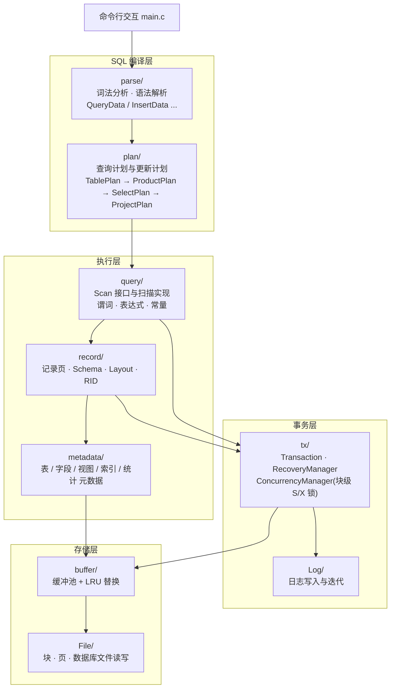
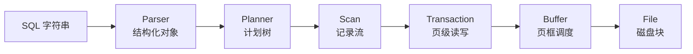

# DBMS_C


**DBMS_C** 是一个用 C 语言从零实现的教学型关系数据库原型,覆盖从页式文件存储、缓冲区管理、日志与事务,到 SQL 解析、查询计划、扫描执行的完整链路。本项目为本科毕业设计成果,目标是让每个数据库核心机制都能对应到一段可读、可运行、可测试的真实源码。

> **项目定位**:教学与学习用途。它刻意保持轻量——单机、单用户命令行、无网络层、无权限体系,不做工业级数据库的完整替代。

## 为什么做这个项目

数据库课程通常只讲授概念,而开源数据库源码(MySQL、PostgreSQL)规模庞大,初学者难以通读。DBMS_C 试图提供一个中间尺度:约 1.5 万行 C 代码、25 个单元测试、13 章配套教程,把「一条 SQL 如何变成页级读写」这条主链路完整走通。

## 架构

系统按层次组织,上层对象通过接口函数调用下层:



一条查询语句的执行主链路:



## 已实现功能

**SQL 支持**

| 语句 | 说明 |
| --- | --- |
| `CREATE TABLE` | 字段类型 `INT` / `VARCHAR` |
| `INSERT` / `UPDATE` / `DELETE` | 基于记录页的事务性写路径 |
| `SELECT` | 投影、`WHERE` 条件、多表连接(笛卡尔积 + 条件过滤) |
| `CREATE VIEW` | 视图定义写入系统表,查询期展开 |
| `CREATE INDEX` | 仅索引元数据登记(未接入查询执行路径) |
| `commit` / `rollback` | 显式事务控制 |

**事务与并发**:块级共享锁 / 排他锁;基于 undo 日志的回滚撤销链路。

**存储与恢复**:页式文件管理;缓冲池与 LRU 页面替换;先写日志(undo);`--trace` 命令行参数开启执行链路追踪。

**索引与统计**:基础哈希索引(结构与代价模型,配单元测试);表级统计信息与简单估算接口。

## 快速开始

环境要求:Windows + CMake ≥ 3.15 + MinGW-w64 GCC(验证环境:GCC 15.2.0);CMocka 1.1.0 已内置于 `external/`,无需单独安装。

```bash
git clone https://github.com/yaohuayuan/DBMS_C.git
cd DBMS_C
cmake -S . -B build
cmake --build build -j4
```

启动数据库(默认使用 `Show2` 数据库目录):

```powershell
.\bin\NewDBMS.exe
```

示例会话(真实输出):

```text
Database has started successfully. Type 'exit' to close the database.
SQL> CREATE TABLE student(id INT, name VARCHAR(20), age INT);
SQL> Command executed. Rows affected: 0
SQL> INSERT INTO student(id, name, age) VALUES(1, 'wang', 22);
SQL> Command executed. Rows affected: 1
SQL> SELECT id, name, age FROM student;
SQL> Query results:
|                  id||                name||                 age|
------------------------------------------------------------------
|                   1||                wang||                  22|
SQL> exit;
Database closed.
```

`demo/demo.sql` 覆盖建表、插入、查询、条件查询、多表查询、更新、删除、视图、索引和提交,可逐条复制到命令行运行。

## 运行测试

```bash
cd build
ctest --output-on-failure
```

共 **25 个测试套件**(CMocka),按模块划分:

| 模块 | 测试 |
| --- | --- |
| Lib 基础库 | `CStringTest` `CListTest` `LibBasicTest` `DBErrorTest` |
| 文件与日志 | `FileManagerTest` `FileManagerBasicTest` `LogTest` `LogManagerBasicTest` |
| 缓冲区 | `BufferManagerTest` `BufferManagerBasicTest` |
| 事务 | `TransactionTest` `TransactionBasicTest` `ConcurrencyBasicTest` `RecoveryBasicTest` |
| 记录与查询 | `RecordTest` `RecordBasicTest` `ExpressionTest` `PlanTest` `PlanScanBasicTest` `UpdateBasicTest` |
| 解析与元数据 | `ParserTest` `ParseBasicTest` `MetadataManagerTest` `MetadataBasicTest` |
| 索引 | `HashIndexTest` |

当前全部通过(详见 [RELEASE_NOTES.md](RELEASE_NOTES.md))。

## 目录结构

- `File/`:块、页和数据库文件访问
- `Log/`:日志写入、日志迭代和恢复支撑
- `Lib/`:字符串、列表、向量、映射、红黑树等基础容器
- `buffer/`:缓冲区管理和 LRU 页面替换策略
- `tx/`:事务、并发控制、恢复管理和缓冲页固定管理
- `record/`:记录页、表扫描、模式和布局
- `metadata/`:表、字段、视图、索引和统计信息的元数据管理
- `parse/`:SQL 词法与语法解析
- `plan/`:查询计划、更新计划和计划节点
- `query/`:扫描执行、表达式、谓词和常量
- `index/`:基础哈希索引实现
- `error/`:统一错误码和错误信息辅助模块
- `trace/`:执行链路追踪模块(`--trace`)
- `test/`:CMocka 单元测试;`test/trace/` 含 trace 模式演示脚本
- `demo/`:毕业设计演示 SQL 脚本
- `docs/`:教程、设计与发布文档
- `external/`:内置 CMocka 1.1.0

## 文档

- [docs/tutorial/](docs/tutorial/main.pdf):13 章配套教程(源码逐步讲解,含编译好的 PDF)
- [docs/design/](docs/design):架构分析(NEWDBMS_ARCH 系列)、核心数据结构手册、模块调用关系图、项目分析
- [docs/error_handling.md](docs/error_handling.md) / [docs/trace_mode.md](docs/trace_mode.md)
- [RELEASE_NOTES.md](RELEASE_NOTES.md):版本变更与已知限制

## 已知限制

如实列出当前边界,避免误读:

- 仅支持 Windows(MinGW);`Lib/rwlock.h` 虽有 pthread 分支,但部分测试使用 Windows API,Linux 尚未验证
- `CREATE INDEX` 只登记元数据,哈希索引未接入查询执行;查询计划使用固定组织(`BasicQueryPlanner`),无基于代价的优化
- 系统启动时不执行自动崩溃恢复;恢复能力为「事务回滚撤销」级别
- 并发控制为块级锁,死锁检测器代码存在但未接入主流程
- 统计信息为简单估算(如不同值数量按 `1 + 行数/3` 估计)
- 无网络层、无用户权限、无并发多客户端会话

## Roadmap

- [ ] Linux / POSIX 移植(补齐测试中的平台相关调用)
- [ ] 将哈希索引接入查询执行路径
- [ ] 系统启动时调用恢复流程(`TransactionRecover`)
- [ ] 查询计划优化:启用 `BetterQueryPlanner`、增强统计信息
- [ ] 统一错误处理体系
- [ ] 教程补充英文版

作者将在新仓库 [AI-NATIVE-DBMS-C](https://github.com/yaohuayuan/AI-NATIVE-DBMS-C) 中继续探索数据库系统的重构与扩展(工程结构、错误处理体系、AI 原生语义查询等),该项目处于早期建设阶段。

## 参与贡献

欢迎 Issue 与 PR,请先阅读 [CONTRIBUTING.md](CONTRIBUTING.md)。提交前请确保 `ctest` 全部通过。

## License

本项目基于 [MIT License](LICENSE) 开源。
