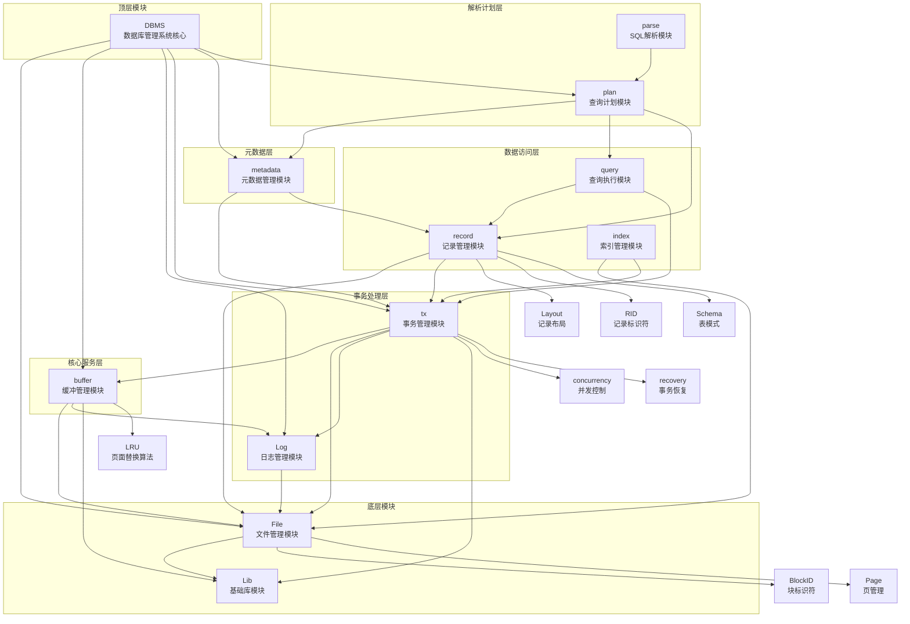

# 模块调用关系图

## 1. 模块关系概览

NewDBMS项目采用分层设计，各模块之间的调用关系呈现出清晰的层级结构。底层模块提供基础服务，上层模块依赖底层模块实现更复杂的功能。

## 2. 模块调用关系图

## 3. 模块调用关系说明

### 3.1 分层调用关系

项目模块从上到下分为七个层次：

1. **顶层模块**：DBMS模块是系统的核心，负责初始化和管理其他所有模块。
2. **解析计划层**：parse模块负责SQL语句的解析，plan模块负责生成和优化查询执行计划。
3. **元数据层**：metadata模块负责管理数据库的元数据，包括表、索引、视图等。
4. **数据访问层**：query、record和index模块负责数据的访问和操作，包括查询执行、记录管理和索引管理。
5. **事务处理层**：tx模块负责事务管理，Log模块负责日志记录和恢复。
6. **核心服务层**：buffer模块负责内存缓冲区管理，减少磁盘I/O操作，提高系统性能。
7. **底层模块**：File模块负责底层文件操作，Lib模块提供各种基础数据结构和工具函数。

### 3.2 主要模块间的调用关系

- **DBMS模块**：作为顶层模块，调用所有其他主要模块，负责系统的整体协调和管理。
- **File模块**：被多个模块调用，提供底层文件操作服务，是系统的基础。
- **buffer模块**：被DBMS、tx等模块调用，提供内存缓冲区管理服务。
- **tx模块**：被DBMS、query、record等模块调用，提供事务处理服务。
- **Log模块**：被DBMS、tx、buffer等模块调用，提供日志记录和恢复服务。
- **metadata模块**：被DBMS、plan等模块调用，提供元数据管理服务。
- **plan模块**：被DBMS调用，依赖metadata、query、record等模块生成查询计划。
- **query模块**：被plan模块调用，依赖record、tx等模块执行查询。
- **record模块**：被plan、query、metadata等模块调用，依赖File、tx等模块管理记录。

### 3.3 模块内部结构

部分模块内部包含子模块：

- **tx模块**：包含concurrency（并发控制）和recovery（事务恢复）子模块。
- **buffer模块**：包含LRU（最近最少使用）页面替换算法子模块。
- **File模块**：包含BlockID（块标识符）和Page（页管理）子模块。
- **record模块**：包含Layout（记录布局）、RID（记录标识符）和Schema（表模式）子模块。

## 4. 系统初始化流程

系统的初始化流程如下：

1. **初始化FileManager**：创建或打开数据库文件。
2. **初始化LogManager**：创建或打开日志文件，依赖FileManager。
3. **初始化BufferManager**：创建内存缓冲区，依赖FileManager和LogManager。
4. **创建Transaction**：创建事务对象，依赖FileManager、LogManager和BufferManager。
5. **初始化MetadataManager**：初始化元数据管理器，依赖Transaction。
6. **初始化Planner**：初始化查询规划器，依赖MetadataManager。

## 5. 典型查询执行流程

一个典型的查询执行流程如下：

1. **SQL解析**：parse模块将SQL语句解析为内部数据结构。
2. **查询计划生成**：plan模块基于解析结果生成查询执行计划。
3. **事务创建**：创建一个新的事务。
4. **查询执行**：query模块执行查询计划，访问record模块获取数据。
5. **事务提交**：提交事务，将修改写入磁盘，并记录日志。
6. **资源释放**：释放事务占用的资源。

## 6. 模块调用关系的设计特点

- **分层设计**：模块按功能分层，上层模块依赖下层模块，下层模块不依赖上层模块，降低了模块间的耦合度。
- **职责单一**：每个模块只负责一个特定的功能，职责明确，便于维护和扩展。
- **接口清晰**：模块间通过清晰的接口进行交互，隐藏了内部实现细节。
- **高内聚低耦合**：模块内部高内聚，模块间低耦合，提高了系统的可维护性和可扩展性。

这种模块化设计使得NewDBMS系统具有良好的可维护性、可扩展性和可测试性，便于后续的功能扩展和性能优化。